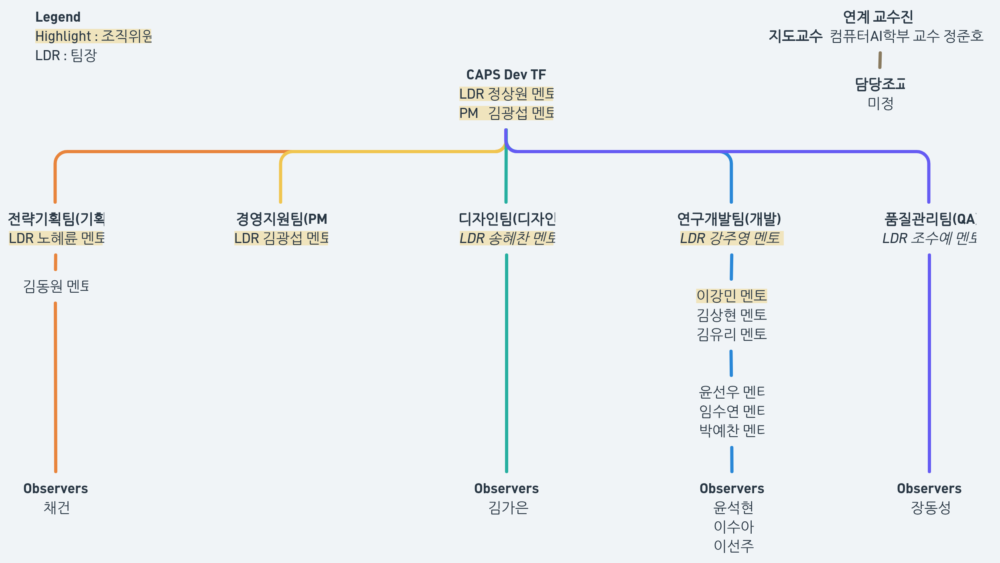

# [문서] 여름 개발 TF 조직체계도

Card ID: `c1xtsaeftpfbktgmztxyysnqsao`

| Property | Value |
|---|---|
| 상태 | 게시 |
| 분류 | 안내 |
| 작성자 | @CodeHotel |
| 게시일 | 2026-09-16 |
| 관련 링크 |  |

작성 2026-09-17. 팀장과 팀원 배치를 한 장으로 정리한다. 멘토·멘티·옵저버의 뜻은 「여름개발 TF 진행 계획」의 역할군 절을 따르고, 팀장·담당자·문서 책임자의 용어는 조직위 열람용 문서의 용어 절을 따른다. 그림의 LDR은 팀장, 강조 표시는 조직위원이다.

## 구성

TF장은 정상원이고 PM은 김광섭이다. 팀은 다섯이며 팀마다 팀장 한 명을 둔다. 경영지원팀은 한 사람이므로 PM이 팀장을 겸한다. 연계 교수진은 지도교수 정준호(컴퓨터AI학부)이고 담당조교는 미정이다.

| 팀 | 팀장 | 멘토 | 멘티 | 옵저버 |
|---|---|---|---|---|
| 전략기획팀 (기획) | 노혜륜 | 김동원 | — | 채건 |
| 경영지원팀 (PM) | 김광섭 (PM 겸임) | — | — | — |
| 디자인팀 (디자인) | 송혜찬 | — | — | 김가은 |
| 연구개발팀 (개발) | 강주영 | 이강민 (풀스택), 김상현 (백엔드), 김유리 (시스템·네트워크) | 윤선우, 임수연, 박예찬 | 윤석현, 이수아, 이선주 |
| 품질관리팀 (QA) | 조수예 | — | — | 장동성 |

팀장도 멘토다. 팀장은 팀의 카드를 검수하고 팀의 상황을 TF장에게 올리며, 팀원 멘토는 각자 분야의 판단을 문서와 회의에 남긴다. 멘티는 멘토를 관찰하고 주간 보고서를 내며 옵저버는 역할이 없다.

## 보고 계통

팀원은 팀장에게, 팀장은 TF장에게 보고한다. PM은 각 팀의 일일결산을 취합해 TF장에게 올리고, 결정이 필요한 것을 TF장과 조직위에 넘긴다. 조직위원은 정상원, 강주영, 이강민, 노혜륜, 송혜찬 다섯이며, 조직위의 판단은 보드가 아니라 조직위 회의록 파일에 남긴다.

## Comments

_No comments._
