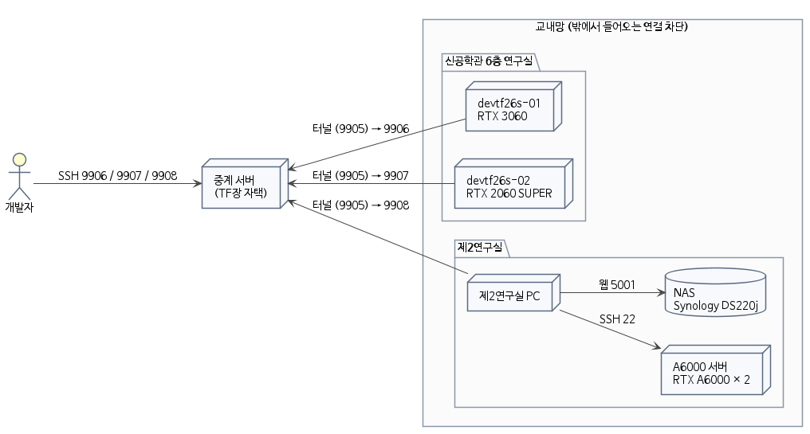

# 개발용 서버 정리

Card ID: `c1ez1w983uighdroc16utnnqr8y`

| Property | Value |
|---|---|
| 상태 | 게시 |
| 분류 | 안내 |
| 작성자 | @CodeHotel |
| 게시일 | 2026-10-06 |
| 관련 링크 |  |

## 서버

개발용 서버는 위치에 따라 신공학관 6층 연구실의 GPU 서버 두 대와 제2연구실의 장비 세 대로 나뉜다.

| 이름 | 위치 | 그래픽카드 | CPU | 메모리 | 운영체제 |
|---|---|---|---|---|---|
| devtf26s-01 | 신공학관 6층 | RTX 3060 12GB | i7-11700, 8코어 | 15GB | Ubuntu 24.04 |
| devtf26s-02 | 신공학관 6층 | RTX 2060 SUPER 8GB | Pentium G4400, 2코어 | 7GB | Ubuntu 24.04 |
| A6000 서버 | 제2연구실 | RTX A6000 48GB 2장 | Xeon Gold 6226R, 16코어 | 125GB | Ubuntu 22.04 |
| 제2연구실 PC | 제2연구실 | 없음 | i7-7700, 4코어 | 15GB | Ubuntu 24.04 |
| NAS (Synology DS220j) | 제2연구실 | 없음 | Realtek RTD1296, 4코어 | 512MB | DSM 7.3.2 |

## 연결 구조

학교 망은 밖에서 들어오는 연결을 막으므로 연구실 장비가 TF장 정상원의 자택에 있는 중계 서버로 먼저 터널을 열어 두고, 개발자는 그 중계 서버의 포트로 SSH 접속한다.

- devtf26s-01, devtf26s-02 : 각자 중계 서버로 터널을 열어 두며, 개발자는 중계 서버의 9906번과 9907번 포트로 각 서버에 접속한다.
- 제2연구실 PC : 같은 방식으로 9908번 포트에 연결되어 제2연구실 장비로 들어가는 입구 역할을 한다.
- A6000 서버와 NAS : 제2연구실 PC에 접속한 뒤 그 안에서 A6000 서버에 SSH로 접속하며, NAS의 웹 화면은 제2연구실 PC를 거쳐 5001번 포트를 열어 브라우저로 연다.
- AWS 중앙 서버 : 백엔드와 외부 사용자의 접속 진입점을 맡으며, 개발팀이 구성하고 있다 (저장소와 AWS 기본 세팅 참고).

두 연구실은 내부망이 서로 달라 신공학관 6층의 GPU 서버에서 제2연구실 PC로 바로 접속할 수 없다.

## 유의 사항

- NAS : 개발 단계에서만 사용하며, 최종 NAS는 따로 선정한다.
- 중계 서버 : TF장 정상원의 자택 회선에 있으므로 자택 회선이나 중계 서버가 멈추면 모든 연구실 장비의 접속이 함께 끊긴다.
- 접속 정보 : 보드는 GitHub에 공개되므로 주소와 계정, 비밀번호는 카드에 적지 않고 DM으로 전달한다.

## Comments

_No comments._
