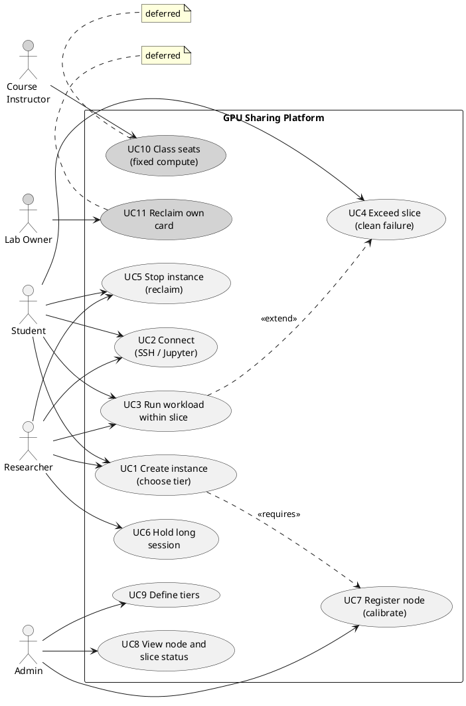
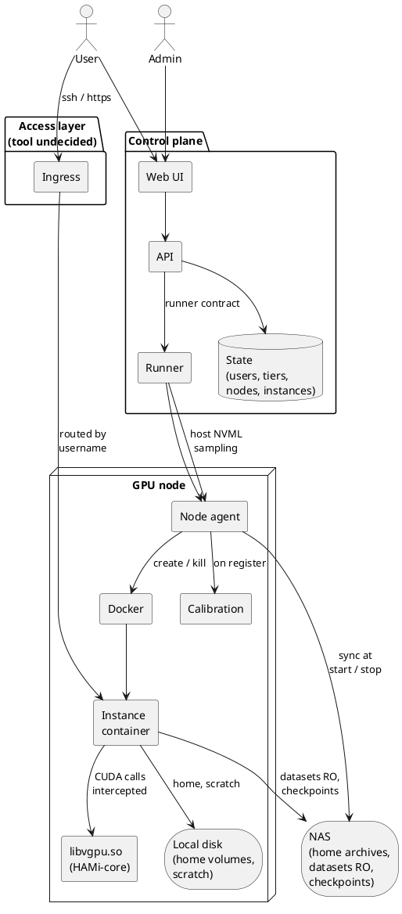
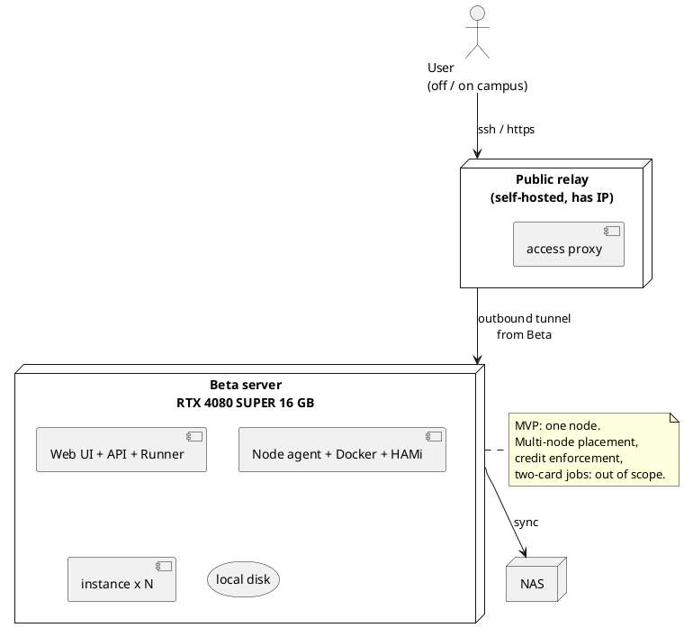
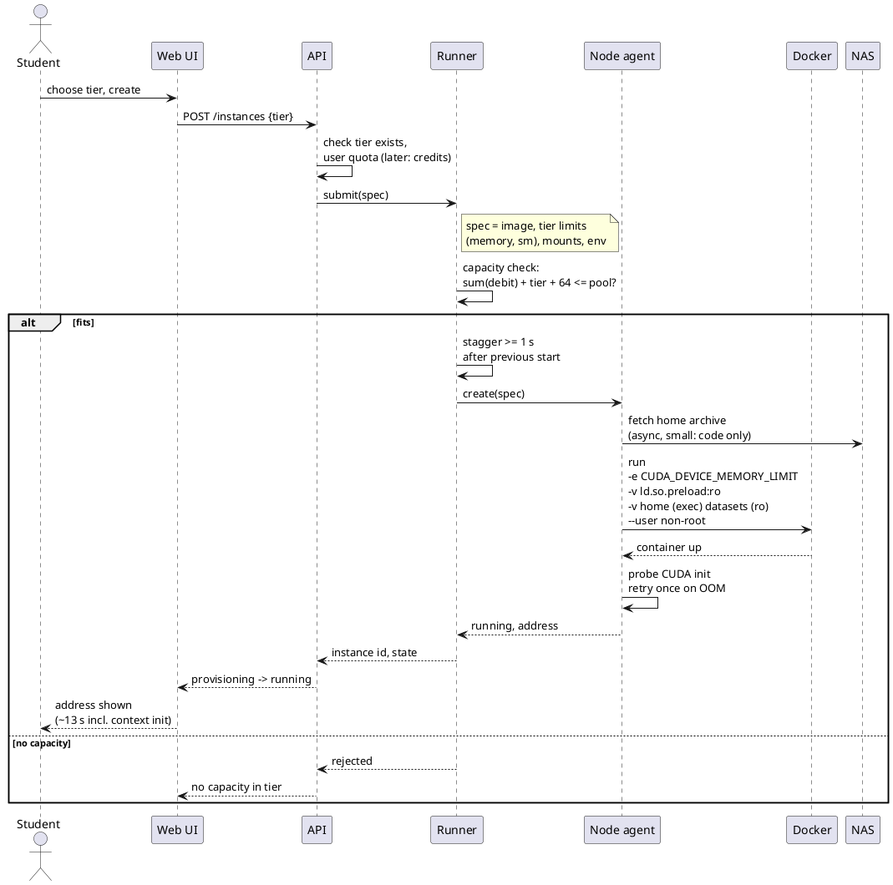
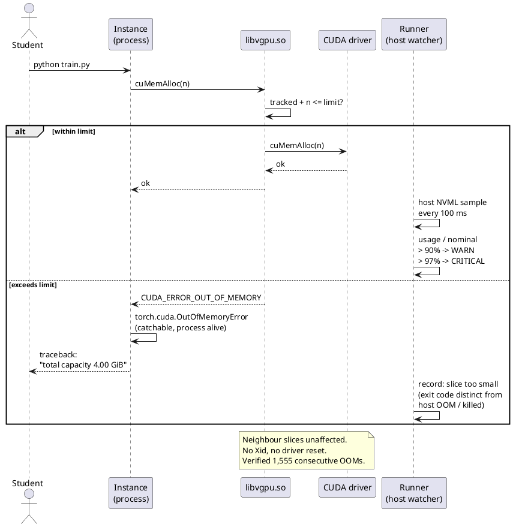
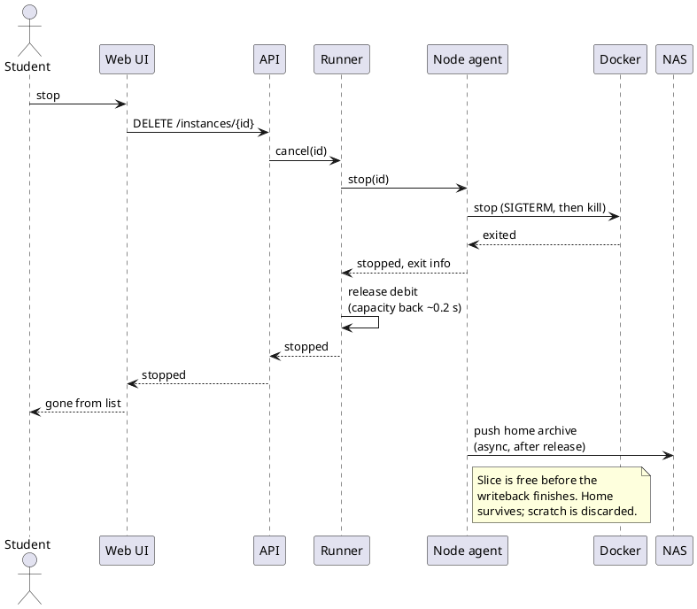
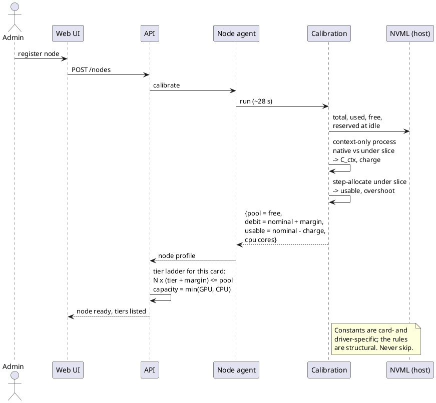
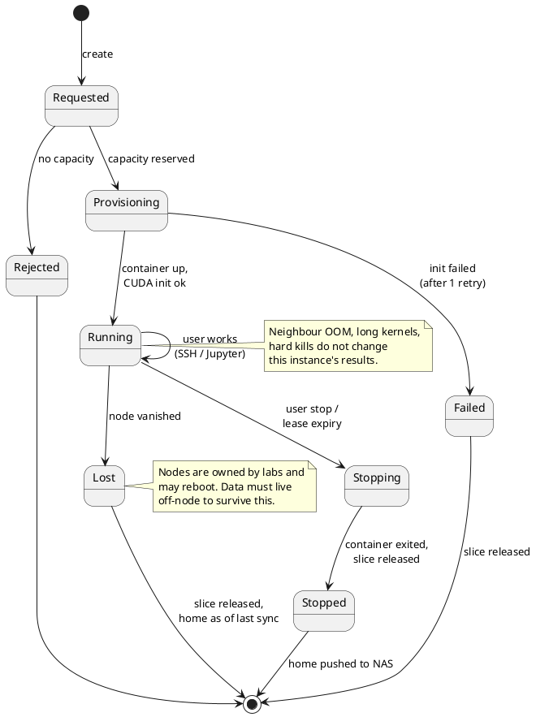
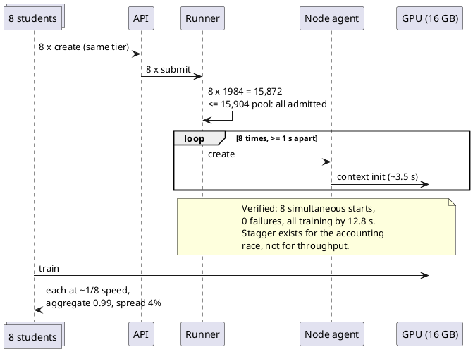

# [전체] 기획서 초안

Card ID: `cusqr7zcrq7ro3ribgyeqio6fea`

| Property | Value |
|---|---|
| 상태 | 작성중 |
| 종류 | 기획서 |
| 작성자 | @CodeHotel |
| 결재자 | 조직위 |
| 팀 | 전체 |
| 날짜 | 2026-09-16 |
| 주차 |  |
| 관련 링크 |  |

본 문서는 「GPU 공동 사용 플랫폼」의 목적과 사용자, 설계가 감당해야 할 제약, 카드 한 장을 여러 몫으로 나누어 공유하는 방식, 시연 범위와 결정·미결 사항을 정리한 기획서 초안을 소개한다. 8월의 구현 방식 검토와 9월 초의 기술검증 결과를 바탕으로 작성하였으며, 향후 기획팀이 기획서를 쓰고 개발·디자인·QA가 각자의 산출물을 설계할 때 출발점으로 활용할 목적을 가지고 있다.


> Non-image attachment omitted by archive policy

카드를 쓰는 모든 프로세스에는 자기 메모리를 할당하기 전에 CUDA 컨텍스트 비용이 드는데, 측정한 카드에서 290MB다. HAMi-core는 그중 250MB를 컨테이너의 몫에 계상하고 나머지 40MB는 계상하지 않으므로, 명목 4GB를 받은 컨테이너는 실제로 약 3.75GB를 할당할 수 있고 카드에서는 실제로 약 4.03GB가 줄어든다. 이 차이는 크기와 무관하게 일정하므로 플랫폼은 두 가지 단순한 규칙으로 계상한다. 사용자가 쓸 수 있는 양은 명목 크기에서 256MB를 뺀 값이고, 카드가 내주는 양은 명목 크기에 64MB를 더한 값이다.

  카드의 총 VRAM도 전부 쓸 수 있지는 않다. 드라이버가 자기 몫으로 예약하는 양이 있는데 측정한 카드에서 약 455MB로, 이는 빈 메모리로 나타나지 않는다. 플랫폼이 나누는 여유량은 유휴 상태에서 NVML이 비어 있다고 보고하는 양이지 제품 사양의 숫자가 아니며, 총량을 쓰면 이 차이만큼 모든 카드를 초과 배정하게 되는데 검증 중에 한 번 그렇게 했다가 발견했다.

  두 숫자는 카드와 드라이버와 적재된 라이브러리에 따라 다르지만 규칙은 다르지 않다. 그래서 모든 카드는 편입될 때 한 번 측정하며 그 측정은 생략할 수 없다.

### 7.3 티어와 정규화

  티어는 사용자가 고르는 이름 붙은 크기로, 메모리 상한과 연산 비율과 디스크 할당량이다. 플랫폼 설계의 중심 발상은 메모리와 연산이 독립된 두 축이라는 점이다. 약 4GB에 약 10TFLOPS로 정의한 티어는 중급 카드에서는 4GB에 연산 비율 절반이고 고급 카드에서는 4GB에 약 1/8인데, 두 카드의 메모리 대비 연산 비율이 다르기 때문이다. 단일 비율로는 두 축을 동시에 맞출 수 없고 독립된 두 값으로는 맞출 수 있으며, 이렇게 해야 제각각인 기증 카드들이 서로 바꿔 쓸 수 있는 좌석이 된다. 균일한 장비를 갖춘 데이터센터에는 없는 문제다.

  연산 비율은 카드 세대 안에서만 실제 속도를 따라가므로 티어는 세대별로 정의하며, 메모리는 정확하므로 티어 사다리는 메모리를 기준으로 구성한다. 검증에 쓴 16GB 소비자용 카드에서 측정한 사다리는 다음과 같다.

| 카드당 인스턴스 | 명목 크기 | 내부 가용 | 수용 작업 |
|---|---|---|---|
| 8 | 1,920MB | 1,664MB | 작은 합성곱 신경망 실습 과제 |
| 4 | 3,904MB | 3,648MB | 기본 크기 언어 모델 미세조정 |
| 3 | 5,184MB | 4,928MB | 이미지 생성 추론 |
| 2 | 7,872MB | 7,616MB | 큰 비전 모델 또는 작은 언어 모델 |
| 1 | 15,808MB | 15,552MB | 측정한 전부 |

  각 행은 인스턴스 수 × (명목 크기 + 64MB) ≤ 여유량이라는 규칙 하나에서 나온다. 크기는 반올림한 값이 아니라 여유량을 채우는 값으로 골랐는데, 반올림한 크기로는 이 중 두 행에서 좌석이 하나 줄어든다. 각 행은 그 크기의 실제 학습 작업으로 카드를 가득 채우고 하나하나 결과가 맞는지 확인했다.

  고정 비용의 결과 하나는 분명히 적어 둘 필요가 있다. 가장 작은 티어에서는 과제 자체의 메모리를 빼면 프로세스 하나분의 고정 오버헤드 정도만 남으므로 학생이 두 번째 노트북을 열면 두 번째는 시작되지 않는다. 티어는 관리자가 운영 중에 바꾸는 설정이므로 이는 설계가 아니라 구성의 문제이며, 노트북 둘이 필요한 수업의 담당자는 실습 티어를 한 단계 올리면 되고 그것이 카드당 좌석을 얼마나 줄이는지는 사다리에서 읽을 수 있다.

### 7.4 공유 비용의 측정

  카드의 시분할은 프로그램이 아니라 커널 시간을 기준으로 공정하다. 긴 커널 몇 개를 실행하는 프로그램이 짧은 커널 여럿을 실행하는 프로그램보다 카드를 오래 차지하여, 측정에서 무거운 모델 하나가 가벼운 모델 5개와 카드를 나눌 때 무거운 쪽에 정당한 몫의 거의 두 배가 배정되었고 가벼운 쪽은 각각 몇 %씩 줄었다. 연구용 환경에서는 받아들일 만하지만 성적을 매기는 수업에서는 그렇지 않은데, 우연히 무거운 모델을 쓴 학생이 같은 반 학생보다 많은 연산을 받기 때문이다.

  SM 제한이 이를 바로잡는데, 두 가지 성질을 측정했고 둘 다 설계에 영향을 준다. 첫째, 백분율은 속도의 백분율이 아니어서, 큰 커널을 실행하는 프로그램은 50% 설정에서 속도의 92%를 유지하는 반면 잦은 동기화와 함께 작은 커널을 실행하는 프로그램은 거의 비례해 54%로 느려진다. 둘째, 이 제한은 작업 보존이 아니어서 25%로 제한된 프로그램은 카드의 나머지가 비어 있어도 대기 상태를 유지한다. 연구용 환경에서는 낭비이고 시험에서는 오히려 필요한 성질인데, 시험에서는 같은 반의 몇 명이 실행하고 있든 모든 학생의 속도가 같아야 하기 때문이다. 그래서 플랫폼은 10장에서 설명하는 두 가지 연산 모드를 둔다.

  메모리 제한만 두고 같은 학습 작업 8개를 한 카드에 올렸을 때 각각은 1/8 속도의 ±4% 안에서 실행되었고, 가장 느린 작업과 가장 빠른 작업의 차이는 4%였으며, 카드 전체의 산출은 작업 하나가 혼자 낼 때의 99%였다. 9개까지 들어갔고 10번째는 시작 시 분명한 오류로 실패했으며 9개는 영향을 받지 않았다. 한계는 스케줄링이 아니라 메모리다.

### 7.5 몫 초과

  HAMi-core가 할당을 거절하면 프레임워크는 통상의 메모리 부족 예외를 일으키고, 프로그램은 그것을 잡고 메모리를 비우고 계속할 수 있으며, 컨테이너는 죽지 않고 카드에는 이상이 없다. 이를 1,555회 연속으로 시험했고 Xid는 0이었다. 실패할 때까지 일부러 할당을 반복하는 이웃, 3초 길이의 작업 단위를 연달아 제출하는 이웃, 할당 도중 죽는 이웃은 옆 환경을 느리게 하되 결과는 바꾸지 않았으며, 다섯 가지 작업이 그 이웃들 각각과 함께 실행될 때 비트 단위로 같은 출력을 냈다.

  플랫폼은 세 가지 실패 원인을 구분하는데 각각 다른 대응이 필요하기 때문이다. 환경이 장비의 일반 RAM을 너무 써서 강제 종료된 경우, 바깥에서 종료시킨 경우, 자기 프로그램이 카드의 몫을 넘긴 경우이며, 마지막 경우만 사용자가 스스로 고칠 수 있으므로 그렇게 알린다.

## 8. 저장소

  세션은 장비의 로컬 디스크에서 실행되며 데이터는 시작과 끝에 옮기되 파일 하나하나가 아니라 아카이브 하나로 옮기는데, 네트워크 파일 시스템은 파일마다 비용이 들고 홈 디렉터리에는 파일이 수천 개이기 때문이다. 사용자의 홈 디렉터리는 인스턴스가 시작할 때 공유 저장소에서 가져오고 종료하거나 크기를 바꿀 때 되돌리며 세션 사이에 유지된다. 큰 데이터셋과 모델 가중치의 공유 캐시는 공유 저장소에 읽기 전용으로 마운트하여 두고 복사하지 않는데, 크고 순차로 읽히므로 네트워크 저장소에 맞는 일이다. 사용자가 학습 중에 저장하는 체크포인트는 로컬 디스크가 아니라 공유 저장소로 바로 가서 장비가 사라져도 남으며, 스크래치는 로컬 디스크에 두고 세션이 끝나면 버린다.

  두 경계는 모두 비동기로 처리한다. 처음 30초 안에 자기 파일이 필요한 사람은 없으므로 홈 아카이브가 다 도착하기 전에 환경이 시작되고, 전송이 끝나기를 기다렸다가 몫을 돌려줄 이유가 없으므로 아카이브가 다 나가기 전에 몫을 여유량에 돌려준다.

  두 가지는 검증 중에 겪은 뒤에야 알았다. 홈 볼륨은 `exec`로 마운트해야 하는데, Docker의 기본 tmpfs는 `noexec`이며 그러면 컴파일된 요소를 가진 모든 파이썬 라이브러리가 원인을 알리지 않는 오류로 적재에 실패한다. 로컬 디스크도 용량 변수가 되어, 장비가 담는 인스턴스 수는 카드와 프로세서 코어뿐 아니라 디스크에도 제한되므로 티어마다 디스크 할당량을 둔다.

## 9. 접근

  모든 인스턴스에는 고정된 주소 하나로 접속한다. SSH는 사용자 이름 말고는 라우팅할 근거가 없으므로 사용자 이름에 학번을 담고, 장비 앞의 라우터가 그것을 인스턴스가 어디서 실행되든 알맞은 인스턴스로 대응시키며, 웹 도구는 사용자가 인스턴스 페이지에서 켜는 인스턴스별 프록시를 통해 같은 방식으로 접속한다.

  모든 운영체제에 이미 있는 SSH 클라이언트 말고는 아무것도 설치하지 않은 개인 컴퓨터에서의 접속은 다음과 같다.

```
ssh 2020112028@compute.dongguk.edu
```

  이 명령으로 사용자의 기본 인스턴스에 들어간다. 인스턴스가 여럿인 사용자는 각각에 이름을 붙이고 그 이름은 사용자 이름에 붙는다.

```
ssh 2020112028-lab3@compute.dongguk.edu
```

  인스턴스는 일반 SSH 호스트이므로 파일 전송도 일반 도구로 한다.

```
scp results.csv 2020112028@compute.dongguk.edu:~/
rsync -av ./project/ 2020112028@compute.dongguk.edu:~/project/
```

  SSH 설정 파일에 항목 하나를 두면 주소가 이름 하나로 줄고, 원격 확장을 가진 편집기를 포함해 SSH를 쓰는 모든 도구가 더 설정 없이 동작한다.

```
Host gpu
  HostName compute.dongguk.edu
  User 2020112028
  IdentityFile ~/.ssh/id_ed25519
```

  그 뒤로는 `ssh gpu`로 접속하고 원격 편집 확장은 `gpu`를 가리키면 된다.

  안에서는 사용자의 몫이 카드 전체인 것처럼 보이며, 드라이버의 상태 도구도 그렇게 보고한다.

```
$ nvidia-smi --query-gpu=memory.total,memory.used --format=csv
memory.total [MiB], memory.used [MiB]
4096, 312
```

  몫보다 많이 요구하는 프로그램은 프레임워크의 통상적인 메모리 부족 오류를 보며 몫이 카드의 용량으로 보고된다.

```
torch.cuda.OutOfMemoryError: CUDA out of memory. Tried to allocate 512.00 MiB.
GPU 0 has a total capacity of 4.00 GiB of which 8.00 MiB is free.
```

  이 뒤에도 프로세스는 살아 있으므로 사용자는 메모리를 비우거나 배치를 줄이고 계속한다.

  웹 도구에는 같은 신원에서 파생된 주소로 브라우저에서 접속한다.

```
https://2020112028.compute.dongguk.edu/          → 노트북
https://2020112028.compute.dongguk.edu/tb/       → 학습 대시보드, 켰을 때
```

### 네트워크 요구 사항

  접근 계층은 네 가지 다른 용도를 감당하며, 같은 소프트웨어를 여러 번 배치하여 네 가지를 모두 감당할 것으로 본다. 개발 중에는 시스템을 만드는 사람들이 어디서든 연구실 장비에 셸로 들어갈 수 있어야 하고, 운영 중에는 사용자가 위에 보인 `ssh`와 브라우저 경로로 공인 주소 하나에 닿아 자기 인스턴스로 라우팅되어야 한다. 모든 세션의 시작과 끝에는 홈 아카이브가 각 장비와 NAS 사이를 오가며 대역폭이 문제가 되는 흐름은 이것 하나로, 40명이 동시에 시작하면 아카이브 40개가 전송된다. 유지보수를 위해서는 사용자용과 별도의 배치가 운영자에게 장비로 들어가는 경로를 주어, 사용자용 경로가 고장났을 때도 그 경로는 동작해야 한다.

  캠퍼스 망은 들어오는 연결을 막으므로 이 흐름 하나하나가 캠퍼스 안의 장비가 공인 주소를 가진 중계 서버로 바깥을 향해 연결하는 데서 시작한다는 점까지는 알고 있다. 접근 소프트웨어를 고르기 전에 연구실 장비에서 측정해야 할 항목은 네 가지다. 첫째, 캠퍼스 NAT가 어떻게 동작하고 UDP를 내보내는지로, 이 결과가 오버레이가 직접 경로를 열 수 있는지 아니면 전부 중계해야 하는지를 정한다. 둘째, 다른 망 구역에 있는 연구실 장비 둘이 서로 직접 닿는지다. 셋째, GPU 장비에서 NAS에 터널 없이 닿는지로, 닿는다면 대용량 전송 문제는 통째로 사라진다. 넷째, 학교에 연구실 장비 위의 오버레이 네트워크에 대한 정책이 있는지다.

  이 네 가지 답에 따라 두 형태 중 하나가 정해진다. 직접 경로가 되고 정책이 허용하면 오버레이가 모든 장비에 고정 주소를 주어 실행기는 세션마다 전송 경로를 만들고 없앨 일이 없으며 라우팅은 조회 하나로 끝난다. 그렇지 않으면 프록시 설계가 어디서든 동작하고 각 인스턴스의 전송 경로는 실행기가 관리하는 상태가 된다. 어느 형태도 위의 명령을 바꾸지 않으며, 그 차이는 사용자에게는 보이지 않지만 실행기에는 실질적이다.

## 10. 연산 모드

  성적을 매기는 수업에서는 세션의 모든 인스턴스가 부하와 무관하게 고정된 연산 비율을 받는다. 7.4에서 본 작업 보존이 아닌 성질을 의도적으로 이용하는 모드로, 학생 간 공정성이 유휴 사이클의 완전한 활용보다 중요하기 때문이다.

  연구에서는 두 인스턴스가 실제로 경합하지 않는 한 연산 제한을 두지 않으며, 경합하면 제한이 우선순위로 작동하여 소유 연구실의 작업을 외부 사용자의 작업보다 앞세운다. 아무도 필요로 하지 않는 제한 때문에 유휴 카드가 묶이는 일은 없다.

  어느 모드에서도 이 설정을 사용자에게 성능의 백분율로 표시하지 않는데, 실제로 성능의 백분율이 아니기 때문이다.

## 11. 화면

### 사용자 화면

  로그인 화면에는 학번과 비밀번호 입력란, 그리고 연동할 수 있다면 학교의 통합 로그인만 두고 다른 것은 두지 않는다.

  내 인스턴스 화면은 목록이며 위에 사용자의 크레딧 잔액과 지금의 감소 속도가 있다. 각 행은 인스턴스 하나로, 이름, 티어, 상태(준비 중, 실행 중, 종료 중, 종료됨), 실행 시간, 가용 크기 대비 메모리 사용량 막대를 보이고, 실행 중인 행은 접속 주소와 종료 버튼을 함께 보인다. 빈 목록에는 생성 버튼 하나만 있다.

  생성 화면은 이 사용자가 고를 수 있는 티어들을 각각의 가용 메모리, 디스크 할당량, 지금 비어 있는 수와 함께 보인다. 수업이면 실습 티어가 미리 선택되고 나머지는 숨기므로 한 번만 누르면 된다.

  인스턴스 상세 화면은 접속 명령을 그대로 복사할 수 있게 보인다. 웹 도구 프록시 스위치는 주피터 노트북이 기본으로 켜져 있고 나머지는 켤 때까지 꺼져 있으며, 두 경고 문턱이 표시된 사용량 막대와 그 문턱을 넘을 때 브라우저뿐 아니라 휴대전화로도 알릴지의 스위치, 종료 버튼, 그리고 종료된 인스턴스에는 같은 티어나 다른 티어로 되살리는 버튼이 있다.

  알림은 브라우저로, 그리고 사용자가 원하면 휴대전화로 푸시한다. 메모리 경고, 시작 실패, 장비가 사라져 상실된 인스턴스, 0에 가까운 크레딧 잔액이 대상이다. 휴대전화 쪽은 휴대전화에서 동작하는 웹 페이지이지 네이티브 앱이 아니며, 필요하다고 드러나면 그때 만든다.

### 관리자 대시보드

  장비 화면은 등록된 모든 장비를 보인다. 이름, 소유 연구실, 모델과 세대로 표시된 카드, 마지막 측정 일자, 티어별로 몇 개의 인스턴스를 담을 수 있는지의 용량과 지금 담고 있는 수를 보이며, 보고를 멈춘 장비는 맨 위에 표시된다. 동작은 새 장비 등록, 재측정, 비우기(새 인스턴스를 받지 않고 실행 중인 인스턴스가 끝나기를 기다림)다.

  카드 화면은 카드마다 지금 배정된 몫들을 여유량에 비례한 크기로 그리고 각각에 사용자와 티어를 붙이며, 각 몫 옆에 호스트에서 측정한 사용량과 경고 상태를 보인다. 이 카드에 지금 누가 있고 각자 상한에 얼마나 가까운지에 답하는 화면이다.

  인스턴스 화면은 모든 장비의 모든 인스턴스를 사용자, 티어, 장비, 상태로 거른다. 여기서 관리자가 인스턴스를 종료할 수 있으며 이것이 플랫폼이 주는 유일한 강제 조치이고, 사유는 기록한다.

  티어 화면은 카드 세대별 사다리로, 명목 크기, 가용 크기, 연산 비율, 디스크 할당량, 카드당 인스턴스 수를 보인다. 운영 중에 고칠 수 있으며 크기를 바꾸면 측정 상수로 적합 수를 다시 계산하고, 티어가 고정 비율인지 우선순위 전용인지도 여기서 정한다.

  크레딧 화면은 티어별 시간당 요율, 연구실과 사용자별 잔액, 조정 이력을 보이며 잔액 부여와 요율 변경은 언제든 여기서 한다. 장비 조사 결과에서 최초 배분을 계산하는 기능은 아직 없으며, 조사가 끝난 뒤에 넣는다.

  이미지 화면은 각 장비가 실행용과 개발용 중 어느 이미지를 갖는지와 마지막으로 만든 때, 그리고 각 이미지의 라이브러리 목록을 보인다. 특정 라이브러리를 넣어 달라는 요청이 들어오는 자리다.

  이벤트 화면은 시간순 피드로, 경고 문턱을 넘은 인스턴스, 시작 실패와 그 이유, 보고가 끊긴 장비, 측정 결과를 최신 순으로 보인다. 여기 있는 항목 자체로 조치가 필요하지는 않으나 사용자가 문제를 보고했을 때 관리자가 보는 곳이다.

  관리자의 모든 수치는 호스트 쪽 감시에서 오며 환경 안에서 읽은 수치는 없다.

## 12. 시스템 구조

11장의 화면들로 이루어진 웹 인터페이스가 사용자, 티어, 장비, 인스턴스를 소유하는 API 위에 있고, API는 실행기와 통신한다. 실행기는 용량을 관리하는 부품으로, 각 장비의 각 카드가 내준 양을 세고, 새 요청이 들어가는지와 어느 장비에 들어가는지를 판정하고, 그 장비의 에이전트에 인스턴스를 만들거나 없애라고 지시하고, 모든 인스턴스를 호스트 쪽 NVML로 감시한다. 인스턴스 안에서는 보지 않는데, 거기서는 HAMi-core가 카드가 아니라 몫을 보고하기 때문이다. 각 장비의 에이전트는 컨테이너 런타임을 제어하고, 홈 아카이브를 공유 저장소와 주고받고, 장비가 등록될 때 상수 산출을 수행한다.

  실행기와 API 사이의 경계는 시스템 계층과 응용 계층이 만나는 곳이므로 어느 쪽을 만들기 전에 적어 두어야 한다. 대략 다음이 필요하다고 본다. 사양 제출과 식별자 발급, 식별자를 통한 상태·주소·현재 사용량·경고·종료 사유 조회, 취소, 목록 조회, 장비 용량 조회, 상태 변화 구독이다. 사양에는 이미지, 메모리 상한, 연산 비율, 마운트 대상, 환경변수, 사용자 신원이 들어간다.

시연은 서버 한 대에서 실행되지만 설계는 여러 대를 전제한다. 장비마다 에이전트가 동작하고 실행기는 그 전부의 용량을 관리하며, 새 인스턴스를 그중 어디에 놓을지는 실행기가 판정한다. 배치 규칙은 아직 정하지 않았고 설계를 세우는 데 필요하지도 않다. 캠퍼스 밖의 공인 주소를 가진 중계 서버가 진입점이 되고 각 장비가 거기로 바깥을 향해 연결하므로 캠퍼스 안에 들어오는 규칙이 필요 없다.

## 13. 흐름

### 인스턴스 생성

사용자가 티어를 고르면 API는 티어가 존재하는지, 나중에는 사용자에게 할당량이 남아 있는지도 확인한다. 실행기는 카드가 이미 내준 양에 이 티어의 크기와 고정 여유분을 더하여 합이 카드의 여유량을 넘으면 거절하고, 들어가면 그 장비에서의 직전 시작 뒤 1초 이상 기다리는데, 두 인스턴스가 같은 순간에 시작하고 하나가 곧바로 큰 메모리를 할당할 때 라이브러리의 회계에 경합이 생김을 확인했기 때문이다. 그런 뒤 에이전트에 컨테이너 생성을 지시하는데, `CUDA_DEVICE_MEMORY_LIMIT`를 설정하고, `/etc/ld.so.preload`를 읽기 전용으로 마운트하고, 홈 볼륨을 `exec`로 마운트하고, 데이터셋을 읽기 전용으로 마운트하고, root 아닌 사용자로 시작한다. 에이전트는 카드가 초기화되었는지 확인하고 되지 않았으면 한 번 다시 시도하며, 홈 아카이브는 그 뒤에 도착한다. 버튼을 누르고 약 13초 뒤에 사용자는 주소를 받는다.

### 실행과 몫 초과

할당 요청은 하나하나 HAMi-core를 거치며 합계에 더한 뒤 넘기거나 거절된다. 실행기는 인스턴스의 실제 사용량을 호스트 쪽 NVML에서 0.1초마다 읽고, 몫의 90%에서 경고를, 97%에서 위급을 최근 증가율에 근거한 남은 시간 추정과 함께 기록한다. 점진적 증가에는 수 초에서 수 분 앞서 경고가 나가며, 이전의 어떤 요청보다 큰 덩어리 하나를 요구하는 프로그램 단계에서 오는 갑작스러운 도약은 예측할 수 없으나 95% 위에 몇 분째 머무는 인스턴스는 그 자체가 경고 신호다. 요청이 거절되면 프로그램은 통상의 메모리 부족 예외를 보고 인스턴스는 살아 있다.

### 인스턴스 종료

컨테이너가 멈추면 메모리는 약 0.2초 안에 카드로 돌아오고 실행기는 몫을 즉시 여유량에 돌려준다. 홈 아카이브는 그 뒤에 공유 저장소로 전송되며, 그것이 끝나기 전에 사용자 목록에서는 인스턴스가 사라진다.

### 장비 등록

에이전트가 상수 산출을 수행하는 단계로, 유휴 상태에서 NVML이 보고하는 여유량을 읽고, 카드에 컨텍스트만 만들고 아무것도 하지 않는 프로세스를 시작하여 HAMi-core가 있을 때와 없을 때의 컨텍스트 비용을 재고, 상한 아래에서 거절될 때까지 단계적으로 할당하여 가용 상한이 실제로 어디인지 찾는다. 이 네 숫자에서 API가 장비의 여유량, 인스턴스당 여유분, 내부 가용 규칙, 그 카드의 티어 사다리를 도출한다. 약 30초 걸리며 필수 단계로, 이 단계 없이 편입된 장비는 티어 사다리가 맞지 않는다.

### 학급 동시 시작

학생 8명이 몇 초 사이에 같은 티어로 인스턴스를 만든다. 티어 크기와 여유분을 더한 값의 8배가 카드에 들어가므로 전부 받고, 실행기가 1초 간격으로 시작시킨다. 측정 결과 실패는 없었고 13초 안에 모든 인스턴스가 학습 중이었으며, 간격을 더 늘리면 오히려 느렸다.

## 14. 인스턴스 수명 주기

인스턴스는 요청 상태에서 시작하여 용량이 없으면 거절되고 있으면 준비 상태로 넘어간다. 준비는 실행 중으로 끝나거나 한 번 재시도한 뒤 실패로 끝나고, 실행 중은 사용자가 종료하거나 임대가 만료되거나 인스턴스가 있는 장비가 사라질 때까지 이어지며, 종료 중에는 몫을 돌려주고 홈 아카이브를 전송한다. 장비가 재부팅되거나 소유자가 회수하여 생기는 상실은 몫을 돌려주고 홈 디렉터리를 마지막 동기화 시점으로 남기며, 그래서 체크포인트가 공유 저장소로 바로 간다. 장비가 사라져도 손실은 많아야 마지막 체크포인트 이후의 작업이며 체크포인트 자체는 남는다.

## 15. 구현 제약

  위의 모든 내용이 구현에 요구하는 사항을 자리별로 묶는다.

  컨테이너와 이미지에서는 사용자를 root로 두지 않고, `/etc/ld.so.preload`는 읽기 전용으로 마운트하며, 홈 볼륨은 `exec`로 마운트하고, PyTorch의 선택 사항인 `cudaMallocAsync` 할당자는 제공하지 않는다. HAMi-core가 그 할당자의 스트림 캡처 경로를 잘못 다루기 때문이며 기본 할당자에서는 CUDA Graphs와 `torch.compile`이 정상이다. `/etc/ld.so.preload`를 지닌 컨테이너는 CUDA 라이브러리가 함께 주입되지 않으면 어떤 프로세스도 시작하지 못하므로 GPU 없는 작업용 환경은 별도 이미지가 필요하다. 이미지는 실행용과 CUDA 컴파일러가 든 개발용 둘이고 개발용이 15GB 크므로 어느 장비에 둘지 정해야 한다.

  용량 회계에서는 여유량을 유휴 상태의 NVML 빈 메모리로 잡고 모든 카드를 편입될 때 측정한다. 장비의 용량은 카드와 프로세서 코어와 디스크가 허용하는 수 중 가장 작은 값으로, 측정 중 인스턴스 8개의 데이터 로더가 코어 8개를 포화시켰다. 평가 배치도 작업의 메모리에 포함되어, 평가 단계가 학습의 가장 큰 덩어리보다 큰 덩어리 하나를 요구하는 학습 실행은 후반에 실패하며 측정한 한 사례에서는 실행의 94% 지점이었다.

  실행 시에는 시작을 1초 간격으로 하고 CUDA 컨텍스트 초기화 실패는 한 번 재시도하며 감시는 호스트 쪽 NVML로만 한다. 세 실패 원인, 곧 호스트 RAM에 대한 Docker의 `OOMKilled`, 외부 종료를 뜻하는 exit 137 단독, 몫 초과에 대한 프레임워크의 `OutOfMemoryError`를 구분한다. SM 제한은 두 모드로 존재하며 속도의 백분율로 서술하지 않는다.

  사용자 인터페이스에서는 가용 크기를 보이고, 공유하면 실행 시간이 이웃 수만큼 늘어난다는 사실을 그대로 알리며, 실습 좌석과 연구 세션은 다른 밀도로 채운다.

## 16. 결정과 미결

  결정 사항:

- 인스턴스 임대, 곧 사용자가 유지하는 환경이지 작업 스케줄링이 아니다.
- 작은 티어는 카드의 일부이고 가장 큰 티어는 카드 한 장 전체다.
- 메모리 몫은 가로채기로 강하게 강제하며 사용자는 root가 아니다.
- 계정, 티어별 요율을 가진 크레딧, 티어는 지금 만들며 운영 중에 조정할 수 있다. 최초 크레딧 배분만 장비 조사를 기다린다.
- 11장의 사용자 화면, 알림, 관리자 패널 전체.
- 처음부터 여러 장비이며 실행기가 그 사이에 인스턴스를 놓는다. 배치 규칙은 미결.
- 네 가지 저장소 분류와 비동기 경계.
- 장비 등록 때의 상수 산출, 절대 생략하지 않음.
- 두 연산 모드: 성적용 고정 비율, 연구용 우선순위 전용.
- 카드 둘 이상이 필요한 작업은 두 카드에 걸친 분할이 검증될 때까지 별도 경로로 카드를 통째로 받는다.

  미결 사항과 결정 방법:

- 접근 소프트웨어와 장비 간 트래픽의 오버레이 사용 여부는 9장의 네 가지 네트워크 측정을 연구실 장비에서 수행하여 정한다.
- 여러 장비의 배치 규칙은 구현 중에 정한다. 이 문서의 어느 내용도 특정 규칙에 의존하지 않는다.
- 측정한 카드 외의 티어 크기는 상수 산출로 정한다.
- 한 인스턴스 안에서 두 카드에 걸친 분할은 카드 둘이 있는 장비에서 한 시간의 시험으로 정한다.
- 최초 크레딧 배분은 장비 조사 뒤 정한다. 크레딧을 쓰고 조정하는 장치는 그와 무관하게 만든다.

  다음 단계로 미룬 사항:

- 시연 경로를 넘어서는 엄밀한 테스트.
- 학교 학사 시스템과의 계정 연동.
- 네이티브 모바일 앱. 모바일 웹 페이지로 부족하다고 드러나면.

## 부록 A. 측정값

  전부 소비자용 16GB 카드 한 장(RTX 4080 SUPER)과 최신 드라이버에서 세 차례에 걸쳐 측정했다.

| 항목 | 값 |
|---|---|
| 카드 위 프로세스당 고정 비용 | 물리 290MB, 몫에 계상 250MB |
| 몫 안의 가용량 | 명목 − 256MB |
| 몫당 카드에서 실제로 줄어드는 메모리 | 명목 + 32MB (계상은 + 64MB) |
| 드라이버 자체 예약 | 455MB, 여유량은 빈 메모리 15,904MB |
| 가로채기 라이브러리의 오버헤드 | 처리량의 1% 미만 |
| 몫 안 작업의 정확성 | 비분할과 비트 단위 일치 20 중 20, 3시간 연속 실행 204 중 204 |
| 연속 메모리 부족 거절, 드라이버 결함 | 1,555, 0 |
| 공유자 N명일 때 작업당 속도 저하 | 1/N ± 4%, N은 2에서 9 |
| 공유자 8명일 때 카드 총 산출 | 단독 작업의 99.3% |
| 8명 중 가장 빠른 작업과 느린 작업의 차이 | 4% |
| 동시 시작 8건 | 실패 0, 12.8초에 전부 학습 중 |
| 강제 종료 뒤 메모리 반환 | 0.22초 |
| 12시간 유지 세션 | 상한, 회계, 결과 모두 불변 |
| 다중 GPU 라이브러리의 통신 버퍼 | 몫에 계상됨 |
| 상수 산출 소요 | 28초 |
| 실행용 이미지, 개발용 이미지 | 6.3GB, 21.3GB |

## 부록 B. 그림 원본

### 사용 사례


### 구성


### 시연 배치


### 생성


### 상한


### 종료


### 등록


### 수명 주기


### 동시 시작


> Non-image attachment omitted by archive policy

> Non-image attachment omitted by archive policy

## Comments

_No comments._
