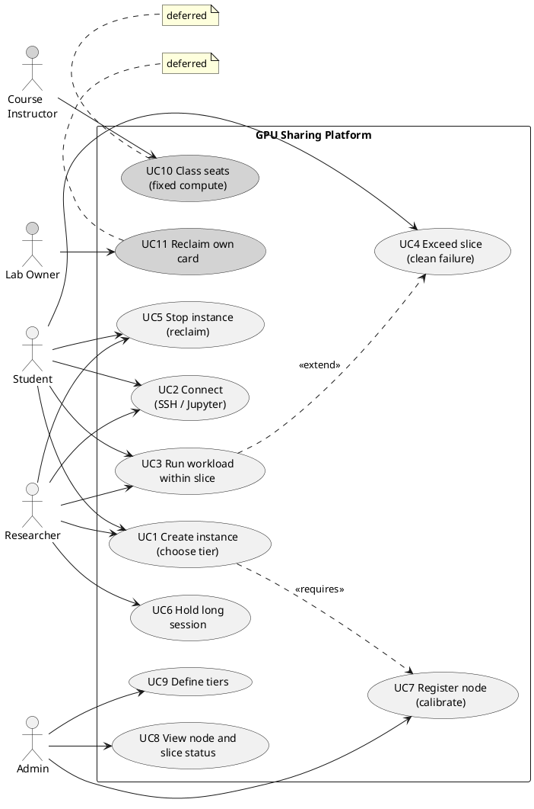
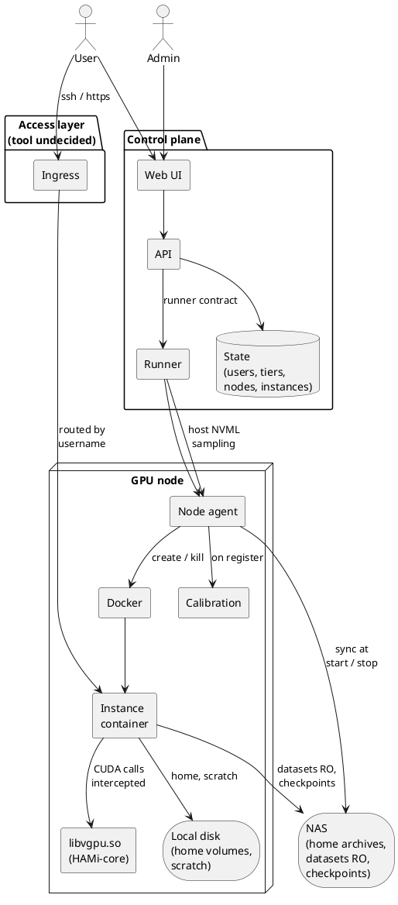
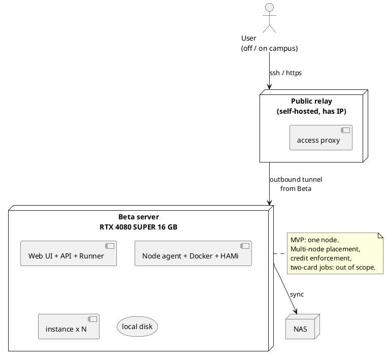
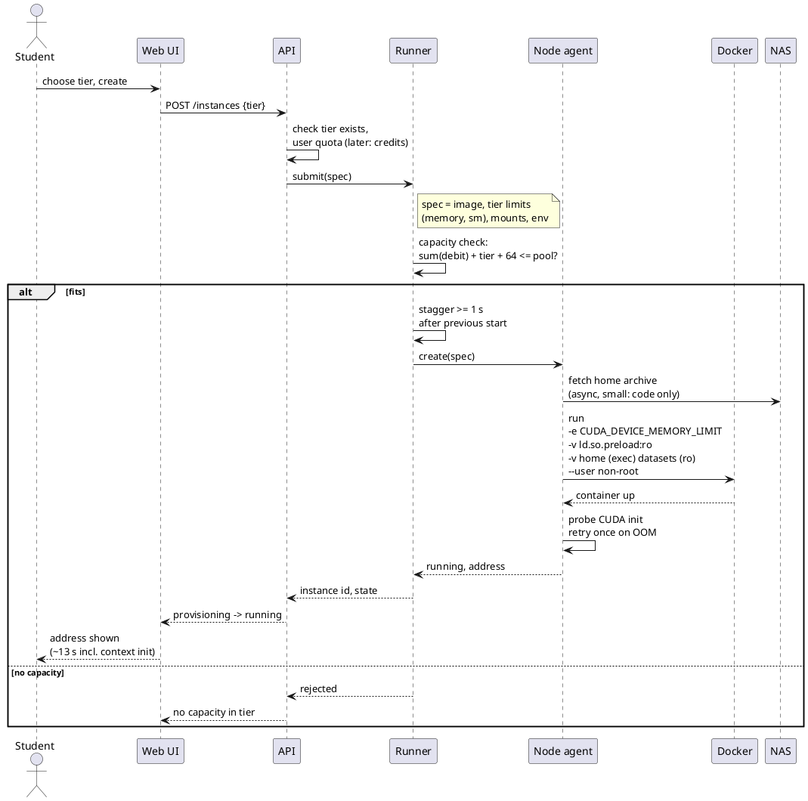
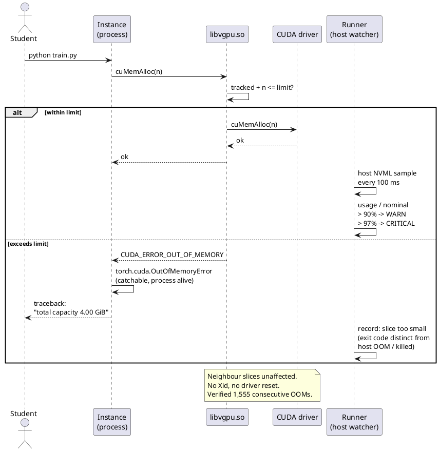
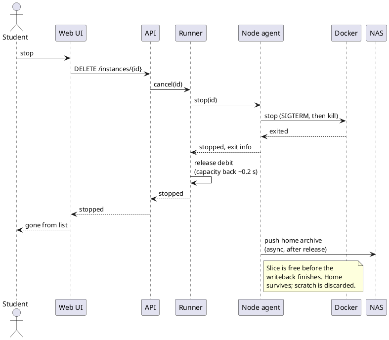
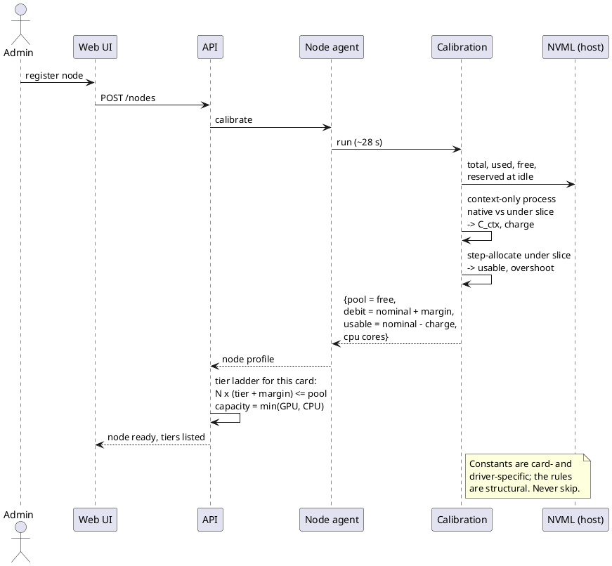
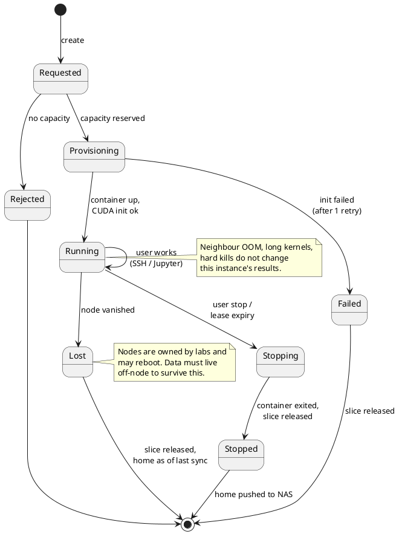
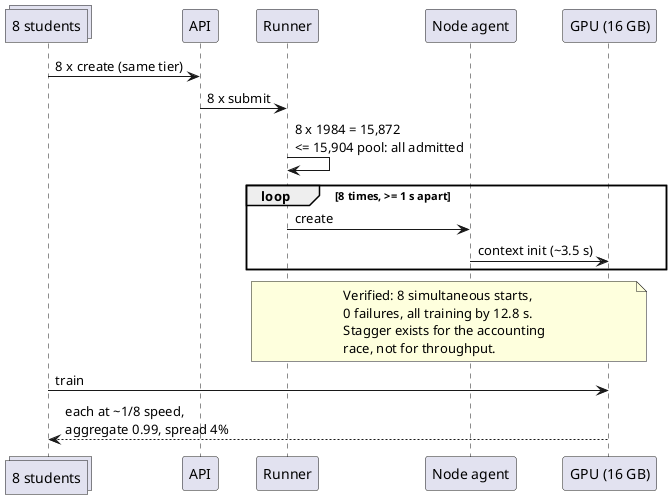

# [전체] 기획서 초안

Card ID: `cusqr7zcrq7ro3ribgyeqio6fea`

| Property | Value |
|---|---|
| 상태 | 작성중 |
| 종류 | 기획서 |
| 작성자 | @CodeHotel |
| 결재자 | 조직위 |
| 팀 | 전체 |
| 날짜 | 2026-09-16 |
| 주차 |  |
| 관련 링크 |  |

본 문서는 「GPU 공동 사용 플랫폼」의 목적과 사용자, 설계가 감당해야 할 제약, 카드 한 장을 여러 몫으로 나누어 공유하는 방식, 시연 범위와 결정·미결 사항을 정리한 기획서 초안을 소개한다. 8월의 구현 방식 검토와 9월 초의 기술검증 결과를 바탕으로 작성하였으며, 향후 기획팀이 기획서를 쓰고 개발·디자인·QA가 각자의 산출물을 설계할 때 출발점으로 활용할 목적을 가지고 있다.

> Non-image attachment omitted by archive policy

사용자가 티어를 고르면 API는 티어가 존재하는지, 나중에는 사용자에게 할당량이 남아 있는지도 확인한다. 실행기는 카드가 이미 내준 양에 이 티어의 크기와 고정 여유분을 더하여 합이 카드의 여유량을 넘으면 거절하고, 들어가면 그 장비에서의 직전 시작 뒤 1초 이상 기다리는데, 두 인스턴스가 같은 순간에 시작하고 하나가 곧바로 큰 메모리를 할당할 때 라이브러리의 회계에 경합이 생김을 확인했기 때문이다. 그런 뒤 에이전트에 컨테이너 생성을 지시하는데, `CUDA_DEVICE_MEMORY_LIMIT`를 설정하고, `/etc/ld.so.preload`를 읽기 전용으로 마운트하고, 홈 볼륨을 `exec`로 마운트하고, 데이터셋을 읽기 전용으로 마운트하고, root 아닌 사용자로 시작한다. 에이전트는 카드가 초기화되었는지 확인하고 되지 않았으면 한 번 다시 시도하며, 홈 아카이브는 그 뒤에 도착한다. 버튼을 누르고 약 13초 뒤에 사용자는 주소를 받는다.

### 실행과 몫 초과

할당 요청은 하나하나 HAMi-core를 거치며 합계에 더한 뒤 넘기거나 거절된다. 실행기는 인스턴스의 실제 사용량을 호스트 쪽 NVML에서 0.1초마다 읽고, 몫의 90%에서 경고를, 97%에서 위급을 최근 증가율에 근거한 남은 시간 추정과 함께 기록한다. 점진적 증가에는 수 초에서 수 분 앞서 경고가 나가며, 이전의 어떤 요청보다 큰 덩어리 하나를 요구하는 프로그램 단계에서 오는 갑작스러운 도약은 예측할 수 없으나 95% 위에 몇 분째 머무는 인스턴스는 그 자체가 경고 신호다. 요청이 거절되면 프로그램은 통상의 메모리 부족 예외를 보고 인스턴스는 살아 있다.

### 인스턴스 종료

컨테이너가 멈추면 메모리는 약 0.2초 안에 카드로 돌아오고 실행기는 몫을 즉시 여유량에 돌려준다. 홈 아카이브는 그 뒤에 공유 저장소로 전송되며, 그것이 끝나기 전에 사용자 목록에서는 인스턴스가 사라진다.

### 장비 등록

에이전트가 상수 산출을 수행하는 단계로, 유휴 상태에서 NVML이 보고하는 여유량을 읽고, 카드에 컨텍스트만 만들고 아무것도 하지 않는 프로세스를 시작하여 HAMi-core가 있을 때와 없을 때의 컨텍스트 비용을 재고, 상한 아래에서 거절될 때까지 단계적으로 할당하여 가용 상한이 실제로 어디인지 찾는다. 이 네 숫자에서 API가 장비의 여유량, 인스턴스당 여유분, 내부 가용 규칙, 그 카드의 티어 사다리를 도출한다. 약 30초 걸리며 필수 단계로, 이 단계 없이 편입된 장비는 티어 사다리가 맞지 않는다.

### 학급 동시 시작

학생 8명이 몇 초 사이에 같은 티어로 인스턴스를 만든다. 티어 크기와 여유분을 더한 값의 8배가 카드에 들어가므로 전부 받고, 실행기가 1초 간격으로 시작시킨다. 측정 결과 실패는 없었고 13초 안에 모든 인스턴스가 학습 중이었으며, 간격을 더 늘리면 오히려 느렸다.

## 14. 인스턴스 수명 주기

인스턴스는 요청 상태에서 시작하여 용량이 없으면 거절되고 있으면 준비 상태로 넘어간다. 준비는 실행 중으로 끝나거나 한 번 재시도한 뒤 실패로 끝나고, 실행 중은 사용자가 종료하거나 임대가 만료되거나 인스턴스가 있는 장비가 사라질 때까지 이어지며, 종료 중에는 몫을 돌려주고 홈 아카이브를 전송한다. 장비가 재부팅되거나 소유자가 회수하여 생기는 상실은 몫을 돌려주고 홈 디렉터리를 마지막 동기화 시점으로 남기며, 그래서 체크포인트가 공유 저장소로 바로 간다. 장비가 사라져도 손실은 많아야 마지막 체크포인트 이후의 작업이며 체크포인트 자체는 남는다.

## 15. 구현 제약

  위의 모든 내용이 구현에 요구하는 사항을 자리별로 묶는다.

  컨테이너와 이미지에서는 사용자를 root로 두지 않고, `/etc/ld.so.preload`는 읽기 전용으로 마운트하며, 홈 볼륨은 `exec`로 마운트하고, PyTorch의 선택 사항인 `cudaMallocAsync` 할당자는 제공하지 않는다. HAMi-core가 그 할당자의 스트림 캡처 경로를 잘못 다루기 때문이며 기본 할당자에서는 CUDA Graphs와 `torch.compile`이 정상이다. `/etc/ld.so.preload`를 지닌 컨테이너는 CUDA 라이브러리가 함께 주입되지 않으면 어떤 프로세스도 시작하지 못하므로 GPU 없는 작업용 환경은 별도 이미지가 필요하다. 이미지는 실행용과 CUDA 컴파일러가 든 개발용 둘이고 개발용이 15GB 크므로 어느 장비에 둘지 정해야 한다.

  용량 회계에서는 여유량을 유휴 상태의 NVML 빈 메모리로 잡고 모든 카드를 편입될 때 측정한다. 장비의 용량은 카드와 프로세서 코어와 디스크가 허용하는 수 중 가장 작은 값으로, 측정 중 인스턴스 8개의 데이터 로더가 코어 8개를 포화시켰다. 평가 배치도 작업의 메모리에 포함되어, 평가 단계가 학습의 가장 큰 덩어리보다 큰 덩어리 하나를 요구하는 학습 실행은 후반에 실패하며 측정한 한 사례에서는 실행의 94% 지점이었다.

  실행 시에는 시작을 1초 간격으로 하고 CUDA 컨텍스트 초기화 실패는 한 번 재시도하며 감시는 호스트 쪽 NVML로만 한다. 세 실패 원인, 곧 호스트 RAM에 대한 Docker의 `OOMKilled`, 외부 종료를 뜻하는 exit 137 단독, 몫 초과에 대한 프레임워크의 `OutOfMemoryError`를 구분한다. SM 제한은 두 모드로 존재하며 속도의 백분율로 서술하지 않는다.

  사용자 인터페이스에서는 가용 크기를 보이고, 공유하면 실행 시간이 이웃 수만큼 늘어난다는 사실을 그대로 알리며, 실습 좌석과 연구 세션은 다른 밀도로 채운다.

## 16. 결정과 미결

  결정 사항:

- 인스턴스 임대, 곧 사용자가 유지하는 환경이지 작업 스케줄링이 아니다.
- 작은 티어는 카드의 일부이고 가장 큰 티어는 카드 한 장 전체다.
- 메모리 몫은 가로채기로 강하게 강제하며 사용자는 root가 아니다.
- 계정, 티어별 요율을 가진 크레딧, 티어는 지금 만들며 운영 중에 조정할 수 있다. 최초 크레딧 배분만 장비 조사를 기다린다.
- 11장의 사용자 화면, 알림, 관리자 패널 전체.
- 처음부터 여러 장비이며 실행기가 그 사이에 인스턴스를 놓는다. 배치 규칙은 미결.
- 네 가지 저장소 분류와 비동기 경계.
- 장비 등록 때의 상수 산출, 절대 생략하지 않음.
- 두 연산 모드: 성적용 고정 비율, 연구용 우선순위 전용.
- 카드 둘 이상이 필요한 작업은 두 카드에 걸친 분할이 검증될 때까지 별도 경로로 카드를 통째로 받는다.

  미결 사항과 결정 방법:

- 접근 소프트웨어와 장비 간 트래픽의 오버레이 사용 여부는 9장의 네 가지 네트워크 측정을 연구실 장비에서 수행하여 정한다.
- 여러 장비의 배치 규칙은 구현 중에 정한다. 이 문서의 어느 내용도 특정 규칙에 의존하지 않는다.
- 측정한 카드 외의 티어 크기는 상수 산출로 정한다.
- 한 인스턴스 안에서 두 카드에 걸친 분할은 카드 둘이 있는 장비에서 한 시간의 시험으로 정한다.
- 최초 크레딧 배분은 장비 조사 뒤 정한다. 크레딧을 쓰고 조정하는 장치는 그와 무관하게 만든다.

  다음 단계로 미룬 사항:

- 시연 경로를 넘어서는 엄밀한 테스트.
- 학교 학사 시스템과의 계정 연동.
- 네이티브 모바일 앱. 모바일 웹 페이지로 부족하다고 드러나면.

## 부록 A. 측정값

  전부 소비자용 16GB 카드 한 장(RTX 4080 SUPER)과 최신 드라이버에서 세 차례에 걸쳐 측정했다.

| 항목 | 값 |
|---|---|
| 카드 위 프로세스당 고정 비용 | 물리 290MB, 몫에 계상 250MB |
| 몫 안의 가용량 | 명목 − 256MB |
| 몫당 카드에서 실제로 줄어드는 메모리 | 명목 + 32MB (계상은 + 64MB) |
| 드라이버 자체 예약 | 455MB, 여유량은 빈 메모리 15,904MB |
| 가로채기 라이브러리의 오버헤드 | 처리량의 1% 미만 |
| 몫 안 작업의 정확성 | 비분할과 비트 단위 일치 20 중 20, 3시간 연속 실행 204 중 204 |
| 연속 메모리 부족 거절, 드라이버 결함 | 1,555, 0 |
| 공유자 N명일 때 작업당 속도 저하 | 1/N ± 4%, N은 2에서 9 |
| 공유자 8명일 때 카드 총 산출 | 단독 작업의 99.3% |
| 8명 중 가장 빠른 작업과 느린 작업의 차이 | 4% |
| 동시 시작 8건 | 실패 0, 12.8초에 전부 학습 중 |
| 강제 종료 뒤 메모리 반환 | 0.22초 |
| 12시간 유지 세션 | 상한, 회계, 결과 모두 불변 |
| 다중 GPU 라이브러리의 통신 버퍼 | 몫에 계상됨 |
| 상수 산출 소요 | 28초 |
| 실행용 이미지, 개발용 이미지 | 6.3GB, 21.3GB |

## 부록 B. 그림 원본

### 사용 사례

### 구성

### 시연 배치

### 생성

### 상한

### 종료

### 등록

### 수명 주기

### 동시 시작

> Non-image attachment omitted by archive policy

> Non-image attachment omitted by archive policy

## Comments

_No comments._
