# [전체] 기획서 초안

Card ID: `cusqr7zcrq7ro3ribgyeqio6fea`

| Property | Value |
|---|---|
| 상태 | 작성중 |
| 종류 | 기획서 |
| 작성자 | @CodeHotel |
| 결재자 | 조직위 |
| 팀 | 전체 |
| 날짜 | 2026-09-16 |
| 주차 |  |
| 관련 링크 |  |

기획서의 초안이다. 8월의 구현 방식 검토와 9월 초의 기술검증 결과를 바탕으로 정상원이 썼고, 기획팀이 이 내용을 기획서 양식에 맞춰 다시 정리한다. 본문의 그림은 PlantUML로 그렸고 원본은 부록 B에 있다. 영문판은 이 카드에 첨부되어 있다.

---

2026-09-04 초안. 인터페이스와 화면과 시스템 계층을 설계할 사람들을 위한 작업 문서로, 플랫폼의 목적, 사용자와 사용 방식, 설계가 감당해야 할 제약, 그리고 공유가 실제로 동작하는 방식을, 컴퓨터과학 배경은 있으나 GPU 가상화 경험은 없는 사람이 읽고 그 위에 만들 수 있을 만큼 풀어 적는다.

접근 도구, 웹 스택, 데이터베이스, 스케줄링과 라우팅 알고리즘은 뒤에 정하며, 무엇을 택하든 이 문서의 내용은 달라지지 않는다. 이 문서의 수치는 모두 실제 장비에서 측정한 값이고, 제약은 모두 실제로 시험하여 확인한 사실이다.

그림은 `diagrams/`에 있고 원본은 마지막 부록에 있다.

## 1. 목적

  학부 안의 연구실들은 각자 GPU를 구입한다. 한 연구실이 자체 실험을 위해 구입한 카드는 그 연구실의 누군가가 쓰고 있을 때만 동작하므로 밤과 주말에는 대개 유휴 상태이고, 그 사이 카드가 없는 다른 연구실은 실험을 미루거나 클라우드 비용을 지불한다. 학부 전체의 카드를 합치면 연산 능력이 적지 않은데도 소유 단위로 갈라져 있어 정작 필요한 곳에서는 쓰지 못한다.

  플랫폼은 연구실이 등록한 카드를 하나로 묶어 소유 연구실이 쓰지 않는 시간을 다른 사람이 쓰게 하되, 소유 연구실이 자기 카드에 갖는 우선권은 유지한다. 사용자는 두 부류이고 요구가 다르다. 연구자는 자기 도구와 자기 데이터를 쓰면서 카드의 큰 몫을 하루 이상 유지하는 작업환경을 원하고, 실습 수강생은 40명이 동시에 두 시간의 수업 동안 같은 데이터셋으로 같은 과제를 하기 위한 작고 균일한 환경을 원한다.

  1단계는 시연으로 마무리되며, 시연은 서버 한 대에서 이루어진다. 학생이 크기를 고르고 인스턴스를 받아 접속하고 상한 안에서 모델을 학습시키고 종료하면 용량이 돌아오는 흐름을 영상으로 기록하여, 지도교수가 다른 연구실과 교무회의에 제시한다. 그 뒤의 소프트웨어는 최소 기능이 아니라 완성된 제품을 목표로 하여 계정, 크레딧, 운영 중에 바꿀 수 있는 티어, 관리자 패널, 여러 장비, 알림까지 포함하며, 시연 경로를 넘어서는 엄밀한 테스트, 연구실별·개인별 크레딧 배분 수치, 학교 학사 시스템과의 계정 연동 세 가지만 다음 단계로 남긴다.

## 2. 사용자 관점

### 실습 수강생

  학생은 학번으로 로그인해 빈 목록을 보고, 가장 작은 실습용 티어를 고르고 생성을 누르면 약 15초 뒤에 접속 주소가 나타난다. 개인 컴퓨터에 이미 있는 SSH 클라이언트로 접속하거나 브라우저에서 주피터 노트북(Jupyter Notebook)을 열면 수업에서 쓰는 라이브러리가 설치되어 있고 수업용 데이터셋이 이미 놓여 있는 리눅스 환경이 있으며, 그 안에서 카드는 몇 GB의 메모리를 가진 장치로 보이는데 그것이 이 학생의 몫이다. 과제를 실행하다가 몫보다 큰 모델을 올리려 하면 프로그램은 분명한 메모리 부족 오류로 멈추지만 그 밖에는 아무 일도 일어나지 않아, 환경은 그대로 있고 같은 반 학생들은 영향을 받지 않는다. 긴 실행 중에 메모리 사용량이 상한에 가까워지면 실패하기 전에 브라우저로, 그리고 켜 두었다면 휴대전화로도 알림이 오고, 목록 옆에 보이는 크레딧 잔액은 인스턴스가 켜져 있는 동안 티어에 따른 속도로 줄어든다. 종료하면 파일은 다음 세션을 위해 남고 카드의 몫은 1초 안에 비워진다.

  같은 카드에는 다른 학생 7명이 동시에 올라 있다. 각자 카드 전체 속도의 약 1/8로 동작하는데 과제에는 충분하며, 서로를 볼 수도 서로에게 영향을 줄 수도 없다.

### 연구자

  연구자는 큰 티어를 골라 하루 이상 유지한다. 홈 디렉터리는 세션이 바뀌어도 유지되어 지난주에 설치한 라이브러리가 그대로 있고, 큰 데이터셋은 공유 저장소에 있어 복사 없이 저장소의 속도 그대로 읽을 수 있다. 학습 중에 저장하는 체크포인트는 그 공유 저장소에 바로 기록되므로 인스턴스가 실행 중인 장비를 소유 연구실이 재부팅해도 체크포인트는 남는다. 가장 큰 티어는 이웃이 전혀 없는 카드 한 장 전체로, 간섭이 문제가 되는 작업에 쓴다.

### 관리자

  관리자는 연구실이 제공한 장비를 등록한다. 플랫폼이 카드를 측정하는 데 1분이 걸리지 않으며, 측정이 끝나면 크기별로 몇 개의 인스턴스를 담을 수 있는지 알 수 있다. 그 뒤로 관리자는 장비별·카드별로 어느 몫이 누구에게 배정되어 있는지를 보는데, 이 수치는 인스턴스 안이 아니라 호스트 쪽 NVML에서 읽으므로 믿을 수 있다. 티어와 크레딧 요율은 같은 패널에서 운영 중에 조정하므로, 더 큰 좌석이 필요한 수업에는 재배포 없이 설정값 하나만 바꾸어 대응한다. 연구실이 표준 이미지에 없는 라이브러리를 요청하면 관리자가 이미지에 추가하는데, 사용자가 시스템 패키지를 직접 설치할 수 없는 이유는 아래에서 설명한다.

## 3. 제약

  이하의 내용은 대부분 여섯 가지 사실에서 나오며, 어느 것도 설계상의 선호가 아니다.

  장비는 새로 사지 않고 연구실이 이미 보유한 카드를 쓴다. 세대가 다르고 메모리 크기가 다른 소비자용 카드이며 각 카드는 구입한 연구실에 물리적으로 남으므로, 설계는 제각각인 카드를 균일한 좌석처럼 보이게 해야 하고, 카드를 가정하지 않고 하나하나 측정해야 하며, 어느 장비든 소유자가 재부팅하면 예고 없이 사라질 수 있다고 전제해야 한다.

  제약이 되는 자원은 연산이 아니라 메모리다. 모델과 학습 배치는 카드 메모리에 들어가면 실행되고 들어가지 않으면 바로 실패하는 반면 연산은 속도만 좌우하므로, 메모리는 정확히 배정하고 강하게 강제해야 하며 연산은 대략 나누어도 된다.

  실습에는 40명이 동시에 들어온다. 카드 12장으로 이 인원을 감당하려면 카드 한 장에 여러 학생이 올라야 하며, 카드를 통째로 내주는 설계는 그 밖의 장점이 무엇이든 이 인원을 감당하지 못한다. 이 사실 하나가 시스템의 형태를 정했다고 해도 지나치지 않다.

  캠퍼스 망은 들어오는 연결을 받지 않으므로 캠퍼스 안의 장비가 바깥의 닿을 수 있는 지점으로 먼저 연결해야 한다. 이는 접근 계층을 제약하지만 플랫폼이 하는 일을 바꾸지는 않는다.

  사용자는 자기 환경 안에서도 관리자가 될 수 없다. 메모리 몫을 강제하는 장치가 파일 하나이고 관리자라면 그 파일을 고칠 수 있으므로, 사용자에게 관리자 권한을 주면 몫은 권고가 된다. 그래서 사용자는 일반 계정과 자기 라이브러리를 설치할 방법을 받고, 시스템 수준 패키지는 관리자를 거친다.

  기간은 여름 한 철이고 팀은 작으므로 성숙한 오픈소스가 있는 영역은 만들지 않고 도입한다. 플랫폼은 기존 부품들을 잇는 연결부와 정책이며, 새로 만드는 부분은 7장에서 설명하는 한 가지뿐이다.

## 4. 설계상의 고려

  공유로 얻는 것은 속도가 아니라 수용력이다. 한 카드에 8명이 올라가면 각자 약 1/8을 받으며, 카드 전체의 산출은 거의 그대로 유지되어 측정값으로 99%였지만 누구의 작업도 공유로 빨라지지는 않는다. 플랫폼이 제공하는 것은 처리량이 아니라 실행 가능성과 예측 가능성이며, 이는 수업에 맞는 조건이고 연구자의 긴 실행에 가장 큰 티어가 카드 한 장 전체인 이유이기도 하다.

  편의보다 강제를 우선한다. 권고에 그치는 메모리 몫은 차라리 없는 편이 나은데, 몫을 넘긴 사용자 때문에 아무 잘못 없는 이웃의 작업이 중단되기 때문이다. 플랫폼은 몫을 강하게 강제하며 그 대가로 사용자는 root를 갖지 못하고 설정 하나는 잠기지만, 사용자가 실제로 하는 일인 파이썬 라이브러리 설치, 노트북 실행, 자기 도구 사용은 전부 root 없이 되고 시스템 패키지만 관리자가 필요하다.

  시간 비용은 세션이 아니라 경계에 둔다. 사용자는 환경 준비에 1분이 걸리는 일은 받아들이지만 그 안에서 라이브러리 설치에 1분이 걸리면 고장으로 받아들이므로, 데이터는 시작과 종료 때 옮기고 세션은 로컬 디스크에서 실행한다.

  작은 몫은 나누고 큰 몫은 카드 한 장이다. 공유의 까다로운 성질인 간섭과 이웃 간 공정성은 이웃이 있을 때만 문제가 되므로, 공유를 작은 티어에 한정하면 그 복잡함은 감당할 수 있는 작업에만 남고 길고 큰 작업은 전용 장비를 받는다.

  결과를 숨기지 않는다. 사용자가 보는 크기는 명목 수치가 아니라 실제로 쓸 수 있는 크기이고, 메모리 부족은 막연한 실패가 아니라 몫이 부족하다는 사실로 알린다. 이 시스템에서 사용자가 읽는 숫자는 그대로 판단의 근거가 된다.

## 5. 배경

  이 문서의 나머지는 운영체제와 링킹과 GPU 프로그래밍의 몇 가지 개념과 그 위에 세워진 오픈소스 프로젝트 하나를 전제한다. 이 장은 각 개념을 앞의 개념에 기대는 순서로 소개하여 컴퓨터과학 일반의 배경만 있는 독자가 6장부터 16장까지를 다른 자료 없이 따라갈 수 있게 하며, CUDA와 동적 연결과 컨테이너에 이미 익숙한 독자는 5.4의 HAMi와 5.7의 네트워크 용어만 보면 되고 전부 익숙하면 6장으로 건너뛰어도 된다.

### 5.1 GPU 소프트웨어 계층

  그래픽 카드는 독자적인 프로세서와 메모리를 가진 별개의 장치다. 그 메모리를 VRAM이라 부르며 컴퓨터의 RAM과는 별개로, 모델과 파라미터와 지금 처리 중인 데이터 배치가 카드에서 계산되려면 여기에 놓여야 하고, 들어가지 않으면 아무것도 실행되지 않으며 RAM이 대신하지도 못한다. 이 프로젝트가 쓰는 소비자용 카드의 VRAM은 8~24GB다.

  사용자 프로그램은 카드를 직접 다루지 않는다. 운영체제 커널 안의 드라이버가 장치를 소유하여 카드의 메모리를 매핑하고 작업을 대기열에 넣고 인터럽트를 처리하며, 드라이버 위의 사용자 공간에는 NVIDIA가 CUDA라는 프로그래밍 인터페이스를 두어 PyTorch든 TensorFlow든 JAX든 모든 기계학습 프레임워크는 결국 CUDA를 호출하는 프로그램이다. 이 문서에서 프로그램이 GPU를 쓴다는 말은 CUDA를 호출한다는 뜻이다.

  CUDA는 층을 이루는 공유 라이브러리 둘로 제공된다. 프레임워크는 편리한 인터페이스를 제공하는 런타임 라이브러리 `libcudart`에 연결하고, 런타임 라이브러리는 다시 드라이버 라이브러리 `libcuda`를 호출하는데, 드라이버 라이브러리는 드라이버와 함께 배포되며 하드웨어 앞의 마지막 사용자 공간 코드다. VRAM 할당 요청과 카드에 보내는 작업은 모두 이 두 라이브러리를 차례로 통과하므로 둘 사이에 놓인 라이브러리는 무엇이든 모든 호출을 보며, 이 층 구조가 중요한 이유가 여기에 있다.

  작업 자체는 커널 단위로 제출된다. GPU에서 말하는 커널은 카드에서 실행되도록 컴파일된 함수로, 호스트 프로그램이 몇 개의 병렬 스레드로 실행할지를 지정해 실행시킨다. 학습 한 단계는 커널을 수백에서 수천 개 실행하며, 행렬 곱처럼 밀리초 단위로 실행되는 큰 커널도 있고 원소별 덧셈처럼 마이크로초에 끝나는 작은 커널도 있다. 카드는 커널을 스트리밍 멀티프로세서, 곧 SM에서 실행하며 소비자용 카드에는 수십에서 백여 개의 SM이 있다. 뒤에서 프로그램의 연산 몫이라 하면 그 프로그램이 받는 SM 시간의 비율을 뜻하며, 이 문서에서 커널은 언제나 GPU 커널이고 운영체제의 커널은 OS 커널로 적는다.

  프로세스가 VRAM을 할당하거나 커널을 실행하기 전에 드라이버는 그 프로세스를 위한 CUDA 컨텍스트, 곧 카드 위의 페이지 테이블과 명령 큐와 컴파일된 코드의 작은 캐시를 만든다. 이 상태는 카드에 존재하며 VRAM을 차지하는데, 이 프로젝트에서 측정한 카드에서는 290MB로, 프로세스가 자기 메모리를 요구하기 전에 프로세스마다 드는 비용이다. 한 카드에 프로세스 둘이면 컨텍스트도 둘이며, 이 고정 비용이 용량 계산에서 가장 중요한 숫자로 드러난다.

  카드의 상태는 별도 인터페이스인 NVML(NVIDIA Management Library)로 본다. NVML은 프로세스별 메모리 사용량, 사용률, 온도, 결함을 보고하며, 명령줄 도구 `nvidia-smi`는 NVML이 돌려주는 값을 그대로 출력하는 도구다. NVML 질의를 호스트에서 하는지 격리된 환경 안에서 하는지에 따라 보고 내용이 달라지는데 그 이유는 5.4에서 설명한다. 결함 자체는 드라이버가 Xid라는 번호 코드로 기록하며, Xid가 없는 실행은 드라이버가 비정상을 감지하지 않은 실행이다.

### 5.2 동적 연결과 가로채기

  프로그램은 자기가 호출하는 모든 함수의 코드를 담고 있지 않다. 공유 라이브러리를 이름으로 지정해 두면 시작할 때 로더가 지정된 라이브러리를 프로세스에 매핑하고, 아직 해결되지 않은 함수 이름 각각을 적재 순서상 그 이름의 함수를 내보내는 첫 라이브러리에 연결한다. 어느 라이브러리가 어느 호출에 답하는가는 프로그램의 의도가 아니라 순서의 문제다.

  그 순서는 프로그램 바깥에서 바꿀 수 있다. 환경변수 `LD_PRELOAD`는 로더가 다른 어떤 라이브러리보다 먼저 매핑해야 할 라이브러리를 지정하며, 그 라이브러리가 내보내는 함수는 프로그램이 실제로 요구한 라이브러리의 같은 이름보다 먼저 발견되므로 재컴파일 없이 어떤 라이브러리 함수든 대체할 수 있다. 다만 환경변수이므로 프로세스가, 또는 프로세스를 시작하는 사람이 지울 수 있고 지우면 대체는 사라진다.

  같은 효과를 그 약점 없이 내는 파일이 있다. 로더는 시스템의 모든 프로세스에 대해 `/etc/ld.so.preload`를 참조하여 거기 적힌 라이브러리를 프로세스의 환경과 무관하게 먼저 적재하므로, 그 파일을 제어하는 쪽이 모든 프로세스가 무엇을 먼저 적재할지를 정한다. 격리된 환경 안에 바깥에서 읽기 전용으로 마운트하면 안에서는 바꿀 수 없다.

  같은 이름을 내보내는 라이브러리를 다른 라이브러리 앞에 놓아 호출이 먼저 새 라이브러리로 가게 하는 기법을 가로채기(interposition)라 한다. 가로채는 라이브러리는 호출을 살피고, 세고, 거절하고, 인자를 바꾸고, 그대로 실제 구현에 넘길 수 있으며 질의에 자기가 정한 값으로 답할 수도 있다. HAMi가 하는 모든 일은 CUDA 드라이버 라이브러리에 대한 가로채기다.

### 5.3 컨테이너

  컨테이너는 파일 시스템, 네트워크, 프로세스 목록, 사용자 목록을 따로 가진 프로세스 묶음으로, 같은 장비의 다른 묶음과 격리되되 그 장비의 OS 커널을 공유한다. 두 번째 커널을 부팅하지 않으므로 가상 머신보다 가볍고 같은 이유로 격리는 덜하며, 이 프로젝트에서 사용자 인스턴스는 모두 컨테이너다.

  컨테이너는 이미지, 곧 운영체제의 사용자 공간 파일과 그 위에 설치된 라이브러리와 도구를 담은 파일 시스템 스냅샷에서 시작한다. 여기서는 프레임워크와 수업용 라이브러리가 든 실행용 이미지와, 자기 커널을 직접 쓰는 사용자를 위해 CUDA 컴파일러를 더한 개발용 이미지 둘을 쓴다. 컨테이너보다 오래 남아야 하는 저장소는 볼륨으로 붙이며 바깥에서 컨테이너의 파일 시스템 안으로 마운트하는데, 사용자의 홈 디렉터리가 볼륨이고 그것을 쓰는 컨테이너는 버려도 된다.

  여기서 쓰는 컨테이너 런타임은 Docker다. 이미지에서 컨테이너를 만들고, 볼륨을 붙이고, NVIDIA의 컨테이너 툴킷을 통해 카드와 그 라이브러리를 주입하고, RAM과 CPU에 상한을 건다. Docker가 혼자서 하지 못하는 일이 VRAM 상한이며 그 틈을 HAMi가 메운다.

  컨테이너의 두 가지 세부 사항이 이 설계를 좌우한다. 첫째, 컨테이너 안의 root는 그 장비의 관리자가 아니라 컨테이너 안에서만의 관리자이지만, 바깥에서 읽기 전용으로 마운트된 파일이 아닌 한 컨테이너가 보는 어떤 파일이든 바꿀 수 있으며 거기에는 preload 파일도 포함된다. 둘째, 파일 시스템은 `noexec`로 마운트할 수 있어 그 위의 프로그램 실행과 라이브러리 적재가 금지되는데, Docker의 기본 임시 공간은 RAM에 두는 파일 시스템인 tmpfs를 정확히 그렇게 마운트한다. 임시 공간에는 무해하지만 설치된 파이썬 패키지를 담을 홈 디렉터리에는 치명적인데, 패키지 대부분이 컴파일된 요소를 포함하기 때문이다.

### 5.4 HAMi

  이 부품들이 갖춰지면 HAMi는 한 문단으로 설명된다. HAMi(Heterogeneous AI Computing Virtualization Middleware)는 Apache 2.0 라이선스의 오픈소스 프로젝트로 2026년 중반부터 Cloud Native Computing Foundation의 인큐베이팅 단계에 있으며, 같은 해 NVIDIA가 자사의 오픈소스 스케줄러에 그 핵심 구성 요소를 병합했다. 통상 Kubernetes 장치 플러그인으로 배포되나 이 프로젝트는 핵심 구성 요소만을 Kubernetes 없이 Docker 위에서 단독으로 쓰며, 상위 저장소의 문서는 이 구성을 예제 하나로 다룬다.

  그 핵심 구성 요소 HAMi-core는 CUDA 드라이버 라이브러리를 가로채는 공유 라이브러리 하나, `libvgpu.so`다. 5.2의 preload 방식으로 컨테이너의 프로세스에 적재되어 세 가지를 한다.

  VRAM을 제한하며 이 제한은 강하다. 컨테이너 안 어느 프로세스의 할당 호출이든 이 라이브러리를 거치고, 누적 합계를 유지하다가 요청이 환경변수 `CUDA_DEVICE_MEMORY_LIMIT`로 정한 상한을 넘기면 드라이버에 넘기지 않고 CUDA의 통상적인 메모리 부족 오류를 돌려주는데, 프레임워크는 그 오류를 이미 처리한다. 합계는 프로세스가 아니라 컨테이너 단위로 유지되므로 포크로 피할 수 없고, 카드 사이에 데이터를 옮기는 라이브러리가 쓰는 경로를 포함해 CUDA의 모든 할당 경로에 적용된다.

  연산도 제한하지만 이 제한은 약하다. 두 번째 변수 `CUDA_DEVICE_SM_LIMIT`가 백분율을 정하면 HAMi-core는 커널 실행을 토큰 버킷으로 계량하여, 실행마다 토큰 하나를 소비하고 백그라운드 스레드가 백분율에 맞는 속도로 토큰을 채우며 토큰이 없는 실행은 토큰이 생길 때까지 대기한다. 카드는 분할되지 않으며 프로그램은 작업을 제출하는 순간에 느려지는데, 이것이 공정성에 미치는 영향은 7장에서 측정한다.

  NVML을 가상화한다. 컨테이너 안에서의 질의는 컨테이너의 상한을 카드의 총 메모리로, 컨테이너의 사용량을 카드의 사용량으로 돌려주므로 NVML이 보고하는 용량에 맞춰 자기 크기를 정하는 프로그램은 자기 몫에 맞게 정한다. 이는 컨테이너 안에서 읽은 NVML이 카드가 아니라 몫을 보고한다는 뜻이기도 하므로, 플랫폼은 모든 관측에 호스트의 NVML을 쓴다.

  HAMi는 드라이버 440 이상의 모든 NVIDIA 카드를 지원하며 아키텍처 하한이 없다. 한 컨테이너에 여러 카드를 각각의 상한으로 넣을 수 있고 메모리와 연산 격리를 함께 또는 따로 쓸 수 있으며, 하드웨어에 분할 기능을 요구하지 않으므로 NVIDIA 자체의 분할 기능이 없는 소비자용 카드에서 동작한다.

  HAMi의 한계도 셋 있다. 하드웨어 분할이 아니므로 드라이버 라이브러리를 아예 우회하는 프로그램이 있다면 HAMi도 우회되겠으나 그런 프로그램은 실제로 없다. 스케줄러가 아니므로 컨테이너 하나의 상한을 강제할 뿐 다른 컨테이너를 알지 못하며, 카드에 무엇을 넣을지는 플랫폼이 정한다. 결함도 있어 검증에서 셋을 찾았고 각각 회피 방법이 있으며 해당하는 절에서 설명한다.

### 5.5 플랫폼의 용어

  남은 용어는 이 문서에서 정한다. 몫(share, slice)은 한 컨테이너가 받는 카드의 부분으로 VRAM 상한과 연산 비율이다. 티어(tier)는 사용자가 인스턴스를 만들 때 고르는 이름 붙은 크기로 VRAM 상한과 연산 비율과 디스크 할당량이며, 카드 세대별로 정의하여 같은 티어가 다른 카드에서 같은 능력을 뜻하게 한다. 여유량(pool)은 카드가 실제로 내줄 수 있는 VRAM으로, 유휴 상태에서 NVML이 비어 있다고 보고하는 양이며 카드의 총량에서 드라이버가 자기 몫으로 예약한 양을 뺀 값이다. 시분할(time-slicing)은 카드가 여러 프로그램을 동시에 처리하는 방식으로, 한 프로그램의 커널을 한동안 실행하고 다른 프로그램의 커널로 넘어가기를 빠르게 반복하며, 연산 제한이 없으면 그 전환은 커널 시간 기준으로 공정하여 긴 커널을 가진 프로그램이 카드를 더 오래 차지한다. 작업 보존(work-conserving)은 제한이 있어도 아무도 원하지 않는 유휴 용량을 프로그램이 자기 몫을 넘어 쓸 수 있는 성질이며, HAMi의 연산 제한에는 이 성질이 없고 10장에서는 그 점을 오히려 이용한다. 상수 산출(calibration)은 특정 카드와 드라이버에서 회계가 의존하는 상수, 곧 컨텍스트 비용과 그중 HAMi가 계상하는 양, 상한과 카드의 실제 감소분 사이의 초과분, 여유량을 측정하는 일로 장비를 등록할 때 한 번 수행한다.

### 5.6 저장소

  NAS는 네트워크에 연결된 저장 장치로, 모든 장비가 마운트하는 파일 서버다. 데이터셋이 요구하는 큰 순차 읽기는 잘 처리하지만 작은 파일 수천 개가 든 홈 디렉터리가 만드는 작은 연산 수천 건은 잘 처리하지 못하며, 이 비대칭 때문에 홈 디렉터리는 파일 하나하나가 아니라 아카이브 하나로 옮긴다. 사용자의 홈 볼륨은 세션 동안 장비의 로컬 디스크에 있고 세션 사이에는 NAS에 아카이브되는 영속 디렉터리이며, 스크래치는 중간 파일을 위한 영속성 없는 로컬 디스크다.

### 5.7 네트워크

  캠퍼스 망 안의 장비는 나가는 연결은 허용하고 들어오는 연결은 막는 방화벽 뒤에 있으며, 이 비대칭이 네트워크 문제의 전부다. 캠퍼스 밖의 사용자나 공개 서버 위의 서비스는 연구실 장비로 연결을 열 수 없고 연구실 장비가 먼저 열어야 하는데, 이를 위한 일반적 기법이 역방향 터널이다. 연구실 장비가 공인 주소를 가진 중계 서버로 바깥을 향해 연결하고 그 연결을 열어 두면 중계 서버가 연구실 장비 앞으로 오는 트래픽을 그 터널로 되돌려 보내므로, 캠퍼스 안의 모든 장비가 바깥으로만 연결하며 들어오는 규칙도 전산실에 요청할 방화벽 예외도 필요 없다.

  같은 발상을 공유하되 연결이 생긴 뒤 트래픽이 어디로 흐르는가에서 갈리는 설계가 둘 있다. 프록시 설계에서는 모든 바이트가 중계 서버를 지나므로 단순하고 언제나 동작하지만 중계 서버의 대역폭이 모두의 상한이 된다. 오버레이 네트워크에서는 중계 서버가 양 끝에 서로의 주소를 알려 주고 각자의 방화벽을 지나 경로를 열도록 도울 뿐이며, 그 뒤로는 둘이 직접 트래픽을 주고받고 중계 서버는 아무 트래픽도 전달하지 않는다. 그 직접 경로가 열리는지는 캠퍼스 NAT가 주소를 어떻게 바꾸는지와 UDP를 내보내는지에 달렸고, 기관 망 가운데는 그렇지 않은 곳이 있어 그런 곳에서는 오버레이도 결국 중계에 의존한다. 이 캠퍼스에 어느 설계가 맞는지는 측정으로 정한다.

  연결이 플랫폼에 닿으면 알맞은 인스턴스를 찾아야 한다. SSH 연결에는 사용자 이름이 담기므로 장비 앞에 둔 SSH 라우터가 그것을 읽어 그 이름이 가리키는 인스턴스로 세션을 넘기며, 사용자는 인스턴스가 어디서 실행되든 주소 하나만 본다. 웹 도구는 리버스 프록시를 통해 사용자에게 닿는데, 리버스 프록시는 그 하나의 주소 아래의 서브도메인이나 경로를 특정 인스턴스 안의 포트로 대응시킨다.

## 6. 방식의 선택

### 6.1 검토한 선택지

  GPU를 공유하는 플랫폼은 여러 층에서 개입할 수 있고 어느 층이냐에 따라 사용자가 받는 단위가 달라진다. 프로젝트는 네 가지를 검토한 끝에 하나로 정했으며, 그 이유가 플랫폼의 성격을 정하므로 여기에 적어 둔다.

  가장 투명한 선택지는 사용자의 프로그램을 제자리에 두고 GPU 호출 하나하나를 네트워크 너머의 카드로 전달하는 방식으로, 프로그램은 바뀌지 않고 카드가 어디 있는지도 모른다. 이 선택지는 일찍 제외했는데, 학습 한 단계가 초당 수천 번 하는 CUDA 호출 하나하나가 네트워크 왕복이 되어, 공개된 측정에 따르면 이 캠퍼스에 없는 저지연 전용 인터커넥트 위에서조차 1.4배에서 5.5배 느려지며, 이를 실제 운영에 쓰는 곳은 찾지 못했다. 광역망 너머로 전달하는 변형은 같은 이유로 더 심하게 실패한다.

  프로젝트의 최초 방향은 두 번째 선택지인 작업 스케줄링이었다. 사용자가 프로그램을 쓰고 카드 몇 장을 몇 시간 쓰겠다는 요청과 함께 제출하면 플랫폼이 대기열에 넣고 카드가 비면 통째로 배정해 실행한 뒤 결과를 돌려주는 방식으로, 대학 슈퍼컴퓨팅 센터가 이렇게 운영되고, 이를 위한 성숙한 소프트웨어가 대기열과 형평성 회계와 예산과 소유권 우선순위까지 갖추고 이미 있어 새로 만들 필요 없이 설정만 하면 된다. 최초 구상은 한 단계 더 나아가, 예측 엔진이 각 작업의 메모리와 실행 시간을 코드에서 추정하여 사용자가 자기 요구량을 짐작하지 않아도 플랫폼이 카드를 빈틈없이 채우게 하려는 구상이었다.

  그 방향은 검토 중에 드러난 세 가지 이유로 제외했다. 첫째, 이 방향이 의존하는 예측 연구가 이 환경에 대해서는 존재하지 않는다. 공개된 연구는 균일한 카드와 빠른 인터커넥트를 가진 데이터센터 장비를 대상으로 하고, 작업이 들어가는지를 실제로 결정하는 메모리가 아니라 실행 시간을 예측하며, 여러 작업이 한 카드를 나누는 경우는 다루지 않는다. 관련해 보였던 유일한 데이터셋은 카드 모델 하나와 신경망 한 계열만 다루고 모델은 공개하지 않았다. 예측기를 만드는 일은 그 자체로 연구 과제이며, 그 연구에 필요한 데이터는 이런 플랫폼이 운영된 뒤에야 생긴다. 둘째, 스케줄러가 내주는 최소 단위는 카드 한 장이고 카드 12장으로 실습 40명은 어떤 스케줄러로도 되지 않는 계산이므로, 가장 큰 사용자 집단에는 단위가 맞지 않는다. 셋째, 제출된 작업은 사용자가 로그인하지 않은 장비에서 실행되므로 연구자가 실제로 의지하는 대화형 도구인 노트북, 디버거, 실시간 학습 대시보드가 기대대로 동작하지 않으며, 연구자들의 작업 방식을 검토한 결과 직접 들어가 작업할 수 없는 환경은 쓰지 않는다는 점이 분명해졌다.

  세 번째 선택지인 인스턴스 임대는 사용자의 작업을 대신 실행해 주는 것이 아니라 동작하는 환경을 건넨다. 크기를 고르면 카드의 몫이 든 컨테이너를 받고 그 안에서 평소 쓰던 도구로 원하는 만큼 오래 일한다. 프로젝트 시작 때는 몰랐던 두 가지 사실이 이를 가능하게 했다. 하나는 기존 오픈소스 라이브러리로 카드를 강제된 몫으로 나눌 수 있다는 사실로, 검토에서 찾았고 세 차례 검증으로 확인했는데, 프로젝트를 시작한 회의는 분할이 불가능하다고 보고 카드 통째 배정으로 정한 바 있었다. 다른 하나는 그 라이브러리가 쓰는 가로채기 기법에 대해 같은 것을 상용 제품으로 파는 한국 회사가 특허를 갖고 있다는 사실이다. 그 회사에 직접 허락을 구했으나 거절당했다. 제3자의 오픈소스 구현을 도입하는 일은 특허받은 방법을 직접 구현하는 일과 법적 위치가 다르며, 지도교수는 특허 문제를 걸림돌로 삼지 말라고 지시했다.

  지도교수와의 긴 논의 끝에 인스턴스 임대를 택하고 예측은 후속 연구 방향으로 남겼다. 소비자용 카드를 나눠 쓰는 환경의 실사용 기록은 어디에도 없으므로 플랫폼의 운영 기록이 그 연구를 처음으로 가능하게 할 것이다. 스케줄러라면 안에 만들었을 두 가지, 곧 연구실과 사용자별 배분량과 몫의 정확한 크기는 설정으로 다루며, 이 문서의 나머지는 택한 방식을 설명한다.

### 6.2 택한 방식의 요약

  이유를 빼고 보면 플랫폼이 하는 일은 다음과 같다.

  사용자가 그래픽 카드의 몫을 소, 중, 대 가운데 골라 요청하면 그 몫이 든 전용 리눅스 환경을 받는다. 그 환경은 그 크기의 그래픽 카드가 달린 개인용 장비처럼 보이고 그렇게 동작하므로, SSH로 로그인하거나 브라우저에서 주피터 노트북을 열고, 필요한 라이브러리를 설치하고, 원하는 프로그램을 실행하고, 원하는 만큼 켜 두며, 끄면 파일은 남고 몫은 다른 사람이 쓰도록 돌아간다.

  그 뒤에서는 물리 카드 한 장이 그런 환경 여럿을 동시에 처리한다. 각 환경의 카드 메모리 몫은 고정되어 있고 강제되어, 몫보다 많이 요구하는 프로그램은 거절되고 그 거절은 같은 카드의 다른 누구에게도 영향을 주지 않는다. 카드의 연산 시간은 번갈아 나누는데, 성적을 매기는 수업이면 균등하게, 연구자들이 나눠 쓰면 우선순위대로다.

  카드를 제공한 연구실은 카드를 연구실에 두고 우선권을 유지하며, 플랫폼은 그 카드가 유휴였을 시간을 쓴다. 관리자가 장비를 한 번 등록하면 플랫폼이 카드를 측정하고, 그 뒤로는 그 카드가 크기별로 몇 개의 환경을 담을 수 있는지 알고 그에 따라 사용자의 크레딧을 차감한다.

  사용자가 하는 모든 일은 개인 컴퓨터에 이미 있는 도구로 주소 하나를 통해 이루어지며, 사용자 쪽에 설치할 프로그램도 바꿀 코드도 없다.

## 7. 카드 분할 방식

  선례가 없는 부분이다.

### 7.1 가로채기

  카드를 쓰는 모든 프로그램은 CUDA 드라이버 라이브러리를 통해 카드와 통신한다. 프레임워크가 VRAM을 원하면 런타임 라이브러리를 호출하고, 런타임 라이브러리가 드라이버 라이브러리를 호출하고, 드라이버 라이브러리가 드라이버에 요청하고, 드라이버가 주소를 돌려주며, 프레임워크는 하드웨어와 직접 통신하지 않는다.

  HAMi-core는 드라이버 라이브러리를 가로챈다. 런타임이 할당 함수를 호출하면 HAMi-core가 먼저 받아 이 컨테이너가 받은 VRAM의 누적 합계를 유지하다가, 새 요청으로 합계가 `CUDA_DEVICE_MEMORY_LIMIT`를 넘게 되면 드라이버에 요청하지 않고 CUDA의 메모리 부족 오류를 돌려주고, 그렇지 않으면 호출을 넘기고 합계를 갱신한다. 프레임워크는 차이를 알 수 없으며, 드라이버도 OS 커널도 사용자의 프로그램도 바꾸지 않는다는 이 점이 플랫폼이 존재할 수 있는 이유다.

  같은 가로채기가 NVML에도 적용되어 컨테이너 안의 프로그램은 자기 몫을 카드 전체로 본다. 커널 실행에도 적용되어 연산이 나뉘는데, 토큰 버킷이 프로그램의 실행을 지연시켜 SM 시간의 더 작은 부분을 받게 하며, 그 제한은 메모리 제한보다 약하고 7.4에서 측정한다.

HAMi-core는 컨테이너 자신의 프로세스가 적재하므로 사용자가 끌 수 없는 방식으로 적재되어야 한다. `LD_PRELOAD`만으로는 변수를 지우면 무력화되며 이는 시험으로 확인했는데, 4GB 몫의 사용자가 6GB를 할당할 수 있었다. 컨테이너에 읽기 전용으로 마운트한 `/etc/ld.so.preload`는 우회되지 않았으며, 이 파일에 대해 시도한 모든 우회가 실패했고 런타임 라이브러리를 정적으로 링크한 프로그램도 그러했다. 그런 프로그램도 드라이버 라이브러리만은 동적으로 호출하는데 HAMi-core가 끼어드는 지점이 거기이기 때문이다. 이 파일이 사용자가 root일 수 없는 이유이기도 한데, 컨테이너 안의 root라면 그것을 고쳐 쓸 수 있다.

  이상은 모두 사용자 공간에서 일어난다. 드라이버도, OS 커널도, 카드 자체의 분할 기능도 건드리지 않으며 그래서 보통의 소비자용 카드에서 동작한다.

### 7.2 고정 비용

  두 가지 오버헤드가 몫을 명목 크기보다 작게 만들며, 둘 다 측정하여 상수로 잡았다.

  카드를 쓰는 모든 프로세스에는 자기 메모리를 할당하기 전에 CUDA 컨텍스트 비용이 드는데, 측정한 카드에서 290MB다. HAMi-core는 그중 250MB를 컨테이너의 몫에 계상하고 나머지 40MB는 계상하지 않으므로, 명목 4GB를 받은 컨테이너는 실제로 약 3.75GB를 할당할 수 있고 카드에서는 실제로 약 4.03GB가 줄어든다. 이 차이는 크기와 무관하게 일정하므로 플랫폼은 두 가지 단순한 규칙으로 계상한다. 사용자가 쓸 수 있는 양은 명목 크기에서 256MB를 뺀 값이고, 카드가 내주는 양은 명목 크기에 64MB를 더한 값이다.

  카드의 총 VRAM도 전부 쓸 수 있지는 않다. 드라이버가 자기 몫으로 예약하는 양이 있는데 측정한 카드에서 약 455MB로, 이는 빈 메모리로 나타나지 않는다. 플랫폼이 나누는 여유량은 유휴 상태에서 NVML이 비어 있다고 보고하는 양이지 제품 사양의 숫자가 아니며, 총량을 쓰면 이 차이만큼 모든 카드를 초과 배정하게 되는데 검증 중에 한 번 그렇게 했다가 발견했다.

  두 숫자는 카드와 드라이버와 적재된 라이브러리에 따라 다르지만 규칙은 다르지 않다. 그래서 모든 카드는 편입될 때 한 번 측정하며 그 측정은 생략할 수 없다.

### 7.3 티어와 정규화

  티어는 사용자가 고르는 이름 붙은 크기로, 메모리 상한과 연산 비율과 디스크 할당량이다. 플랫폼 설계의 중심 발상은 메모리와 연산이 독립된 두 축이라는 점이다. 약 4GB에 약 10TFLOPS로 정의한 티어는 중급 카드에서는 4GB에 연산 비율 절반이고 고급 카드에서는 4GB에 약 1/8인데, 두 카드의 메모리 대비 연산 비율이 다르기 때문이다. 단일 비율로는 두 축을 동시에 맞출 수 없고 독립된 두 값으로는 맞출 수 있으며, 이렇게 해야 제각각인 기증 카드들이 서로 바꿔 쓸 수 있는 좌석이 된다. 균일한 장비를 갖춘 데이터센터에는 없는 문제다.

  연산 비율은 카드 세대 안에서만 실제 속도를 따라가므로 티어는 세대별로 정의하며, 메모리는 정확하므로 티어 사다리는 메모리를 기준으로 구성한다. 검증에 쓴 16GB 소비자용 카드에서 측정한 사다리는 다음과 같다.

| 카드당 인스턴스 | 명목 크기 | 내부 가용 | 수용 작업 |
|---|---|---|---|
| 8 | 1,920MB | 1,664MB | 작은 합성곱 신경망 실습 과제 |
| 4 | 3,904MB | 3,648MB | 기본 크기 언어 모델 미세조정 |
| 3 | 5,184MB | 4,928MB | 이미지 생성 추론 |
| 2 | 7,872MB | 7,616MB | 큰 비전 모델 또는 작은 언어 모델 |
| 1 | 15,808MB | 15,552MB | 측정한 전부 |

  각 행은 인스턴스 수 × (명목 크기 + 64MB) ≤ 여유량이라는 규칙 하나에서 나온다. 크기는 반올림한 값이 아니라 여유량을 채우는 값으로 골랐는데, 반올림한 크기로는 이 중 두 행에서 좌석이 하나 줄어든다. 각 행은 그 크기의 실제 학습 작업으로 카드를 가득 채우고 하나하나 결과가 맞는지 확인했다.

  고정 비용의 결과 하나는 분명히 적어 둘 필요가 있다. 가장 작은 티어에서는 과제 자체의 메모리를 빼면 프로세스 하나분의 고정 오버헤드 정도만 남으므로 학생이 두 번째 노트북을 열면 두 번째는 시작되지 않는다. 티어는 관리자가 운영 중에 바꾸는 설정이므로 이는 설계가 아니라 구성의 문제이며, 노트북 둘이 필요한 수업의 담당자는 실습 티어를 한 단계 올리면 되고 그것이 카드당 좌석을 얼마나 줄이는지는 사다리에서 읽을 수 있다.

### 7.4 공유 비용의 측정

  카드의 시분할은 프로그램이 아니라 커널 시간을 기준으로 공정하다. 긴 커널 몇 개를 실행하는 프로그램이 짧은 커널 여럿을 실행하는 프로그램보다 카드를 오래 차지하여, 측정에서 무거운 모델 하나가 가벼운 모델 5개와 카드를 나눌 때 무거운 쪽에 정당한 몫의 거의 두 배가 배정되었고 가벼운 쪽은 각각 몇 %씩 줄었다. 연구용 환경에서는 받아들일 만하지만 성적을 매기는 수업에서는 그렇지 않은데, 우연히 무거운 모델을 쓴 학생이 같은 반 학생보다 많은 연산을 받기 때문이다.

  SM 제한이 이를 바로잡는데, 두 가지 성질을 측정했고 둘 다 설계에 영향을 준다. 첫째, 백분율은 속도의 백분율이 아니어서, 큰 커널을 실행하는 프로그램은 50% 설정에서 속도의 92%를 유지하는 반면 잦은 동기화와 함께 작은 커널을 실행하는 프로그램은 거의 비례해 54%로 느려진다. 둘째, 이 제한은 작업 보존이 아니어서 25%로 제한된 프로그램은 카드의 나머지가 비어 있어도 대기 상태를 유지한다. 연구용 환경에서는 낭비이고 시험에서는 오히려 필요한 성질인데, 시험에서는 같은 반의 몇 명이 실행하고 있든 모든 학생의 속도가 같아야 하기 때문이다. 그래서 플랫폼은 10장에서 설명하는 두 가지 연산 모드를 둔다.

  메모리 제한만 두고 같은 학습 작업 8개를 한 카드에 올렸을 때 각각은 1/8 속도의 ±4% 안에서 실행되었고, 가장 느린 작업과 가장 빠른 작업의 차이는 4%였으며, 카드 전체의 산출은 작업 하나가 혼자 낼 때의 99%였다. 9개까지 들어갔고 10번째는 시작 시 분명한 오류로 실패했으며 9개는 영향을 받지 않았다. 한계는 스케줄링이 아니라 메모리다.

### 7.5 몫 초과

  HAMi-core가 할당을 거절하면 프레임워크는 통상의 메모리 부족 예외를 일으키고, 프로그램은 그것을 잡고 메모리를 비우고 계속할 수 있으며, 컨테이너는 죽지 않고 카드에는 이상이 없다. 이를 1,555회 연속으로 시험했고 Xid는 0이었다. 실패할 때까지 일부러 할당을 반복하는 이웃, 3초 길이의 작업 단위를 연달아 제출하는 이웃, 할당 도중 죽는 이웃은 옆 환경을 느리게 하되 결과는 바꾸지 않았으며, 다섯 가지 작업이 그 이웃들 각각과 함께 실행될 때 비트 단위로 같은 출력을 냈다.

  플랫폼은 세 가지 실패 원인을 구분하는데 각각 다른 대응이 필요하기 때문이다. 환경이 장비의 일반 RAM을 너무 써서 강제 종료된 경우, 바깥에서 종료시킨 경우, 자기 프로그램이 카드의 몫을 넘긴 경우이며, 마지막 경우만 사용자가 스스로 고칠 수 있으므로 그렇게 알린다.

## 8. 저장소

  세션은 장비의 로컬 디스크에서 실행되며 데이터는 시작과 끝에 옮기되 파일 하나하나가 아니라 아카이브 하나로 옮기는데, 네트워크 파일 시스템은 파일마다 비용이 들고 홈 디렉터리에는 파일이 수천 개이기 때문이다. 사용자의 홈 디렉터리는 인스턴스가 시작할 때 공유 저장소에서 가져오고 종료하거나 크기를 바꿀 때 되돌리며 세션 사이에 유지된다. 큰 데이터셋과 모델 가중치의 공유 캐시는 공유 저장소에 읽기 전용으로 마운트하여 두고 복사하지 않는데, 크고 순차로 읽히므로 네트워크 저장소에 맞는 일이다. 사용자가 학습 중에 저장하는 체크포인트는 로컬 디스크가 아니라 공유 저장소로 바로 가서 장비가 사라져도 남으며, 스크래치는 로컬 디스크에 두고 세션이 끝나면 버린다.

  두 경계는 모두 비동기로 처리한다. 처음 30초 안에 자기 파일이 필요한 사람은 없으므로 홈 아카이브가 다 도착하기 전에 환경이 시작되고, 전송이 끝나기를 기다렸다가 몫을 돌려줄 이유가 없으므로 아카이브가 다 나가기 전에 몫을 여유량에 돌려준다.

  두 가지는 검증 중에 겪은 뒤에야 알았다. 홈 볼륨은 `exec`로 마운트해야 하는데, Docker의 기본 tmpfs는 `noexec`이며 그러면 컴파일된 요소를 가진 모든 파이썬 라이브러리가 원인을 알리지 않는 오류로 적재에 실패한다. 로컬 디스크도 용량 변수가 되어, 장비가 담는 인스턴스 수는 카드와 프로세서 코어뿐 아니라 디스크에도 제한되므로 티어마다 디스크 할당량을 둔다.

## 9. 접근

  모든 인스턴스에는 고정된 주소 하나로 접속한다. SSH는 사용자 이름 말고는 라우팅할 근거가 없으므로 사용자 이름에 학번을 담고, 장비 앞의 라우터가 그것을 인스턴스가 어디서 실행되든 알맞은 인스턴스로 대응시키며, 웹 도구는 사용자가 인스턴스 페이지에서 켜는 인스턴스별 프록시를 통해 같은 방식으로 접속한다.

  모든 운영체제에 이미 있는 SSH 클라이언트 말고는 아무것도 설치하지 않은 개인 컴퓨터에서의 접속은 다음과 같다.

```
ssh 2020112028@compute.dongguk.edu
```

  이 명령으로 사용자의 기본 인스턴스에 들어간다. 인스턴스가 여럿인 사용자는 각각에 이름을 붙이고 그 이름은 사용자 이름에 붙는다.

```
ssh 2020112028-lab3@compute.dongguk.edu
```

  인스턴스는 일반 SSH 호스트이므로 파일 전송도 일반 도구로 한다.

```
scp results.csv 2020112028@compute.dongguk.edu:~/
rsync -av ./project/ 2020112028@compute.dongguk.edu:~/project/
```

  SSH 설정 파일에 항목 하나를 두면 주소가 이름 하나로 줄고, 원격 확장을 가진 편집기를 포함해 SSH를 쓰는 모든 도구가 더 설정 없이 동작한다.

```
Host gpu
  HostName compute.dongguk.edu
  User 2020112028
  IdentityFile ~/.ssh/id_ed25519
```

  그 뒤로는 `ssh gpu`로 접속하고 원격 편집 확장은 `gpu`를 가리키면 된다.

  안에서는 사용자의 몫이 카드 전체인 것처럼 보이며, 드라이버의 상태 도구도 그렇게 보고한다.

```
$ nvidia-smi --query-gpu=memory.total,memory.used --format=csv
memory.total [MiB], memory.used [MiB]
4096, 312
```

  몫보다 많이 요구하는 프로그램은 프레임워크의 통상적인 메모리 부족 오류를 보며 몫이 카드의 용량으로 보고된다.

```
torch.cuda.OutOfMemoryError: CUDA out of memory. Tried to allocate 512.00 MiB.
GPU 0 has a total capacity of 4.00 GiB of which 8.00 MiB is free.
```

  이 뒤에도 프로세스는 살아 있으므로 사용자는 메모리를 비우거나 배치를 줄이고 계속한다.

  웹 도구에는 같은 신원에서 파생된 주소로 브라우저에서 접속한다.

```
https://2020112028.compute.dongguk.edu/          → 노트북
https://2020112028.compute.dongguk.edu/tb/       → 학습 대시보드, 켰을 때
```

### 네트워크 요구 사항

  접근 계층은 네 가지 다른 용도를 감당하며, 같은 소프트웨어를 여러 번 배치하여 네 가지를 모두 감당할 것으로 본다. 개발 중에는 시스템을 만드는 사람들이 어디서든 연구실 장비에 셸로 들어갈 수 있어야 하고, 운영 중에는 사용자가 위에 보인 `ssh`와 브라우저 경로로 공인 주소 하나에 닿아 자기 인스턴스로 라우팅되어야 한다. 모든 세션의 시작과 끝에는 홈 아카이브가 각 장비와 NAS 사이를 오가며 대역폭이 문제가 되는 흐름은 이것 하나로, 40명이 동시에 시작하면 아카이브 40개가 전송된다. 유지보수를 위해서는 사용자용과 별도의 배치가 운영자에게 장비로 들어가는 경로를 주어, 사용자용 경로가 고장났을 때도 그 경로는 동작해야 한다.

  캠퍼스 망은 들어오는 연결을 막으므로 이 흐름 하나하나가 캠퍼스 안의 장비가 공인 주소를 가진 중계 서버로 바깥을 향해 연결하는 데서 시작한다는 점까지는 알고 있다. 접근 소프트웨어를 고르기 전에 연구실 장비에서 측정해야 할 항목은 네 가지다. 첫째, 캠퍼스 NAT가 어떻게 동작하고 UDP를 내보내는지로, 이 결과가 오버레이가 직접 경로를 열 수 있는지 아니면 전부 중계해야 하는지를 정한다. 둘째, 다른 망 구역에 있는 연구실 장비 둘이 서로 직접 닿는지다. 셋째, GPU 장비에서 NAS에 터널 없이 닿는지로, 닿는다면 대용량 전송 문제는 통째로 사라진다. 넷째, 학교에 연구실 장비 위의 오버레이 네트워크에 대한 정책이 있는지다.

  이 네 가지 답에 따라 두 형태 중 하나가 정해진다. 직접 경로가 되고 정책이 허용하면 오버레이가 모든 장비에 고정 주소를 주어 실행기는 세션마다 전송 경로를 만들고 없앨 일이 없으며 라우팅은 조회 하나로 끝난다. 그렇지 않으면 프록시 설계가 어디서든 동작하고 각 인스턴스의 전송 경로는 실행기가 관리하는 상태가 된다. 어느 형태도 위의 명령을 바꾸지 않으며, 그 차이는 사용자에게는 보이지 않지만 실행기에는 실질적이다.

## 10. 연산 모드

  성적을 매기는 수업에서는 세션의 모든 인스턴스가 부하와 무관하게 고정된 연산 비율을 받는다. 7.4에서 본 작업 보존이 아닌 성질을 의도적으로 이용하는 모드로, 학생 간 공정성이 유휴 사이클의 완전한 활용보다 중요하기 때문이다.

  연구에서는 두 인스턴스가 실제로 경합하지 않는 한 연산 제한을 두지 않으며, 경합하면 제한이 우선순위로 작동하여 소유 연구실의 작업을 외부 사용자의 작업보다 앞세운다. 아무도 필요로 하지 않는 제한 때문에 유휴 카드가 묶이는 일은 없다.

  어느 모드에서도 이 설정을 사용자에게 성능의 백분율로 표시하지 않는데, 실제로 성능의 백분율이 아니기 때문이다.

## 11. 화면

### 사용자 화면

  로그인 화면에는 학번과 비밀번호 입력란, 그리고 연동할 수 있다면 학교의 통합 로그인만 두고 다른 것은 두지 않는다.

  내 인스턴스 화면은 목록이며 위에 사용자의 크레딧 잔액과 지금의 감소 속도가 있다. 각 행은 인스턴스 하나로, 이름, 티어, 상태(준비 중, 실행 중, 종료 중, 종료됨), 실행 시간, 가용 크기 대비 메모리 사용량 막대를 보이고, 실행 중인 행은 접속 주소와 종료 버튼을 함께 보인다. 빈 목록에는 생성 버튼 하나만 있다.

  생성 화면은 이 사용자가 고를 수 있는 티어들을 각각의 가용 메모리, 디스크 할당량, 지금 비어 있는 수와 함께 보인다. 수업이면 실습 티어가 미리 선택되고 나머지는 숨기므로 한 번만 누르면 된다.

  인스턴스 상세 화면은 접속 명령을 그대로 복사할 수 있게 보인다. 웹 도구 프록시 스위치는 주피터 노트북이 기본으로 켜져 있고 나머지는 켤 때까지 꺼져 있으며, 두 경고 문턱이 표시된 사용량 막대와 그 문턱을 넘을 때 브라우저뿐 아니라 휴대전화로도 알릴지의 스위치, 종료 버튼, 그리고 종료된 인스턴스에는 같은 티어나 다른 티어로 되살리는 버튼이 있다.

  알림은 브라우저로, 그리고 사용자가 원하면 휴대전화로 푸시한다. 메모리 경고, 시작 실패, 장비가 사라져 상실된 인스턴스, 0에 가까운 크레딧 잔액이 대상이다. 휴대전화 쪽은 휴대전화에서 동작하는 웹 페이지이지 네이티브 앱이 아니며, 필요하다고 드러나면 그때 만든다.

### 관리자 대시보드

  장비 화면은 등록된 모든 장비를 보인다. 이름, 소유 연구실, 모델과 세대로 표시된 카드, 마지막 측정 일자, 티어별로 몇 개의 인스턴스를 담을 수 있는지의 용량과 지금 담고 있는 수를 보이며, 보고를 멈춘 장비는 맨 위에 표시된다. 동작은 새 장비 등록, 재측정, 비우기(새 인스턴스를 받지 않고 실행 중인 인스턴스가 끝나기를 기다림)다.

  카드 화면은 카드마다 지금 배정된 몫들을 여유량에 비례한 크기로 그리고 각각에 사용자와 티어를 붙이며, 각 몫 옆에 호스트에서 측정한 사용량과 경고 상태를 보인다. 이 카드에 지금 누가 있고 각자 상한에 얼마나 가까운지에 답하는 화면이다.

  인스턴스 화면은 모든 장비의 모든 인스턴스를 사용자, 티어, 장비, 상태로 거른다. 여기서 관리자가 인스턴스를 종료할 수 있으며 이것이 플랫폼이 주는 유일한 강제 조치이고, 사유는 기록한다.

  티어 화면은 카드 세대별 사다리로, 명목 크기, 가용 크기, 연산 비율, 디스크 할당량, 카드당 인스턴스 수를 보인다. 운영 중에 고칠 수 있으며 크기를 바꾸면 측정 상수로 적합 수를 다시 계산하고, 티어가 고정 비율인지 우선순위 전용인지도 여기서 정한다.

  크레딧 화면은 티어별 시간당 요율, 연구실과 사용자별 잔액, 조정 이력을 보이며 잔액 부여와 요율 변경은 언제든 여기서 한다. 장비 조사 결과에서 최초 배분을 계산하는 기능은 아직 없으며, 조사가 끝난 뒤에 넣는다.

  이미지 화면은 각 장비가 실행용과 개발용 중 어느 이미지를 갖는지와 마지막으로 만든 때, 그리고 각 이미지의 라이브러리 목록을 보인다. 특정 라이브러리를 넣어 달라는 요청이 들어오는 자리다.

  이벤트 화면은 시간순 피드로, 경고 문턱을 넘은 인스턴스, 시작 실패와 그 이유, 보고가 끊긴 장비, 측정 결과를 최신 순으로 보인다. 여기 있는 항목 자체로 조치가 필요하지는 않으나 사용자가 문제를 보고했을 때 관리자가 보는 곳이다.

  관리자의 모든 수치는 호스트 쪽 감시에서 오며 환경 안에서 읽은 수치는 없다.

## 12. 시스템 구조

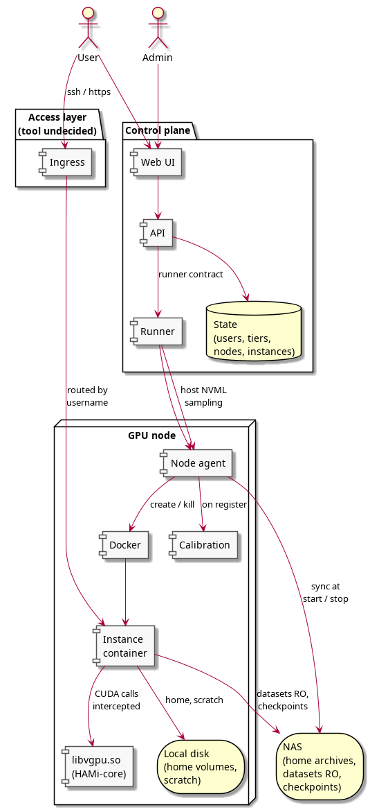

11장의 화면들로 이루어진 웹 인터페이스가 사용자, 티어, 장비, 인스턴스를 소유하는 API 위에 있고, API는 실행기와 통신한다. 실행기는 용량을 관리하는 부품으로, 각 장비의 각 카드가 내준 양을 세고, 새 요청이 들어가는지와 어느 장비에 들어가는지를 판정하고, 그 장비의 에이전트에 인스턴스를 만들거나 없애라고 지시하고, 모든 인스턴스를 호스트 쪽 NVML로 감시한다. 인스턴스 안에서는 보지 않는데, 거기서는 HAMi-core가 카드가 아니라 몫을 보고하기 때문이다. 각 장비의 에이전트는 컨테이너 런타임을 제어하고, 홈 아카이브를 공유 저장소와 주고받고, 장비가 등록될 때 상수 산출을 수행한다.

  실행기와 API 사이의 경계는 시스템 계층과 응용 계층이 만나는 곳이므로 어느 쪽을 만들기 전에 적어 두어야 한다. 대략 다음이 필요하다고 본다. 사양 제출과 식별자 발급, 식별자를 통한 상태·주소·현재 사용량·경고·종료 사유 조회, 취소, 목록 조회, 장비 용량 조회, 상태 변화 구독이다. 사양에는 이미지, 메모리 상한, 연산 비율, 마운트 대상, 환경변수, 사용자 신원이 들어간다.

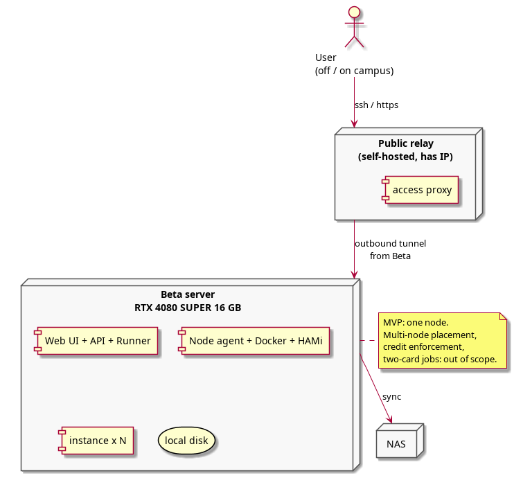

시연은 서버 한 대에서 실행되지만 설계는 여러 대를 전제한다. 장비마다 에이전트가 동작하고 실행기는 그 전부의 용량을 관리하며, 새 인스턴스를 그중 어디에 놓을지는 실행기가 판정한다. 배치 규칙은 아직 정하지 않았고 설계를 세우는 데 필요하지도 않다. 캠퍼스 밖의 공인 주소를 가진 중계 서버가 진입점이 되고 각 장비가 거기로 바깥을 향해 연결하므로 캠퍼스 안에 들어오는 규칙이 필요 없다.

## 13. 흐름

### 인스턴스 생성

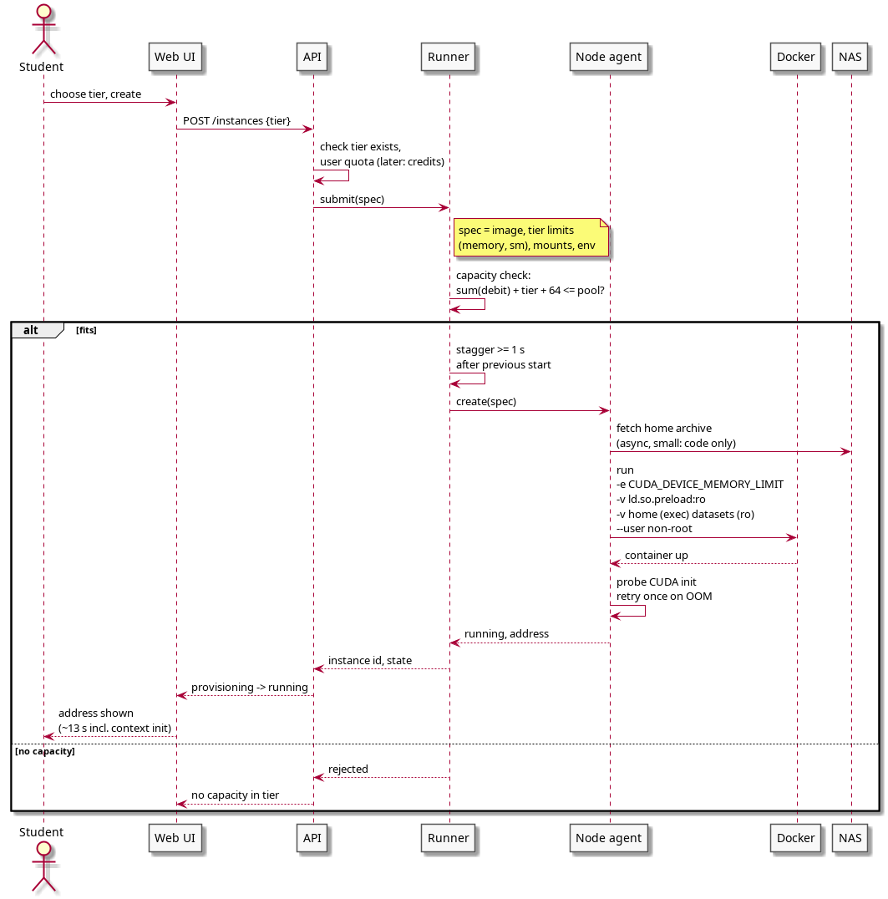

사용자가 티어를 고르면 API는 티어가 존재하는지, 나중에는 사용자에게 할당량이 남아 있는지도 확인한다. 실행기는 카드가 이미 내준 양에 이 티어의 크기와 고정 여유분을 더하여 합이 카드의 여유량을 넘으면 거절하고, 들어가면 그 장비에서의 직전 시작 뒤 1초 이상 기다리는데, 두 인스턴스가 같은 순간에 시작하고 하나가 곧바로 큰 메모리를 할당할 때 라이브러리의 회계에 경합이 생김을 확인했기 때문이다. 그런 뒤 에이전트에 컨테이너 생성을 지시하는데, `CUDA_DEVICE_MEMORY_LIMIT`를 설정하고, `/etc/ld.so.preload`를 읽기 전용으로 마운트하고, 홈 볼륨을 `exec`로 마운트하고, 데이터셋을 읽기 전용으로 마운트하고, root 아닌 사용자로 시작한다. 에이전트는 카드가 초기화되었는지 확인하고 되지 않았으면 한 번 다시 시도하며, 홈 아카이브는 그 뒤에 도착한다. 버튼을 누르고 약 13초 뒤에 사용자는 주소를 받는다.

### 실행과 몫 초과

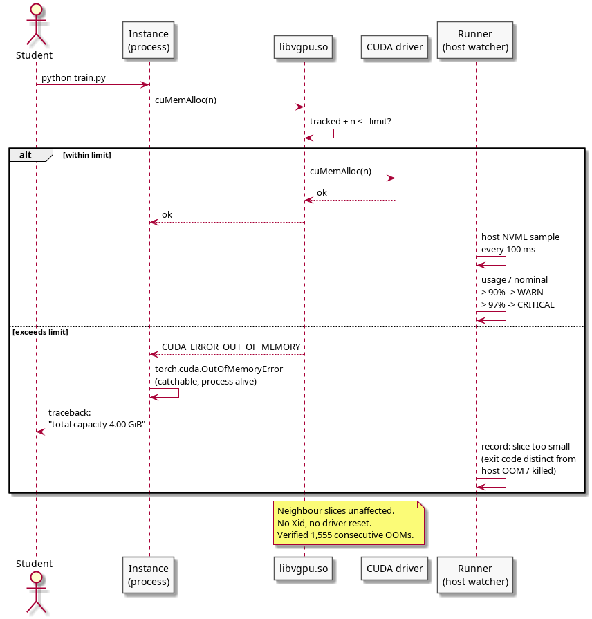

할당 요청은 하나하나 HAMi-core를 거치며 합계에 더한 뒤 넘기거나 거절된다. 실행기는 인스턴스의 실제 사용량을 호스트 쪽 NVML에서 0.1초마다 읽고, 몫의 90%에서 경고를, 97%에서 위급을 최근 증가율에 근거한 남은 시간 추정과 함께 기록한다. 점진적 증가에는 수 초에서 수 분 앞서 경고가 나가며, 이전의 어떤 요청보다 큰 덩어리 하나를 요구하는 프로그램 단계에서 오는 갑작스러운 도약은 예측할 수 없으나 95% 위에 몇 분째 머무는 인스턴스는 그 자체가 경고 신호다. 요청이 거절되면 프로그램은 통상의 메모리 부족 예외를 보고 인스턴스는 살아 있다.

### 인스턴스 종료

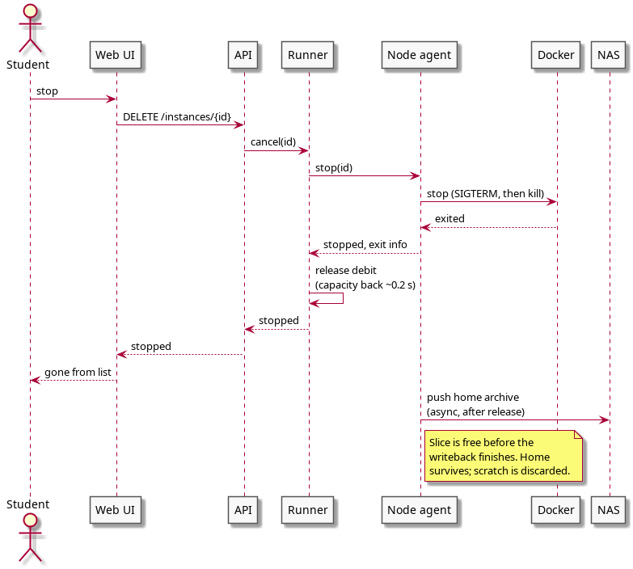

컨테이너가 멈추면 메모리는 약 0.2초 안에 카드로 돌아오고 실행기는 몫을 즉시 여유량에 돌려준다. 홈 아카이브는 그 뒤에 공유 저장소로 전송되며, 그것이 끝나기 전에 사용자 목록에서는 인스턴스가 사라진다.

### 장비 등록

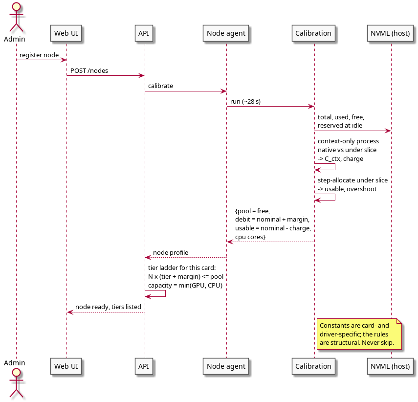

에이전트가 상수 산출을 수행하는 단계로, 유휴 상태에서 NVML이 보고하는 여유량을 읽고, 카드에 컨텍스트만 만들고 아무것도 하지 않는 프로세스를 시작하여 HAMi-core가 있을 때와 없을 때의 컨텍스트 비용을 재고, 상한 아래에서 거절될 때까지 단계적으로 할당하여 가용 상한이 실제로 어디인지 찾는다. 이 네 숫자에서 API가 장비의 여유량, 인스턴스당 여유분, 내부 가용 규칙, 그 카드의 티어 사다리를 도출한다. 약 30초 걸리며 필수 단계로, 이 단계 없이 편입된 장비는 티어 사다리가 맞지 않는다.

### 학급 동시 시작

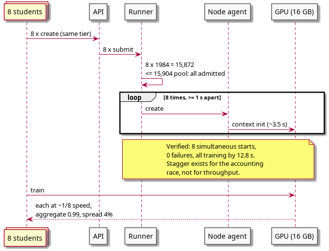

학생 8명이 몇 초 사이에 같은 티어로 인스턴스를 만든다. 티어 크기와 여유분을 더한 값의 8배가 카드에 들어가므로 전부 받고, 실행기가 1초 간격으로 시작시킨다. 측정 결과 실패는 없었고 13초 안에 모든 인스턴스가 학습 중이었으며, 간격을 더 늘리면 오히려 느렸다.

## 14. 인스턴스 수명 주기

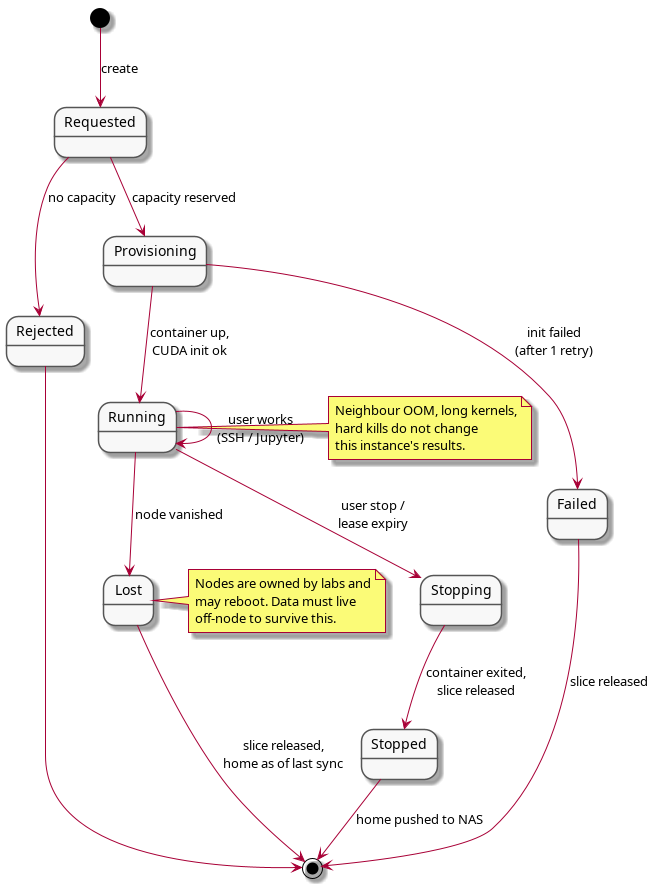

인스턴스는 요청 상태에서 시작하여 용량이 없으면 거절되고 있으면 준비 상태로 넘어간다. 준비는 실행 중으로 끝나거나 한 번 재시도한 뒤 실패로 끝나고, 실행 중은 사용자가 종료하거나 임대가 만료되거나 인스턴스가 있는 장비가 사라질 때까지 이어지며, 종료 중에는 몫을 돌려주고 홈 아카이브를 전송한다. 장비가 재부팅되거나 소유자가 회수하여 생기는 상실은 몫을 돌려주고 홈 디렉터리를 마지막 동기화 시점으로 남기며, 그래서 체크포인트가 공유 저장소로 바로 간다. 장비가 사라져도 손실은 많아야 마지막 체크포인트 이후의 작업이며 체크포인트 자체는 남는다.

## 15. 구현 제약

  위의 모든 내용이 구현에 요구하는 사항을 자리별로 묶는다.

  컨테이너와 이미지에서는 사용자를 root로 두지 않고, `/etc/ld.so.preload`는 읽기 전용으로 마운트하며, 홈 볼륨은 `exec`로 마운트하고, PyTorch의 선택 사항인 `cudaMallocAsync` 할당자는 제공하지 않는다. HAMi-core가 그 할당자의 스트림 캡처 경로를 잘못 다루기 때문이며 기본 할당자에서는 CUDA Graphs와 `torch.compile`이 정상이다. `/etc/ld.so.preload`를 지닌 컨테이너는 CUDA 라이브러리가 함께 주입되지 않으면 어떤 프로세스도 시작하지 못하므로 GPU 없는 작업용 환경은 별도 이미지가 필요하다. 이미지는 실행용과 CUDA 컴파일러가 든 개발용 둘이고 개발용이 15GB 크므로 어느 장비에 둘지 정해야 한다.

  용량 회계에서는 여유량을 유휴 상태의 NVML 빈 메모리로 잡고 모든 카드를 편입될 때 측정한다. 장비의 용량은 카드와 프로세서 코어와 디스크가 허용하는 수 중 가장 작은 값으로, 측정 중 인스턴스 8개의 데이터 로더가 코어 8개를 포화시켰다. 평가 배치도 작업의 메모리에 포함되어, 평가 단계가 학습의 가장 큰 덩어리보다 큰 덩어리 하나를 요구하는 학습 실행은 후반에 실패하며 측정한 한 사례에서는 실행의 94% 지점이었다.

  실행 시에는 시작을 1초 간격으로 하고 CUDA 컨텍스트 초기화 실패는 한 번 재시도하며 감시는 호스트 쪽 NVML로만 한다. 세 실패 원인, 곧 호스트 RAM에 대한 Docker의 `OOMKilled`, 외부 종료를 뜻하는 exit 137 단독, 몫 초과에 대한 프레임워크의 `OutOfMemoryError`를 구분한다. SM 제한은 두 모드로 존재하며 속도의 백분율로 서술하지 않는다.

  사용자 인터페이스에서는 가용 크기를 보이고, 공유하면 실행 시간이 이웃 수만큼 늘어난다는 사실을 그대로 알리며, 실습 좌석과 연구 세션은 다른 밀도로 채운다.

## 16. 결정과 미결

  결정 사항:

- 인스턴스 임대, 곧 사용자가 유지하는 환경이지 작업 스케줄링이 아니다.
- 작은 티어는 카드의 일부이고 가장 큰 티어는 카드 한 장 전체다.
- 메모리 몫은 가로채기로 강하게 강제하며 사용자는 root가 아니다.
- 계정, 티어별 요율을 가진 크레딧, 티어는 지금 만들며 운영 중에 조정할 수 있다. 최초 크레딧 배분만 장비 조사를 기다린다.
- 11장의 사용자 화면, 알림, 관리자 패널 전체.
- 처음부터 여러 장비이며 실행기가 그 사이에 인스턴스를 놓는다. 배치 규칙은 미결.
- 네 가지 저장소 분류와 비동기 경계.
- 장비 등록 때의 상수 산출, 절대 생략하지 않음.
- 두 연산 모드: 성적용 고정 비율, 연구용 우선순위 전용.
- 카드 둘 이상이 필요한 작업은 두 카드에 걸친 분할이 검증될 때까지 별도 경로로 카드를 통째로 받는다.

  미결 사항과 결정 방법:

- 접근 소프트웨어와 장비 간 트래픽의 오버레이 사용 여부는 9장의 네 가지 네트워크 측정을 연구실 장비에서 수행하여 정한다.
- 여러 장비의 배치 규칙은 구현 중에 정한다. 이 문서의 어느 내용도 특정 규칙에 의존하지 않는다.
- 측정한 카드 외의 티어 크기는 상수 산출로 정한다.
- 한 인스턴스 안에서 두 카드에 걸친 분할은 카드 둘이 있는 장비에서 한 시간의 시험으로 정한다.
- 최초 크레딧 배분은 장비 조사 뒤 정한다. 크레딧을 쓰고 조정하는 장치는 그와 무관하게 만든다.

  다음 단계로 미룬 사항:

- 시연 경로를 넘어서는 엄밀한 테스트.
- 학교 학사 시스템과의 계정 연동.
- 네이티브 모바일 앱. 모바일 웹 페이지로 부족하다고 드러나면.

## 부록 A. 측정값

  전부 소비자용 16GB 카드 한 장(RTX 4080 SUPER)과 최신 드라이버에서 세 차례에 걸쳐 측정했다.

| 항목 | 값 |
|---|---|
| 카드 위 프로세스당 고정 비용 | 물리 290MB, 몫에 계상 250MB |
| 몫 안의 가용량 | 명목 − 256MB |
| 몫당 카드에서 실제로 줄어드는 메모리 | 명목 + 32MB (계상은 + 64MB) |
| 드라이버 자체 예약 | 455MB, 여유량은 빈 메모리 15,904MB |
| 가로채기 라이브러리의 오버헤드 | 처리량의 1% 미만 |
| 몫 안 작업의 정확성 | 비분할과 비트 단위 일치 20 중 20, 3시간 연속 실행 204 중 204 |
| 연속 메모리 부족 거절, 드라이버 결함 | 1,555, 0 |
| 공유자 N명일 때 작업당 속도 저하 | 1/N ± 4%, N은 2에서 9 |
| 공유자 8명일 때 카드 총 산출 | 단독 작업의 99.3% |
| 8명 중 가장 빠른 작업과 느린 작업의 차이 | 4% |
| 동시 시작 8건 | 실패 0, 12.8초에 전부 학습 중 |
| 강제 종료 뒤 메모리 반환 | 0.22초 |
| 12시간 유지 세션 | 상한, 회계, 결과 모두 불변 |
| 다중 GPU 라이브러리의 통신 버퍼 | 몫에 계상됨 |
| 상수 산출 소요 | 28초 |
| 실행용 이미지, 개발용 이미지 | 6.3GB, 21.3GB |

## 부록 B. 그림 원본

`diagrams/*.puml`의 보존용 사본이다.


### 01_usecases.puml
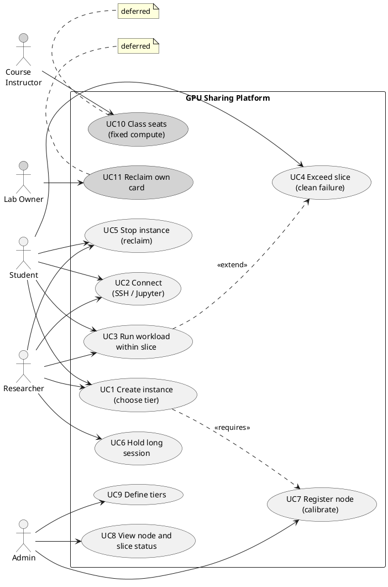

### 02_components.puml
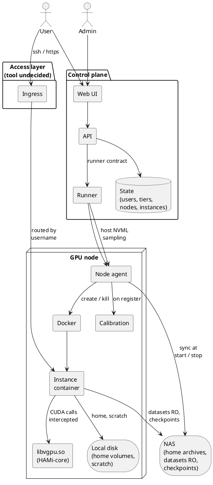

### 03_deployment_mvp.puml
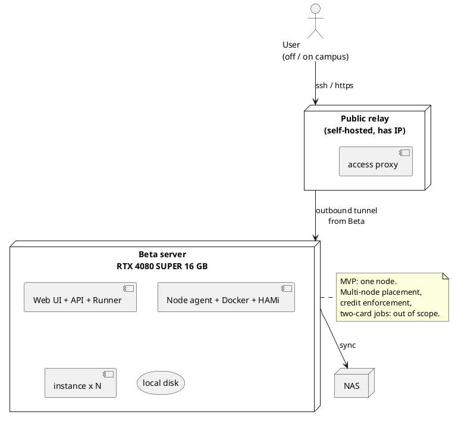

### 04_seq_create.puml
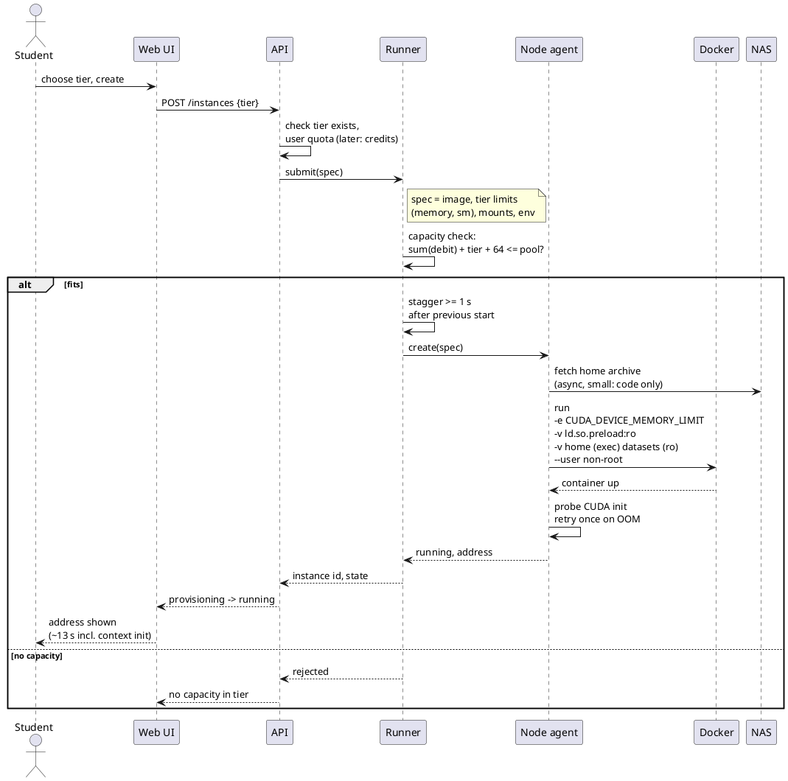

### 05_seq_oom.puml
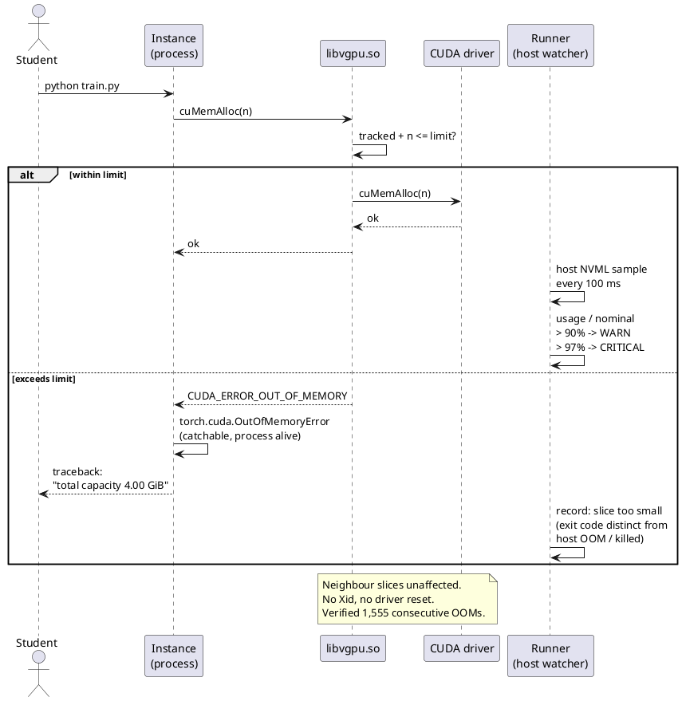

### 06_seq_stop.puml
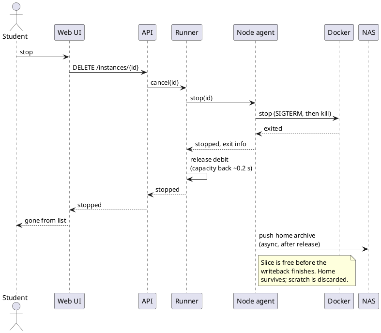

### 07_seq_onboard.puml
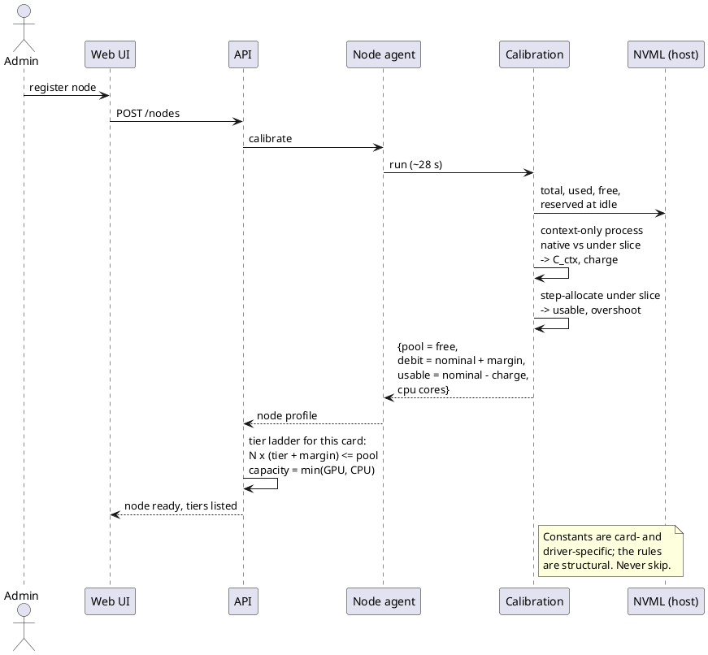

### 08_state_instance.puml
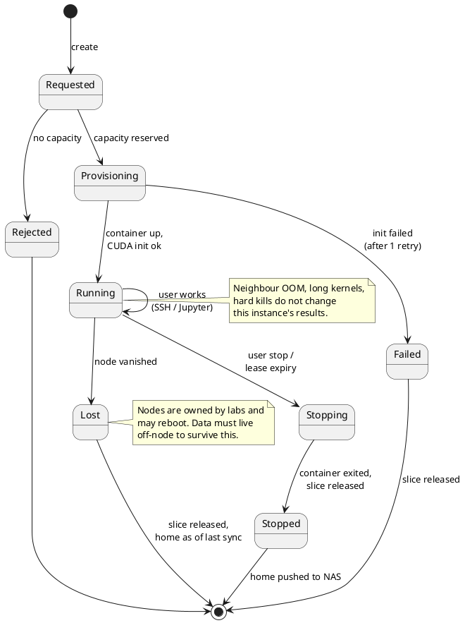

### 09_seq_class_start.puml
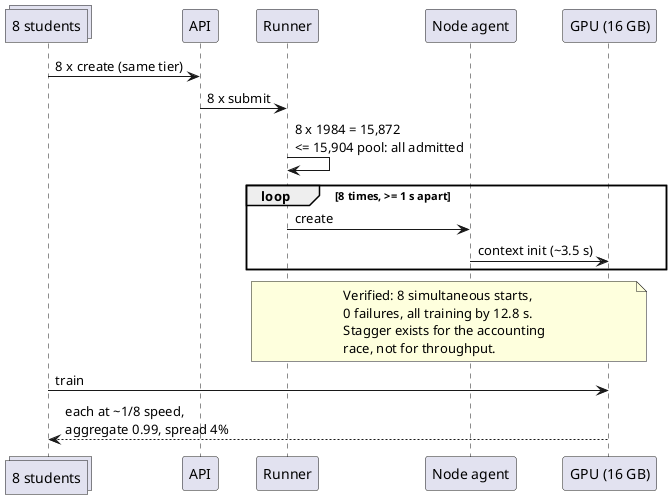

### 01_usecases.puml


### 02_components.puml


### 03_deployment_mvp.puml


### 04_seq_create.puml


### 05_seq_oom.puml


### 06_seq_stop.puml


### 07_seq_onboard.puml


### 08_state_instance.puml


### 09_seq_class_start.puml


## Comments

_No comments._
