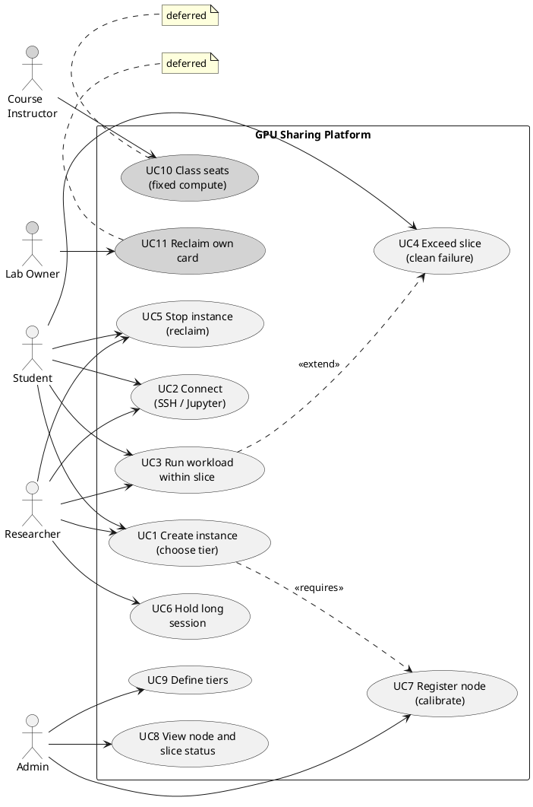
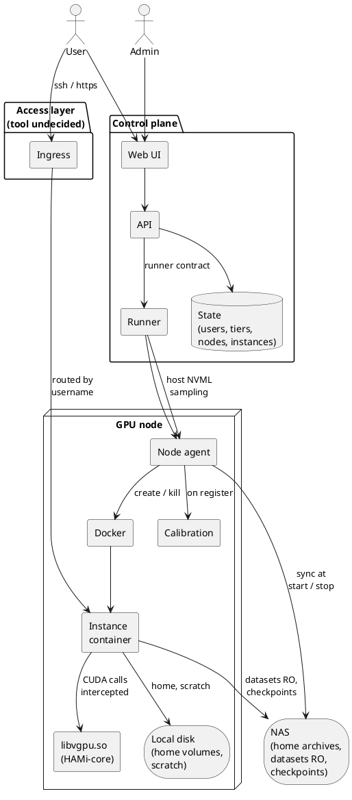
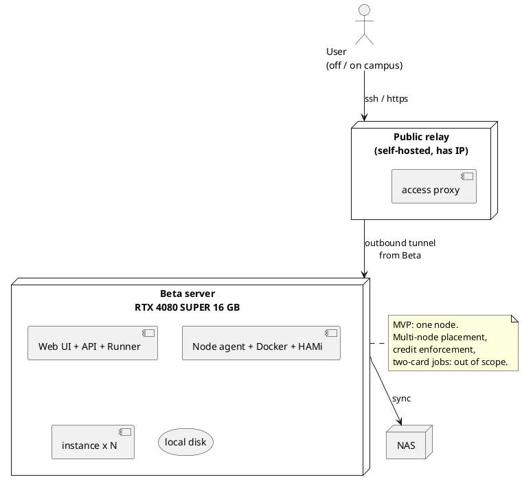
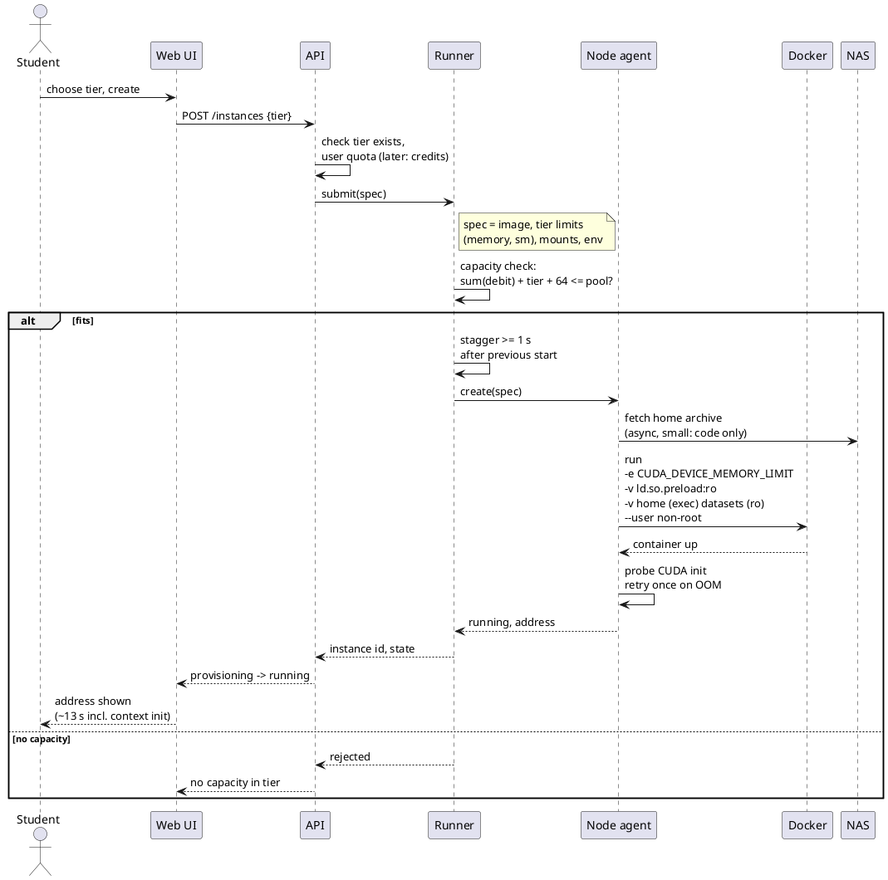
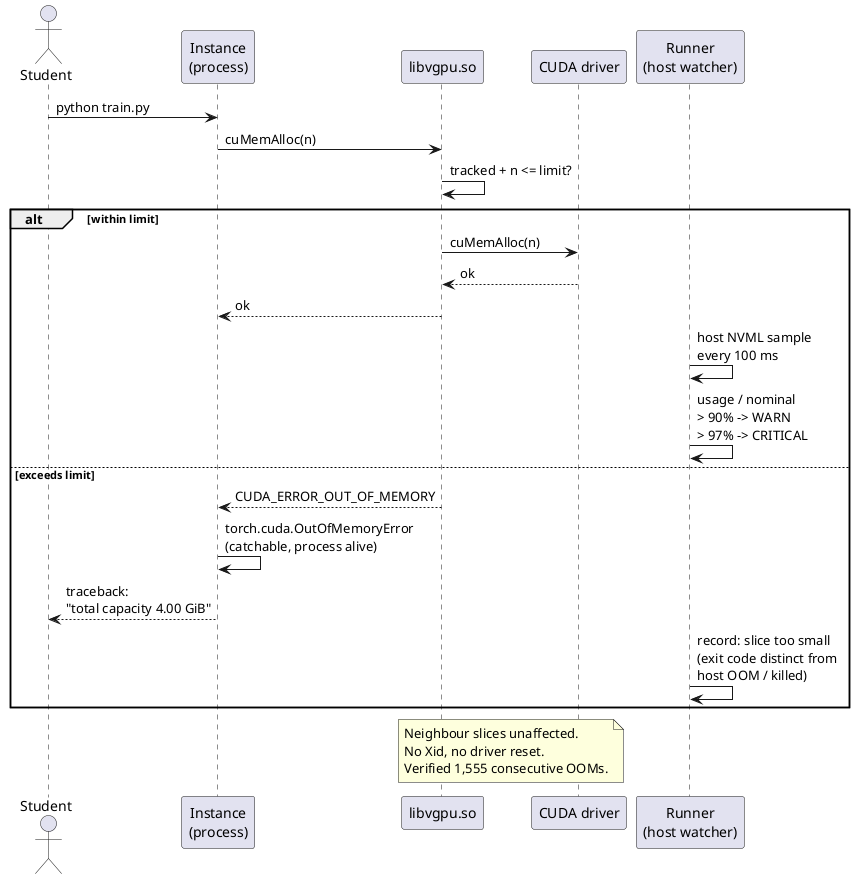
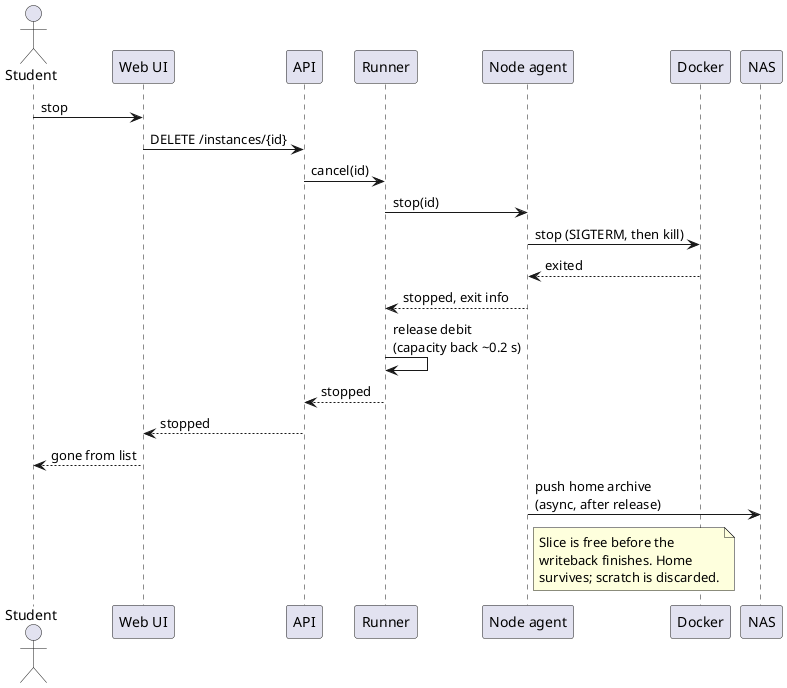
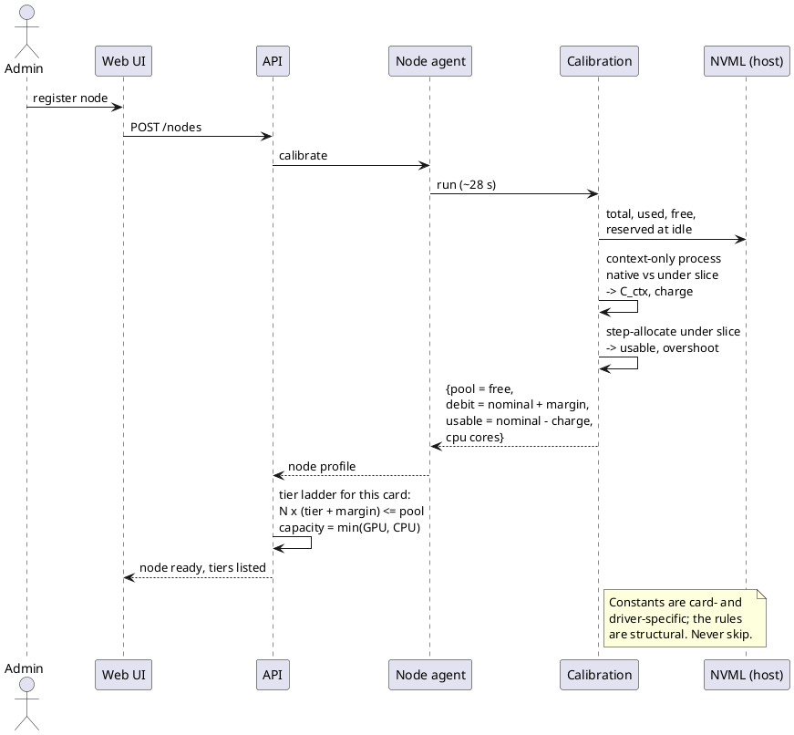
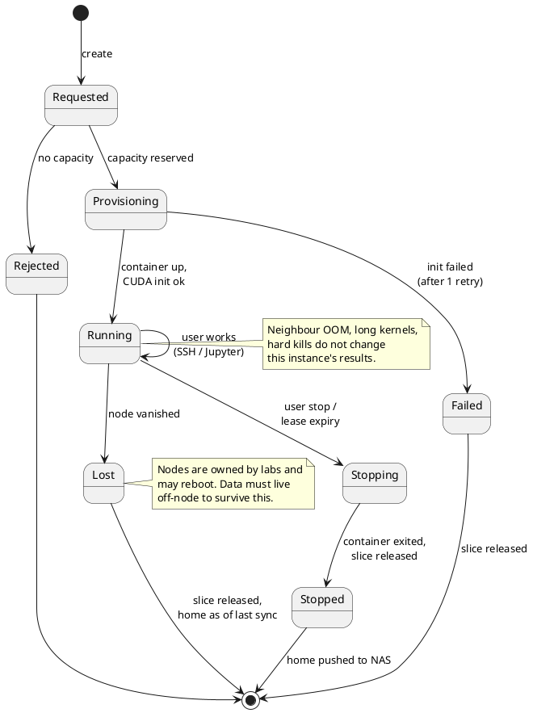
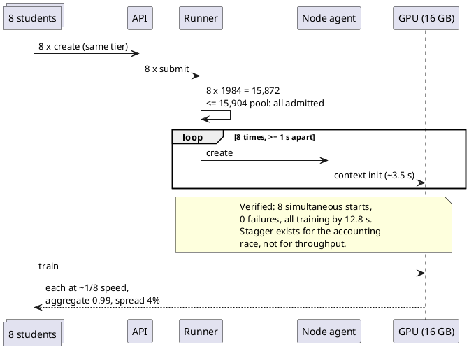

# GPU Sharing Platform — Planning Draft

Draft of 2026-09-04. This is a working document in English for the people who will design the interface, the screens, and the system layer. It describes what the platform is for, who uses it and what they see, the constraints the design has to live with, and how the sharing actually works — in enough detail that someone with a computer science background but no experience of GPU virtualization can follow it and build against it.

It does not decide the access tool, the web stack, the database, or any scheduling or routing algorithm. Those come later and none of them changes what follows. Where a number appears here it was measured on real hardware; where a constraint appears it was found by breaking something.

Diagrams are in `diagrams/`; their sources are in the last appendix.

## 1. Purpose

Research labs in the department each buy their own GPUs. A card bought for one lab's experiments runs at night and on weekends only when someone in that lab happens to be using it, which is rarely. Meanwhile another lab with no card of its own postpones an experiment or pays a cloud provider. Add up the cards across the department and the total compute is considerable; the problem is that it is fragmented by ownership.

The platform pools the cards that labs choose to register so that idle capacity is usable by others, while the lab that owns a card keeps first claim on it. It serves two kinds of people with different needs. Researchers want a working environment they can keep for a day or longer, with their own tools and their own data, on a large share of a card. Students in a lab course want a small, identical environment, forty of them at once, for the two hours of a session, doing the same assignment on the same dataset.

The demonstration that closes the first phase runs on one server: a student picks a size, receives an environment, connects to it, trains a model inside its limits, and stops it, at which point the capacity returns. That flow, recorded, is what the professor will show other labs and the faculty meeting. The software behind it is meant to be complete rather than minimal — accounts, credits, tiers that can be changed while the system runs, an administrator's panel, several machines, notifications — with only three things left for a later phase: rigorous testing beyond the demonstration path, the exact allocation of credits to each lab and person, and linking accounts to the university's course management system.

## 2. User perspectives

### A student in a lab session

The student logs in with a student ID and sees an empty list. They choose the course tier — the smallest one — and click create. Within about fifteen seconds an address appears. They connect with the SSH client already on their laptop, or open a notebook in the browser, and find a Linux environment with the course's libraries installed and the course dataset already present. Inside it, the card appears to have a few gigabytes of memory, which is their share. They run the assignment. If they try to load a model too large for their share, the program stops with a clear out-of-memory error and nothing else happens; their environment is still there and their classmates are unaffected. If their memory use creeps toward the limit during a long run, a notification reaches them — in the browser, and on their phone if they turned that on — before the failure rather than after. Their credit balance, shown beside the list, decreases while the environment runs at a rate set by its tier. When they stop, their files are kept for next time and their share of the card is free within a second.

Seven other students are on the same card at the same time. Each one runs at roughly one-eighth of the card's full speed, which is fine for an assignment, and none of them can see or affect the others.

### A researcher

The researcher chooses a larger tier and holds it for a working day or longer. Their home directory is theirs across sessions; the libraries they installed last week are still there. Large datasets sit on shared storage and read at full speed without copying. Checkpoints they write during training land on that shared storage directly, so if the machine their environment runs on is rebooted by its owner, the checkpoints survive. The largest tier is an entire card with no neighbours at all, for the work where interference matters.

### The administrator

An administrator registers a machine that a lab has contributed. The platform measures the card — this takes under a minute — and reports how many environments of each size it can hold. From then on the administrator sees, per machine and per card, which shares are occupied and by whom, measured with host-side NVML rather than from inside the environments, so the numbers are trustworthy. Tiers and credit rates are adjusted from the same panel while the system runs; a course that needs a larger seat gets one by changing a number, not by redeploying. When a lab asks for a library that is not in the standard image, the administrator adds it to the image; users cannot install system packages themselves, for reasons explained below.

## 3. Constraints

Most of what follows is shaped by six facts. None of them is a design preference.

**The hardware is whatever labs already own.** Different generations, different memory sizes, consumer cards rather than data-center ones. And each card stays physically in the lab that bought it. The design has to make mismatched cards behave like uniform seats, has to measure each card individually rather than assume, and has to assume that any machine can disappear without warning because its owner rebooted it.

**Memory is the resource that binds; compute is not.** A model and its training batch either fit in the card's memory or they do not. If they fit, the job runs; if they do not, it fails immediately. Compute only changes how fast it runs. So memory must be allocated precisely and enforced hard, while compute can be shared approximately.

**A lab course is forty people at the same time.** With a dozen cards, that arithmetic only works if a card can hold several students. A design that hands out whole cards cannot serve this population at all, no matter how good it is otherwise. This single fact decided the shape of the system.

**The campus network does not accept inbound connections.** Anything on campus must connect outward to something that can be reached. This constrains the access layer but does not change what the platform does.

**Users cannot be administrators inside their own environment.** The mechanism that enforces a memory share is a file that any administrator could edit. Giving users administrative rights would make the share advisory. So users get a normal account and a way to install their own libraries, and system-level packages go through the administrator.

**One summer and a small team.** Anything that exists as mature open source is adopted rather than built. The platform is glue and policy around existing pieces, plus the one genuinely new thing described in section 7.

## 4. Design considerations

**Sharing buys capacity, not speed.** Eight people on one card each get about an eighth of it. The card's total output is preserved almost exactly — measured at 99 percent — but nobody's job gets faster by sharing. The platform sells the ability to run at all, and predictability, not throughput. This is the right trade for a course; for a researcher's long run it is why the largest tier is a whole card.

**Enforcement over convenience.** A memory share that is only advisory is worse than none, because a user who exceeds it takes down a neighbour who did nothing wrong. The platform enforces shares hard, at the cost of users not having root and of one setting that has to be locked. Everything a normal user actually does — installing Python libraries, running notebooks, using their own tools — works without root; only system packages need the administrator.

**Time cost goes to the boundaries, not the session.** Users accept that starting an environment takes a minute. They do not accept that installing a library inside it takes a minute, because that reads as broken. So the design moves data at start and stop and keeps the session on local disk.

**Small shares are split; large shares are whole cards.** The difficult properties of sharing — interference, fairness between neighbours — only matter when there are neighbours. Confining sharing to the small tiers keeps the complexity where the workloads can tolerate it and gives long, large jobs dedicated hardware.

**Consequences are not hidden.** The size a user sees is the size they can actually use, not the nominal figure. An out-of-memory failure is reported as "your share is too small," not as a generic failure. A user who reads a number in this system can act on it.

## 5. Background

The rest of this document assumes a handful of concepts from operating systems, linking, and GPU programming, plus one open-source project built on them. This chapter introduces each in the order it depends on the one before, so that a reader with a general computer science background can follow sections 6 through 15 without outside reference. A reader already comfortable with CUDA, dynamic linking, and containers can skip to 5.4 for HAMi alone and 5.7 for the network terms; a reader comfortable with all of it can skip to section 6.

### 5.1 The GPU software stack

A graphics card is a separate device with its own processor and its own memory. That memory — **VRAM** — is distinct from the computer's RAM and is where a model, its parameters, and the batch of data it is currently processing must reside for the card to compute on them. If they do not fit, nothing runs; RAM does not substitute. The consumer cards this project uses have between eight and twenty-four gigabytes of it.

No user program touches the card directly. Inside the operating system's kernel a **driver** owns the device: it maps the card's memory, queues work onto it, and handles its interrupts. Above the driver, in user space, NVIDIA provides a programming interface called **CUDA**, and every machine-learning framework — PyTorch, TensorFlow, JAX — is ultimately a program that makes CUDA calls. When this document says a program "uses the GPU," it means the program calls CUDA.

CUDA arrives as two shared libraries stacked on each other. Frameworks link against the **runtime library**, `libcudart`, which offers a convenient interface. The runtime library in turn calls the **driver library**, `libcuda`, which is shipped with the driver and is the last piece of user-space code before the hardware. Every request to allocate VRAM and every piece of work submitted to the card passes down through both libraries. This layering matters because anything placed between them sees everything.

The work itself is submitted as **kernels**. A kernel, in the GPU sense, is a function compiled to run on the card, launched by the host program with an instruction for how many parallel threads should execute it. A single training step launches hundreds or thousands of them, some large — a matrix multiplication running for milliseconds — and some tiny — an element-wise addition finishing in microseconds. The card executes kernels on its **streaming multiprocessors**, or SMs, of which a consumer card has dozens to over a hundred. When later sections speak of a program's compute share, they mean the fraction of SM time it receives. The word "kernel" in this document always means a GPU kernel; the operating system's kernel is written "OS kernel."

Before a process can allocate any VRAM or launch any kernel, the driver creates a **CUDA context** for it: the process's page tables on the card, its command queues, a small cache of compiled code. This state exists on the card and costs VRAM — 290 megabytes on the card measured for this project — and it is paid per process, before the process asks for anything of its own. Two processes on one card mean two contexts. This fixed cost turns out to be the single most important number in the capacity arithmetic.

Observing what a card is doing goes through a separate interface, the **NVIDIA Management Library** or NVML, which reports memory in use per process, utilization, temperature, and faults. The command-line tool `nvidia-smi` is a thin front end that prints what NVML returns. Where a query to NVML is made from — the host, or inside an isolated environment — turns out to affect what it reports, for reasons explained in 5.4. Faults themselves are logged by the driver as numbered **Xid** codes; a run with no Xid is a run in which the driver saw nothing abnormal.

### 5.2 Dynamic linking and interposition

A program does not contain the code for every function it calls. It names shared libraries, and when the program starts, the **loader** maps each named library into the process and connects every unresolved function name to the first library, in load order, that exports a function of that name. Which library answers a given call is therefore a matter of order, not of the program's intent.

That order can be influenced from outside the program. The environment variable **`LD_PRELOAD`** names a library the loader must map before all others; any function it exports is found first, ahead of the same name in the libraries the program actually asked for. A process can be given a substitute for any library function this way without recompiling. But it is an environment variable, so the process — or whoever launches it — can unset it, and the substitution vanishes.

A file has the same effect without that weakness. The loader consults **`/etc/ld.so.preload`** for every process on the system and preloads whatever it lists, regardless of the process's environment. Whoever controls that file controls what every process loads first. If the file is mounted into an isolated environment read-only from outside, nothing inside the environment can change it.

Placing a library in front of another by exporting the same names, so that calls land in the newcomer first, is called **interposition**. The interposing library may inspect a call, count it, refuse it, alter its arguments, or forward it unchanged to the real implementation — and it may answer queries with values of its own choosing. Everything HAMi does is interposition on the CUDA driver library.

### 5.3 Containers

A **container** is a group of processes given a private view of the filesystem, the network, the process table, and the user database, isolated from other groups on the same machine, while sharing that machine's OS kernel. It is lighter than a virtual machine because there is no second kernel to boot; it is less isolated for the same reason. In this project every user environment is a container.

A container starts from an **image**: a filesystem snapshot holding an operating system's user-space files plus whatever libraries and tools were installed on top. Two images exist here — a *runtime* image with the frameworks and course libraries, and a *development* image that adds the CUDA compiler for users who write their own kernels. Storage that must outlive the container is attached as a **volume**, mounted into the container's filesystem view from outside. A user's home directory is a volume; the container that uses it is disposable.

**Docker** is the container runtime used: it creates containers from images, attaches volumes, injects the card and its libraries by way of NVIDIA's container toolkit, and enforces limits on RAM and CPU. What Docker does not do, on its own, is limit VRAM; that is the gap HAMi fills.

Two details of containers shape this design. First, **root inside a container** is the administrator account of the container's private view, not of the machine — but it can still change any file the container sees, including a preload file, unless that file was mounted read-only from outside. Second, a filesystem can be mounted with **`noexec`**, which forbids running programs or loading libraries stored on it, and Docker's default scratch space is a **tmpfs** — a filesystem held in RAM — mounted exactly that way. That is harmless for scratch and fatal for a home directory that will hold installed Python packages, most of which include compiled components.

### 5.4 HAMi

With those pieces in place, HAMi can be described in a paragraph. **HAMi** — Heterogeneous AI Computing Virtualization Middleware — is an open-source project under the Apache 2.0 license, an incubating project of the Cloud Native Computing Foundation since mid-2026; NVIDIA merged its core component into NVIDIA's own open-source scheduler the same year. It is normally deployed as a Kubernetes device plugin. This project uses only its core component, standalone, under plain Docker, which the upstream documentation describes in a single example.

That core component, **HAMi-core**, is one shared library, `libvgpu.so`, which interposes on the CUDA driver library. Loaded into a container's processes through the preload mechanism of 5.2, it does three things.

It limits VRAM, and the limit is hard. Every allocation call from any process in the container passes through it; it keeps a running total, and if a request would push the total past a limit set by the environment variable `CUDA_DEVICE_MEMORY_LIMIT`, it returns CUDA's ordinary out-of-memory error without forwarding the call to the driver. Frameworks already handle that error. The count is kept per container, not per process, so forking does not evade it, and it covers every allocation path CUDA offers, including the ones used by libraries that move data between cards.

It limits compute, and that limit is soft. A second variable, `CUDA_DEVICE_SM_LIMIT`, sets a percentage. HAMi-core meters kernel launches with a token bucket: each launch consumes a token, a background thread refills tokens at a rate matching the percentage, and a launch that finds no token sleeps until one appears. The card is never partitioned; the program is slowed at the moment it submits work. This has consequences for fairness that section 7 measures.

It virtualizes NVML. Queries made from inside the container return the container's limit as the card's total memory and the container's usage as the card's usage, so a program that sizes itself from what NVML reports sizes itself correctly for its share. It also means that NVML read inside a container reports the share, not the card; the platform therefore reads NVML on the host for every monitoring purpose.

HAMi supports every NVIDIA card on any driver from version 440 upward, with no architecture floor. It supports several cards in one container, each with its own limit, and memory and compute isolation together or separately. It asks nothing of the hardware — no partitioning feature — which is why it works on consumer cards where NVIDIA's own partitioning does not.

Three things HAMi is not. It is not a hardware partition: a program that bypassed the driver library entirely would bypass it, though no practical program does. It is not a scheduler: it enforces one container's limit and knows nothing of other containers; deciding what fits on a card is the platform's job. And it is not flawless: verification found three defects, each with a workaround, described in the sections where they bite.

### 5.5 Platform vocabulary

The remaining terms are this document's, not the field's. A **share**, or **slice**, is one container's portion of a card — its VRAM limit and its compute share. A **tier** is a named size that a user chooses when creating an environment: a VRAM limit, a compute share, and a disk quota, defined per card generation so that the same tier means the same capability on different cards. The **pool** is the VRAM a card can actually hand out, which is what NVML reports free at idle — the card's total less the driver's own reserve. **Time-slicing** is how a card serves several programs at once, running one program's kernels for a while and then another's; without a compute limit, that switching is fair per kernel-time, so a program with long kernels holds the card longer. A limit is **work-conserving** if it lets a program use idle capacity beyond its share when no one else wants it; HAMi's compute limit is not, and section 10 turns that into a feature. **Calibration** is the measurement, on a specific card and driver, of the constants the accounting depends on — the context cost, how much of it HAMi charges, the overshoot between the limit and the card's real loss, and the pool — run once when a machine is registered.

### 5.6 Storage

**NAS** is network-attached storage: a file server every machine mounts. It handles large sequential reads well, which is what datasets need, and handles thousands of small operations poorly, which is what a home directory full of small files produces; that asymmetry is why home directories move as one archive rather than file by file. A user's **home volume** is their persistent directory, held on the machine's local disk during a session and archived to NAS between sessions. **Scratch** is local disk with no persistence, for intermediate files.

### 5.7 Network

A machine on the campus network sits behind a **firewall** that permits connections going out and blocks connections coming in. That asymmetry is the whole network problem. A user off campus, or a service on a public server, cannot open a connection to a lab machine; the lab machine has to open the connection first. The general technique is a **reverse tunnel**: the lab machine connects outward to a **relay** that has a public address and holds that connection open, and the relay forwards traffic arriving for the lab machine back down the tunnel. Everything on campus dials out; nothing needs an inbound rule, and nothing needs a firewall exception requested from the network office.

Two designs share that idea and differ in where traffic flows once a connection exists. In a **proxied** design every byte passes through the relay. It is simple and always works, and the relay's bandwidth becomes everyone's ceiling. In an **overlay network** the relay only introduces the two ends — it tells each the other's address and helps them open a path through their respective firewalls — after which they exchange traffic directly and the relay carries nothing. Whether that direct path can be opened depends on how the campus **NAT** rewrites addresses and whether it lets UDP out; on some institutional networks it does not, and an overlay then falls back to relaying anyway. Which design fits this campus is a measurement, not a preference.

Once a connection reaches the platform it has to find the right environment. SSH carries a username, and an **SSH router** placed in front of the machines reads it and forwards the session to the environment that username names, so the user sees one address regardless of where the environment runs. Web tools reach the user through a **reverse proxy**, which maps a subdomain or path on that one address to a port inside a specific environment.

## 6. Choice of approach

### 6.1 Options considered

A platform that shares GPUs can intervene at several layers, and what the user receives differs at each. The project examined four before settling on one, and the reasons matter because they fix what the platform is.

The most transparent option leaves the user's program where it is and forwards every GPU call across the network to a card somewhere else. The program is unchanged and never learns where the card lives. It was set aside quickly. Each of the thousands of CUDA calls a training step makes per second becomes a network round trip; published measurements show slowdowns of 1.4 to 5.5 times even over the specialized low-latency interconnects that this campus does not have; and no one has been found running it in production. A variant that forwards across the wide-area network fails for the same reason, more so.

The initial direction of the project was the second option, **job scheduling**. The user writes a program, submits it with a request for so many cards for so many hours, and the platform queues it, runs it on a whole card when one is free, and returns the results. University supercomputing centers work this way, and mature software for it exists — queueing, fair-share accounting, budgets, ownership priority, all configured rather than written. The initial concept went one step further: a prediction engine would estimate each job's memory and running time from its code, so that the platform could pack cards tightly without users having to guess their own requirements.

That direction was set aside for three reasons that emerged during the review. First, the prediction research it depended on does not exist for this setting. The published work targets datacenter hardware with uniform cards and fast interconnects; it predicts running time rather than memory, which is the quantity that actually decides whether a job fits; and it says nothing about several jobs sharing one card. The one dataset that appeared relevant turned out to cover a single card model and a single family of networks, with no model released. Building the predictor would be a research project of its own, on data that only comes into existence once a platform like this is running. Second, the smallest unit a scheduler hands out is one whole card, and forty students in a lab session with a dozen cards is arithmetic that no scheduler can make work — the granularity is wrong for the largest user population. Third, a submitted job runs on a machine the user is not logged into, so the interactive tools researchers actually rely on — notebooks, debuggers, live training dashboards — do not work as they expect, and the review of how researchers work made clear that an environment they cannot sit inside is one they will not use.

The third option, **instance leasing**, hands the user a running environment rather than running their job for them: they choose a size, receive a container with a share of a card, and work inside it for as long as they like with whatever tools they normally use. Two facts made this viable that were not known when the project began. One is that a card can be split into enforced shares by an existing open-source library — the review found it and three rounds of verification confirmed it — whereas the meeting that launched the project had ruled splitting out as infeasible and settled on whole cards. The other is that the interception technique that library uses is patented by a Korean company whose commercial product does the same thing. The company was asked in person for permission and declined. Adopting a third-party open-source implementation of a technique is a different legal position from writing the patented method oneself, and the supervising professor directed that the patent question not be treated as a blocker.

After extended discussion with the supervising professor, instance leasing was chosen, with prediction set aside as a later research direction — one that the platform's own usage records would make possible for the first time, since no such records exist for heterogeneous consumer cards under fractional sharing. Two things that would have been built into a scheduler are instead treated as configuration: how much each lab and user is entitled to, and the exact sizes of the shares. The rest of this document describes the chosen approach.

### 6.2 The chosen approach in brief

Stripped of the reasoning, what the platform does is this.

A user asks for a slice of a graphics card — small, medium, or large — and receives a private Linux environment with that slice inside it. The environment looks and behaves like a personal machine with a graphics card of that size. They log in with SSH or open a notebook in the browser, install what they need, run what they want, and leave it running for as long as they like. When they stop it, their files stay and the slice goes back for someone else to use.

Behind that, one physical card is serving several such environments at once. Each environment's share of the card's memory is fixed and enforced: a program that asks for more than its share is refused, and the refusal cannot touch anyone else on the same card. The card's computing time is shared by taking turns — equally, when a class is being graded, or by priority, when researchers are sharing.

A lab that contributes a card keeps it in the lab and keeps first claim on it. The platform uses the hours it would otherwise sit idle. An administrator registers the machine once, the platform measures the card, and from then on it knows how many environments of each size that card can hold and charges each user's credits accordingly.

Everything a user does goes through one address, with the tools already on their laptop. Nothing is installed on their side; nothing about their program has to change.

## 7. Card sharing mechanism

This is the part with no exact precedent.

### 7.1 Interposition

Every program that uses the card talks to it through the CUDA driver library. When a framework wants VRAM, it calls the runtime library, which calls the driver library, which asks the driver, which hands back an address. The framework never talks to hardware directly.

HAMi-core interposes on the driver library. When the runtime calls the allocation function, HAMi-core receives the call first. It keeps a running count of how much VRAM this container has been given. If the new request would push the count past `CUDA_DEVICE_MEMORY_LIMIT`, it returns CUDA's out-of-memory error without ever asking the driver; otherwise it forwards the call and updates the count. The framework cannot tell the difference. This is why the platform can exist: no change to the driver, no change to the OS kernel, no change to the user's program.

The same interposition covers NVML, so a program inside the container sees its share as the whole card. It also covers kernel launches, which is how compute is shared: the token bucket delays a program's launches so that it receives a smaller portion of SM time. That limit is softer than the memory one and is measured in 7.4.

Each environment is a container — a group of processes with its own view of the filesystem and network, isolated from other groups on the same machine but sharing that machine's operating system. Because HAMi-core is loaded by the container's own processes, it has to be loaded in a way the user cannot switch off. `LD_PRELOAD` alone is defeated by unsetting it, which was tested and confirmed — a user in a 4-gigabyte share allocated 6 gigabytes. `/etc/ld.so.preload`, mounted read-only into the container, holds. That file is why users cannot be root: root inside the container could rewrite it. With it in place every bypass that was tried failed, including a program that statically linked its own copy of the runtime library — because even that program still calls the driver library dynamically, and that is where HAMi-core sits.

Everything above is user-space. Nothing touches the driver, the OS kernel, or the card's own partitioning features, which is why it works on ordinary consumer cards.

### 7.2 Fixed costs

Two overheads make a share smaller than its nominal size, and both were measured.

Every process that uses the card pays for its CUDA context before it has allocated anything of its own. On the tested card this is 290 megabytes. HAMi-core charges 250 of those against the container's share and does not know about the remaining 40. So an environment given a nominal 4 gigabytes can actually allocate about 3.75, and the card actually loses about 4.03. The gap is constant across sizes, so the platform accounts for it with two simple rules: what the user can use is the nominal size less 256 megabytes, and what the card gives up is the nominal size plus 64.

The card's total VRAM is also not all available. The driver keeps a reserve for itself — about 455 megabytes on the tested card — that never appears as free. The pool the platform divides is what NVML reports free at idle, not the number on the box. Getting this wrong by using the total overcommits every card by that margin, which was done once during verification and caught.

Both numbers depend on the card, the driver, and the libraries loaded. The rules do not. So every card is measured once when it joins, and the measurement is not optional.

### 7.3 Tiers and normalization

A tier is a named size that a user chooses: a memory limit and a compute share, together with a disk quota. The platform's central design idea is that memory and compute are independent knobs. A tier defined as "about four gigabytes and about ten teraflops" is four gigabytes plus half the compute share on a mid-range card, and four gigabytes plus about an eighth on a high-end one, because the two cards have different ratios of compute to memory. No single fraction fits both axes at once; two independent settings do. This is what turns a shelf of mismatched donated cards into interchangeable seats, and it is a problem that data centers with uniform hardware never have to solve.

The compute share only tracks real speed within a card generation, so tiers are defined per generation. Memory is exact and is what the ladder is built on. For the card used in verification, a 16-gigabyte consumer card, the measured ladder is:

| Environments per card | Nominal size | Usable inside | What fits |
|---|---|---|---|
| 8 | 1,920 MB | 1,664 MB | a course assignment on a small convolutional network |
| 4 | 3,904 MB | 3,648 MB | fine-tuning a base-size language model |
| 3 | 5,184 MB | 4,928 MB | image generation inference |
| 2 | 7,872 MB | 7,616 MB | a larger vision model or a small language model |
| 1 | 15,808 MB | 15,552 MB | anything measured |

Each row comes from one rule: the number of environments times the nominal size plus 64 must fit in the card's free memory. Sizes are chosen to pack, not to be round — round sizes waste a seat at two of these rows. Each row was confirmed by filling the card with real training jobs at that size and checking every one produced correct results.

One consequence of the fixed cost is worth stating plainly. In the smallest tier, after the assignment's own memory, roughly one process worth of fixed overhead is left, so a student who opens a second notebook will find the second one cannot start. Because tiers are an administrator setting changed at runtime, this is configuration rather than design: an instructor whose course needs two notebooks sets the course tier one step larger, and the ladder tells them what that costs in seats per card.

### 7.4 Measured cost of sharing

Time-slicing on the card is fair in an unexpected way: it is fair per kernel-time, not per program. A program that launches a few long kernels holds the card longer than one that launches many short ones. In measurement, a heavy model sharing a card with five light ones took almost twice its fair share while the light ones each lost a few percent. For a research pool that is acceptable. For a graded course it is not, because a student who happens to use a heavier model would get more compute than a classmate.

The SM limit fixes this. Two properties were measured and both matter. First, the percentage is not a percentage of speed: a program launching large kernels keeps 92 percent of its speed at a 50 percent setting, while one launching small kernels with frequent synchronization slows almost in proportion, to 54 percent. Second, the limit is not work-conserving — a program at 25 percent keeps sleeping even when the rest of the card is idle. That is waste in a research pool and exactly right in an exam, where every student's speed should be the same regardless of how many classmates are running. So the platform has two compute modes, described in section 10.

With the memory limit alone, eight identical training jobs on one card each ran at one-eighth speed within four percent, the slowest and fastest differing by four percent, and the card's total output was 99 percent of what one job alone achieves. Nine fit; a tenth failed at start with a clean error and the nine were untouched. The limit is memory, not scheduling.

### 7.5 Share overrun

HAMi-core refuses the allocation and the framework raises its normal out-of-memory exception. The program can catch it, free memory, and continue; the container is not killed; the card is not disturbed. This was exercised 1,555 consecutive times with zero Xid. A neighbour that deliberately loops on allocation until it fails, submits three-second units of work back to back, or is killed mid-allocation slows the environment next to it but never changes its results — five different workloads produced bit-identical outputs beside every one of those neighbours.

The platform tells the three failure causes apart, because they need different responses: the environment was killed for using too much of the machine's ordinary RAM, it was killed from outside, or its own program exceeded its share of the card. Only the last is something the user can fix themselves, and it is reported that way.

## 8. Storage

The session runs on the machine's local disk. Data moves at the start and the end, as a single archive rather than file by file, because network filesystems charge per file and a home directory has thousands. The user's home directory is pulled from shared storage when the environment starts and pushed back when it stops or changes size, and it persists between sessions. Large datasets and the shared cache of model weights stay on shared storage, mounted read-only, and are never copied — they are big, read sequentially, and that is what network storage does well. Checkpoints the user writes during training go directly to shared storage rather than local disk, so that they survive the machine disappearing. Scratch space is local and discarded.

Both boundaries are asynchronous. The environment starts before the home archive has finished arriving, because nobody needs their files in the first thirty seconds. The share is released to the pool before the archive has finished leaving, because a freed share should not wait on a transfer nobody is waiting for.

Two things were learned the hard way. The home volume has to be mounted `exec`; Docker's default tmpfs is `noexec`, and every Python library with a compiled component then fails to load with an error that does not say why. And local disk becomes a capacity variable: how many environments a machine holds is bounded by its disk as well as its card and its processor cores, so each tier carries a disk quota.

## 9. Access

Every environment is reached through one fixed address. SSH has no way to route on anything but the username, so the username carries the student ID and a router in front of the machines maps it to the right environment wherever that environment happens to be running. Web tools reach the user the same way through a per-environment proxy that the user switches on from their environment's page.

What this looks like from a laptop, with nothing installed beyond the SSH client every operating system already ships:

```
ssh 2020112028@compute.dongguk.edu
```

That lands in the user's default environment. A user with more than one names them, and the name rides on the username:

```
ssh 2020112028-lab3@compute.dongguk.edu
```

File transfer is ordinary because the environment is an ordinary SSH host:

```
scp results.csv 2020112028@compute.dongguk.edu:~/
rsync -av ./project/ 2020112028@compute.dongguk.edu:~/project/
```

An entry in the SSH configuration file makes the address a single word, and every tool that speaks SSH — editors with remote extensions included — then works without further setup:

```
Host gpu
  HostName compute.dongguk.edu
  User 2020112028
  IdentityFile ~/.ssh/id_ed25519
```

after which `ssh gpu` connects and a remote-editing extension is pointed at `gpu`.

Inside, the card shows the user's share as if it were the whole card. The driver's own status tool reports it:

```
$ nvidia-smi --query-gpu=memory.total,memory.used --format=csv
memory.total [MiB], memory.used [MiB]
4096, 312
```

A program that asks for more than the share sees the framework's normal out-of-memory error, with the share reported as the card's capacity:

```
torch.cuda.OutOfMemoryError: CUDA out of memory. Tried to allocate 512.00 MiB.
GPU 0 has a total capacity of 4.00 GiB of which 8.00 MiB is free.
```

The process is still alive after this; the user frees memory or reduces the batch and continues.

Web tools are reached in the browser at an address derived from the same identity:

```
https://2020112028.compute.dongguk.edu/          → notebook
https://2020112028.compute.dongguk.edu/tb/       → training dashboard, once enabled
```

### What the network must provide

The access layer serves four distinct needs, and the same software is expected to cover all of them, deployed more than once. During development, the people building the system need shell access to the lab machines from wherever they are. In operation, users need the `ssh` and browser paths shown above, arriving at one public address and routed to their environment. At the start and end of every session, home archives move between each machine and the NAS, and that is the one flow where bandwidth matters — a class of forty starting at once moves forty archives. And for maintenance, a deployment separate from the user-facing one gives the operators a path into the machines that keeps working when the user-facing path is what has broken.

What is known: the campus network blocks inbound connections, so every one of these flows begins with a machine on campus connecting outward to a relay with a public address. What is not known, and has to be measured from the lab machines before the access software is chosen: how the campus NAT behaves and whether it lets UDP out, which decides whether an overlay can open direct paths or must relay everything; whether two lab machines on different network segments can reach each other directly; whether the NAS is reachable from the GPU machines without any tunnel, which if true removes the bulk-transfer question entirely; and whether the university has a policy on overlay networks running on lab hardware.

Those four answers pick between two shapes. If direct paths work and policy permits, an overlay gives every machine a stable address and the runner never has to create or destroy transport per session — routing becomes a lookup. If they do not, a proxied design works everywhere, and each environment's transport becomes state the runner manages. Neither shape changes any command above; the difference is invisible to users and material to the runner.

## 10. Compute modes

For graded coursework, every environment in the session gets a fixed compute share that does not change with load. This is the non-work-conserving mode from 7.4, used on purpose: fairness between students matters more than using every idle cycle.

For research, no compute limit is set unless two environments are actually competing, in which case the limit acts as a priority — the owning lab's work ahead of a guest's. An idle card is never held back by a limit nobody needs.

In neither mode is the setting shown to users as a percentage of performance, because it is not one.

## 11. Screens

### User screens

**Sign in.** Student ID and password, or the university's single sign-on if it can be attached. Nothing else on this screen.

**My environments.** A list, with the user's credit balance and its current rate of decrease above it. Each row is one environment: its name, its tier, its state (provisioning, running, stopping, stopped), how long it has been running, and a bar showing memory used against the usable size. A running row shows the connect address and a stop control. An empty list has one button, create.

**Create.** The tiers available to this user, each with its usable memory, its disk quota, and how many are currently free. For a course, the course tier is preselected and the others are hidden. One click.

**Environment detail.** The connect command shown verbatim, ready to copy. The web-tool proxy switches — notebook on by default, others off until enabled. The usage bar with the two warning thresholds marked, and a switch for whether crossing them sends a notification to the user's phone as well as the browser. A stop control, and for a stopped environment, a control to bring it back at the same or a different tier.

**Notifications.** The platform pushes to the browser and, if the user opts in, to a phone: a memory warning, a failed start, an environment lost because its machine went away, a credit balance near zero. The mobile side is a web page that works on a phone, not a native application, unless one turns out to be needed.

### Administrator dashboard

**Machines.** Every registered machine: its name, the lab that owns it, its card or cards by model and generation, the date it was last calibrated, and its capacity — how many environments of each tier it can hold — alongside how many it holds now. A machine that has stopped reporting is flagged at the top. Actions: register a new machine, recalibrate, drain (stop admitting new environments while existing ones finish).

**Cards.** Per card: the shares currently occupied, drawn to scale against the pool, each labelled with the user and the tier. Beside each share, its measured usage from the host and its warning state. This is the view that answers "who is on this card right now and how close is each of them to their limit."

**Environments.** Every environment across all machines, filterable by user, tier, machine, and state. From here the administrator can stop an environment, which is the only override the platform offers; the reason is recorded.

**Tiers.** The ladder per card generation: nominal size, usable size, compute share, disk quota, and how many fit per card. Editable while the system runs, with the fit recomputed from the calibration numbers as sizes change. Whether a tier is fixed-share or priority-only is set here.

**Credits.** The rate each tier charges per hour, each lab's and each user's balance, and the history of adjustments. Balances can be granted and rates changed from here at any time; what this screen does not yet do is compute the initial allocation from the hardware inventory, which waits for that inventory to exist.

**Images.** Which image each machine carries — runtime, development, or both — and when it was last rebuilt. The list of libraries in each image, so that "please add X" requests have a place to land.

**Events.** A feed: environments that crossed a warning threshold, failed starts and why, machines that went silent, calibration results. Newest first; nothing here requires action by itself, but it is where an administrator looks when a user reports a problem.

All administrator numbers come from the host-side monitor, never from inside an environment.

## 12. System structure


A web interface — the screens of section 11 — sits on an API that owns users, tiers, machines, and environments. The API talks to a runner, which is the piece that knows about capacity: it keeps the count of what each card on each machine has given out, decides whether a new request fits and on which machine, tells that machine's agent to create or destroy an environment, and watches every environment through host-side NVML — never from inside, where HAMi-core reports the share rather than the truth. The agent on each machine drives the container runtime, moves home archives to and from shared storage, and runs the calibration when the machine is registered.

The boundary between the runner and the API is where the system layer and the application layer meet, and it should be written down before either side is built. It needs roughly: submit a specification and get an identifier; ask an identifier for its state, address, current usage, warnings, and how it ended; cancel; list; ask a machine for its capacity; and subscribe to state changes. The specification is an image, a memory limit, a compute share, what to mount, environment variables, and who the user is.


The demonstration runs on one server, but the design is several: each machine runs an agent, the runner holds the capacity of all of them, and placing a new environment on one of them is the runner's decision. The placement rule is not yet chosen and does not need to be for the design to stand. A relay outside campus with a public address provides the entry point, and each machine connects out to it, so nothing on campus needs an inbound rule.

## 13. Flows

### Environment creation


The user chooses a tier. The API checks the tier exists and, later, that the user has quota. The runner adds up what the card has already given out, adds this tier's size plus the fixed margin, and refuses if the total exceeds the card's free memory. If it fits, the runner waits at least a second after the previous start on that machine — a race in the library's accounting was found when two environments start in the same instant and one allocates heavily at once — then tells the agent to create the container with `CUDA_DEVICE_MEMORY_LIMIT` set, `/etc/ld.so.preload` mounted read-only, the home volume mounted `exec`, the datasets mounted read-only, and a non-root user. The agent probes that the card initialized and retries once if it did not. The home archive arrives in the background. About thirteen seconds after clicking, the user has an address.

### Execution and share overrun


Each allocation passes through HAMi-core, which counts and forwards or counts and refuses. The runner samples the container's real usage from host-side NVML every tenth of a second and records a warning at ninety percent of the share and a critical at ninety-seven, with an estimate of time remaining based on recent growth. Gradual growth gets seconds to minutes of warning. A sudden jump — a phase of the program that needs one block larger than anything before — cannot be predicted, but an environment sitting above ninety-five percent for minutes is itself the signal. When a request is refused, the program sees an ordinary out-of-memory exception and its environment stays up.

### Environment stop


The container is stopped and its memory returns to the card in about a fifth of a second. The runner releases the share to the pool immediately. The home archive is pushed to shared storage afterwards; the user's list shows the environment gone before that finishes.

### Machine registration


The agent runs the calibration: it reads NVML free at idle, starts a process that does nothing but hold a CUDA context to measure its cost with and without HAMi-core, then allocates in steps under a limit until refused to find where the usable ceiling actually is. From those four numbers the API derives the machine's pool, the per-environment margin, the usable-inside rule, and the tier ladder for that card. The routine takes about thirty seconds and is a required step; a machine admitted without it has a wrong ladder.

### Simultaneous class start


Eight students create environments in the same tier within seconds of each other. Eight times the tier size plus margin fits the card, so all are admitted. The runner starts them one second apart. Measured: zero failures, every environment training within thirteen seconds. Spacing them further apart for its own sake was slower.

## 14. Environment lifecycle


An environment is requested, and either rejected for lack of capacity or provisioned. Provisioning ends in running or, after one retry, in failed. Running continues until the user stops it, a lease expires, or the machine it lives on vanishes. Stopping releases the share and then pushes the home archive. Lost — the machine reboots or is reclaimed by its owner — releases the share and leaves the home directory as of its last sync, which is why checkpoints go directly to shared storage: a lost machine costs at most the work since the last checkpoint, never the checkpoint itself.

## 15. Implementation constraints

These are the specific consequences of everything above, grouped by where they land.

In the container and the image: users are not root, `/etc/ld.so.preload` is mounted read-only, the home volume is mounted `exec`, and PyTorch's optional `cudaMallocAsync` allocator is not offered because HAMi-core mishandles its stream-capture path (CUDA Graphs and `torch.compile` are fine with the default allocator). A container carrying `/etc/ld.so.preload` cannot start any process at all unless the CUDA libraries are also injected, so environments for non-GPU work need a separate image. There are two images — runtime, and development with the CUDA compiler — and the development image is fifteen gigabytes larger, so which machines carry it is a decision.

In capacity accounting: the pool is NVML free at idle. Every card is calibrated when it joins. A machine's capacity is the smallest of what its card, its processor cores, and its disk allow — eight environments' data loaders saturated eight cores during measurement. The evaluation batch counts toward a job's memory: a training run whose evaluation phase needs one block larger than training's largest fails late, at ninety-four percent of the run in one measured case.

At runtime: starts are spaced by a second and a failed CUDA context initialization is retried once. Monitoring is host-side NVML only. The three failure causes — Docker's `OOMKilled` for host RAM, exit 137 alone for an external kill, the framework's `OutOfMemoryError` for a share overrun — are distinguished. The SM limit exists in two modes and is never described as a percentage of speed.

Toward users: the size shown is the usable size. Sharing multiplies time by the number of neighbours, and the interface should say so. Course seats and research sessions are packed at different densities.

## 16. Decisions and open items

Decided:

- Instance leasing — an environment the user keeps — rather than job scheduling.
- Small tiers are fractions of a card; the largest tier is a whole card.
- Memory shares are enforced hard, through interposition, and users are not root.
- Accounts, credits with per-tier rates, and tiers are all built now and adjustable while the system runs; only the initial credit allocation waits for the hardware inventory.
- The user screens, the notifications, and the full administrator panel of section 11.
- Several machines from the start, with the runner placing environments across them; the placement rule is open.
- The four storage classes and asynchronous boundaries.
- Calibration when a machine is registered, never skipped.
- Two compute modes: fixed share for graded work, priority-only for research.
- A job that needs more than one card gets whole cards on a separate path, until sharing across two cards is verified.

Open, with what closes each:

- The access software, and whether machine traffic uses an overlay network — decided by the four network measurements in section 9, taken from the lab machines.
- The placement rule for several machines — decided during implementation; nothing in this document depends on which one.
- Tier sizes for cards other than the one measured — decided by calibrating them.
- Sharing across two cards inside one environment — an hour's test on any machine with two cards.
- The initial credit allocation — decided after the hardware inventory; the mechanism that spends and adjusts credits is built regardless.

Deferred to a later phase:

- Rigorous testing beyond the demonstration path.
- Linking accounts to the university's course management system.
- A native mobile application, if the mobile web page proves insufficient.

## Appendix A — Measured values

All on one 16-gigabyte consumer card (RTX 4080 SUPER) with a current driver, over three rounds of testing.

| What | Value |
|---|---|
| Fixed cost per process on the card | 290 MB physical; 250 MB charged to the share |
| Usable inside a share | nominal − 256 MB |
| Card memory actually consumed per share | nominal + 32 MB (accounted as + 64) |
| Driver's own reserve | 455 MB; the pool is free memory, 15,904 MB |
| Overhead of the interposing library | under 1 percent of throughput |
| Correctness of jobs inside a share | bit-identical to unshared, 20 of 20; 204 of 204 over a 3-hour soak |
| Consecutive out-of-memory refusals, driver faults | 1,555; 0 |
| Per-job slowdown with N sharers | 1/N within 4 percent, N from 2 to 9 |
| Card's total output with 8 sharers | 99.3 percent of one job alone |
| Spread between fastest and slowest of 8 | 4 percent |
| Eight simultaneous starts | 0 failures; all training by 12.8 seconds |
| Memory returned after a hard kill | 0.22 seconds |
| Twelve-hour held session | no change in limit, accounting, or results |
| Communication buffers of a multi-GPU library | counted against the share |
| Calibration runtime | 28 seconds |
| Runtime image; development image | 6.3 GB; 21.3 GB |

## Appendix B — Diagram sources

Durable copies of `diagrams/*.puml`.

### 01_usecases.puml


### 02_components.puml


### 03_deployment_mvp.puml


### 04_seq_create.puml


### 05_seq_oom.puml


### 06_seq_stop.puml


### 07_seq_onboard.puml


### 08_state_instance.puml


### 09_seq_class_start.puml

