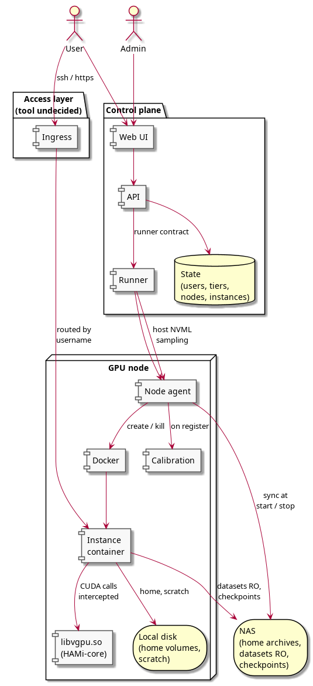
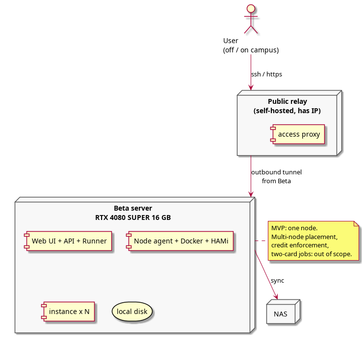
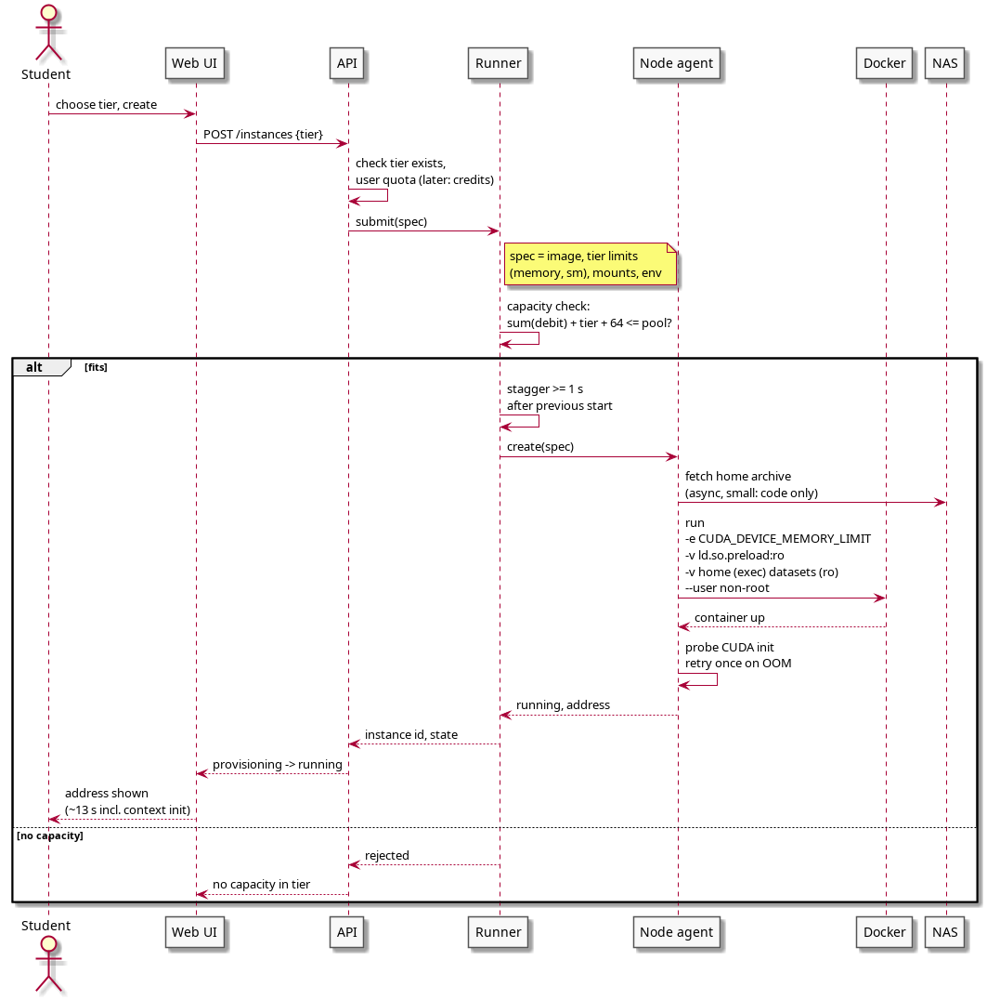
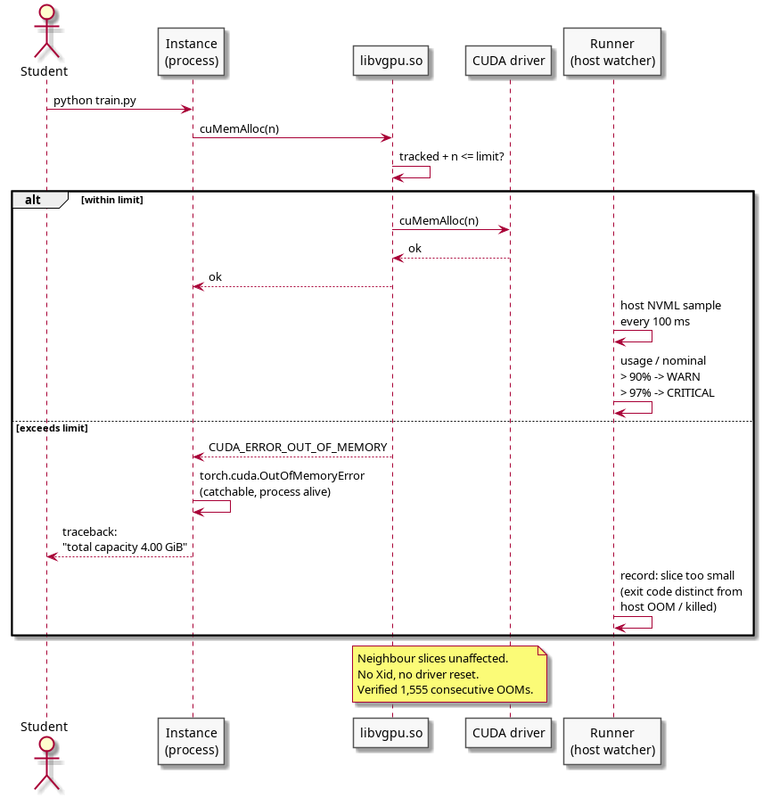
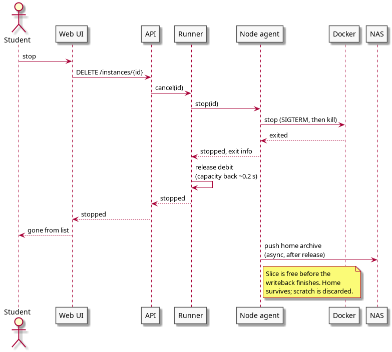
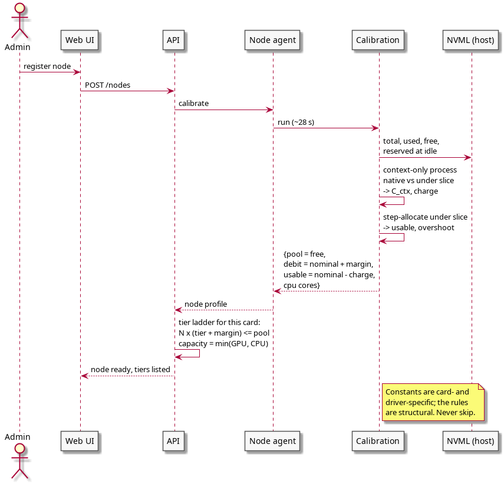
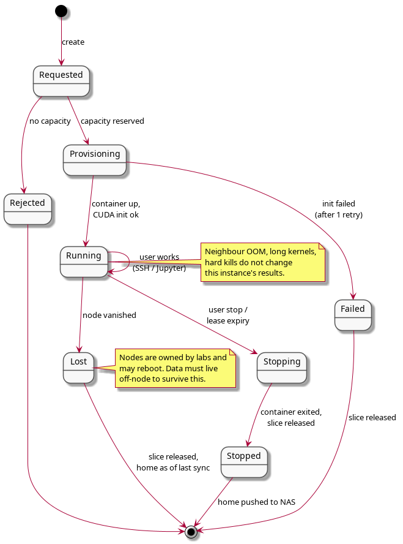

# 기획서 초안

Card ID: `cusqr7zcrq7ro3ribgyeqio6fea`

| Property | Value |
|---|---|
| 상태 | 작성중 |
| 종류 | 기획서 |
| 작성자 | @CodeHotel |
| 결재자 | 조직위 |
| 팀 | 전체 |
| 날짜 | 2026-09-16 |
| 주차 |  |
| 관련 링크 |  |

본 문서는 「GPU 공동 사용 플랫폼」의 목적과 사용자, 설계가 감당해야 할 제약, 그래픽카드 한 장을 여러 몫으로 나누어 공유하는 방식, 시연 범위와 결정·미결 사항을 정리한 기획서 초안을 소개한다. 8월의 구현 방식 검토와 9월 초의 기술검증 결과를 바탕으로 작성하였으며, 향후 기획팀이 기획서를 쓰고 개발·디자인·QA가 각자의 산출물을 설계할 때 출발점으로 활용할 목적을 가지고 있다.

[기획서 초안.md](attachments/7crfucwdgstbo3fa3h9q9ppgfah.md)

[기획서 초안 국문.pdf](attachments/7tk4ty6zhqpdqpbpk6jtsjoc76o.pdf)

[기획서 초안 국문.docx](attachments/75mctib31ff8amk649udwuu9tjo.docx)

## Comments

_No comments._
